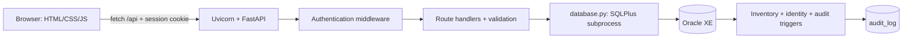

# Project ও architecture

এই application PSTU Central Library-এর staff management portal। Frontend plain HTML/CSS/JavaScript; backend FastAPI; HTTP server Uvicorn; persistence Oracle XE 10g। ORM অথবা JavaScript build pipeline নেই। Backend Python SQL string বানিয়ে installed Windows SQL*Plus subprocess চালায়।

Browser প্রথমে HTML ও /static assets নেয়। shared.js header/session check করে; management pages loadData দিয়ে books, students, issues, fines ও meta নেয়। Changes POST/DELETE endpoints দিয়ে যায়। Server validation ও Oracle constraints দুটোতেই checks থাকে। Successful DML এবং তার audit একই transaction-এ commit হয়। Response আসলে page data reload করে।

Directory দায়িত্ব: backend = request/application logic; backend/auth = authentication/accounts; database = bootstrap/reset/migrations; frontend = UI; tests = backend/HTTP/JS checks; overview = এই documentation।

Internal student_id, display PSTU member ID, academic roll এবং registration আলাদা। Display ID database-তে নতুন column নয়; memberId() দিয়ে বানানো হয়। Book quantity total physical stock; available_quantity issue করার মতো copies। Loan issue_book table-এ, completed return return_book-এ, monetary fine fine-এ থাকে।

Documentation current source snapshot-এর ব্যাখ্যা, production security certification নয়। Runtime data বদলালে source একই থেকেও directory/counts বদলাতে পারে।
