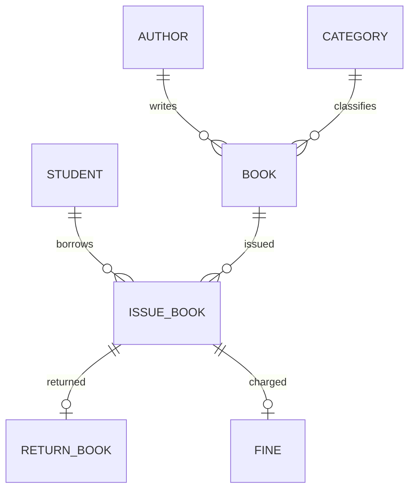

# Database schema, PL/SQL ও business rules

| Table | Fields ও দায়িত্ব |
| --- | --- |
| admin | admin_id, name, email, password; legacy profile/demo table, management login source নয় |
| student | student_id, name, department, phone, email, password, membership_status, roll_no, registration_no |
| author | author_id, author_name; books-এর author reference |
| category | category_id, category_name; books-এর category reference |
| book | book_id, title, author_id, category_id, publisher, quantity, available_quantity |
| issue_book | issue_id, student_id, book_id, issue_date, due_date, return_date, status |
| return_book | return_id, issue_id unique, return_date, fine_amount, status |
| fine | fine_id, issue_id unique, amount, payment_status |
| login_user | user_id, username, password, user_type, account_status |
| audit_log | audit_id, occurred_at UTC timestamp, actor, action, entity, record_id, before_data, after_data |

audit_log ও login_user/student-এর মধ্যে FK নেই। Audit record_id entity অনুযায়ী interpret করতে হয়; target deleted হলেও event থাকে। login_user আর student একই ব্যক্তি হওয়া database FK দিয়ে enforced নয়।

Primary keys NUMBER; *_seq sequences ও BEFORE INSERT triggers ID না দিলে NEXTVAL বসায়। Sequence rollback হয় না: failed/test transactions-এ gaps স্বাভাবিক। migrate.sql পুরোনো MAX(id) registrations-এর পর student_seq current max ছাড়িয়ে নেয়। পরবর্তী inserts table-wide lock ছাড়াই sequence IDs পায়।

Uniqueness: student phone/email; case-insensitive trimmed email; independent UPPER(TRIM(roll_no)) ও UPPER(TRIM(registration_no)); author/category normalized names; normalized username; book identity = LOWER(TRIM(title))+author_id+category_id। একই author/category/title restock হয়। একই নামের members হতে পারে; roll/reg/phone/email আলাদা হতে হয়।

Legacy null IDs রাখা হয় যাতে invented identifiers না বসে। student_identity_trigger new insert বা ID edit-এ দুটো academic identifier required, trim/uppercase এবং allowed pattern checks। Existing member-এর অন্য field-only update এই trigger fire করে না; full edit UI দুটো IDs-ই চায়।

Stock invariant: quantity≥0, available_quantity≥0 ও available≤quantity। Reduce stock available copies-এর বেশি নয়। issue_quantity_trigger book row lock করে unavailable হলে -20001; available এক কমায়; dates defaults প্রয়োজনে বসায়।

issue_book_proc locks the member row and validates ACTIVE membership, unpaid fines and the three-copy allowance. Active reservations count toward that allowance. New loans are due 15 days after the issue date; reserved-copy collection uses the same rule. Copy locks prevent simultaneous circulation of one physical copy.

return_book_proc locks the loan, rejects a second return and calculates max(TRUNC(today)-TRUNC(due_date),0) × Tk 10. It returns the physical copy and records the fine in one transaction. Fine payments record receipts and require the full outstanding balance; legacy partial receipts are preserved.

book_details view author/category names join করে readable inventory rows দেয়। check_book_available function availability string দেয়; current frontend API এই function call করে না। Original setup initially issue_book_proc fine table তৈরি হওয়ার আগে defines করে, পরে compile করে; final invalid-object check প্রয়োজন।

setup.sql includes database/schema modules in dependency order, then feature upgrades and audit triggers before sample records. Academic identifiers and session are defined in schema/members.sql. Setup resets project tables; existing installations use backend.upgrade_circulation instead.
