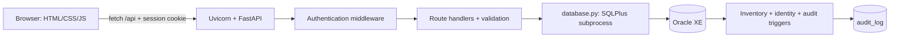
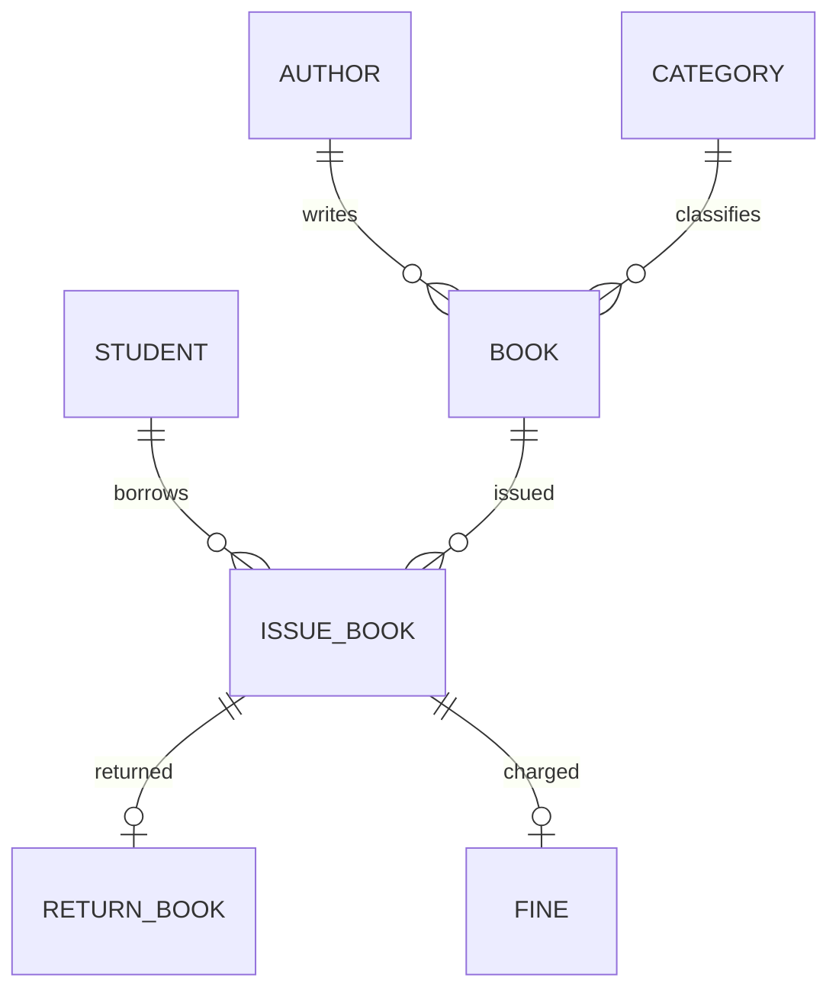

# overview/tools/generate_docs.py

এই documentation-এর generator: source inventory, API extraction, function/line explanation, complete code copies এবং SHA-256 manifest তৈরি করে। App import বা database mutation করে না।

Source: [মূল file](../../overview/tools/generate_docs.py)। Snapshot 2026-10-04; 709 lines; SHA-256 `26dd1089a30b3ccffa314d25d34a085daa248f7dd666a294d30c8191c8b9fc32`।

## Function / object / element inventory

### `write` — L492–L495

`def write(name, content):`

Test/setup helper: write; নিচের assertions/calls সেই behavior define করে।

### `purpose` — L498–L505

`def purpose(relative):`

Test/setup helper: purpose; নিচের assertions/calls সেই behavior define করে।

### `explain` — L508–L582

`def explain(line, language, scope):`

Test/setup helper: explain; নিচের assertions/calls সেই behavior define করে।

### `python_functions` — L585–L588

`def python_functions(source):`

Test/setup helper: python functions; নিচের assertions/calls সেই behavior define করে।

### `sources` — L591–L597

`def sources():`

Test/setup helper: sources; নিচের assertions/calls সেই behavior define করে।

### `build` — L600–L694

`def build():`

Test/setup helper: build; নিচের assertions/calls সেই behavior define করে।

## সম্পূর্ণ original source

````python
"""Generate source-backed Bengali project documentation without importing the app."""

import ast
import hashlib
import html
import json
import re
from pathlib import Path

ROOT = Path(__file__).resolve().parents[2]
OUT = ROOT / "overview"
DATE = "2026-10-04"

PURPOSES = {
    "backend/main.py": "FastAPI application তৈরি, authentication middleware বসানো, HTML page দেওয়া এবং library API পরিচালনা করে। SQL transport ও validation আলাদা module থেকে ব্যবহার করে।",
    "backend/database.py": "Environment ও .env থেকে database configuration নেয়; SQL*Plus subprocess দিয়ে Oracle SQL চালায়; errors-কে HTTP status-এ রূপান্তর এবং delimiter-separated rows-কে dictionaries-এ decode করে।",
    "backend/validation.py": "URL-encoded form parsing, required fields, integer, text length, academic IDs এবং member contact তথ্য যাচাই করে।",
    "backend/audit.py": "ContextVar-এ request actor রাখে; একই request-এর database কাজ কে করছে সেই পরিচয় Oracle session-এ পাঠানোর ব্যবস্থা করে।",
    "backend/setup_database.py": "Windows SQL*Plus দিয়ে SYSDBA/bootstrap, sample database reset অথবা existing database migration চালায়।",
    "backend/auth/routes.py": "Login, logout, current session, librarian account management এবং administrator credentials change endpoints নিবন্ধন করে।",
    "backend/auth/session.py": "In-memory session token সৃষ্টি/expiry/invalidation, admin permission, request origin check এবং protected resource access নিয়ন্ত্রণ করে।",
    "backend/auth/passwords.py": "Salted PBKDF2 password hashes তৈরি ও verify করে; legacy plaintext management passwords-ও login-এর সময় verify করতে পারে।",
    "backend/auth/__init__.py": "Auth package-এর public helper functions re-export করে।",
    "backend/requirements.txt": "FastAPI এবং Uvicorn dependencies ঘোষণা করে; বর্তমানে version pin করা নেই।",
    "backend/oracle_config/tnsnames.ora": "XE alias-কে localhost TCP port 1521 এবং XE service-এর সঙ্গে যুক্ত করে।",
    "backend/oracle_config/sqlnet.ora": "Application connection-এর Windows OS authentication বন্ধ রাখে। Setup-এর স্থানীয় SYSDBA path এই TNS configuration বাদ দেয়।",
    "database/bootstrap.sql": "CONFIGURED_SCHEMA user তৈরি অথবা তার password reset/unlock করে এবং schema তৈরির privileges দেয়।",
    "database/setup.sql": "Existing library objects drop করে demo schema, sequences, triggers, procedures, view এবং sample records তৈরি করে। শেষে members/audit upgrade অন্তর্ভুক্ত করে।",
    "database/migrate.sql": "Existing records না মুছে sequence advance, case-insensitive indexes ও member/audit upgrade চালায় এবং invalid objects পরীক্ষা করে।",
    "database/members_audit.sql": "Roll/registration fields ও uniqueness, student identity validation, transactional audit triggers এবং initial snapshots তৈরি করে।",
    "frontend/shared.js": "সব management page-এর shared API client, state, header, navigation, live data loader, reconnection monitor, escaping, modal ও form submission helpers।",
    "frontend/login.js": "Password show/hide, single pending login request, username trim, timeout, response validation এবং successful redirect পরিচালনা করে।",
    "frontend/dashboard.js": "Books, copies, loans, members ও fines-এর overview metrics এবং recent loans render করে।",
    "frontend/books.js": "Book search, inventory rows, restock এবং available stock reduction forms পরিচালনা করে।",
    "frontend/students.js": "Member directory ও search; add, full Edit এবং membership enable/disable actions চালায়।",
    "frontend/circulation.js": "Eligible member search, available book selection, issuing, return এবং loan status filter পরিচালনা করে।",
    "frontend/fines.js": "Fine totals, unpaid/paid history এবং mark-paid action পরিচালনা করে।",
    "frontend/accounts.js": "Administrator-এর librarian create/toggle/delete এবং নিজের credentials change forms চালায়।",
    "frontend/audit.js": "Admin audit search, filters, pagination এবং before/after details modal render করে।",
    "frontend/login.css": "Photo background, translucent glass login card, autofill readability, focus indication ও responsive sign-in layout।",
    "frontend/styles.css": "Management pages-এর shared design tokens, header, navigation, tables, metrics, forms, dialogs এবং responsive styles।",
    "run.ps1": "Project directory-তে গিয়ে dependencies import check/install করে localhost:8091-এ Uvicorn চালায়।",
    "Open-Library-Project.bat": "Minimized PowerShell server launcher শুরু করে আট সেকেন্ড পরে browser-এ localhost:8091 খোলে।",
    "Setup-Database.bat": "Database setup Python script চালিয়ে success/failure দেখায় এবং window খোলা রাখে।",
    ".env.example": "Public database configuration template; real private .env values-এর পরিবর্তে এটি document করা হয়েছে।",
    ".gitignore": "Private .env, virtual environments, caches, logs এবং local database backups version control থেকে বাদ দেওয়ার তালিকা।",
    ".vscode/settings.json": "Local VS Code Python interpreter ও Pylance import search paths configure করে। Paths এই computer-এর জন্য নির্দিষ্ট।",
    "README.md": "Project চালানো, database upgrade, structure, login flow, member identifiers ও audit সম্পর্কে মূল usage guide।",
    "overview/tools/generate_docs.py": "এই documentation-এর generator: source inventory, API extraction, function/line explanation, complete code copies এবং SHA-256 manifest তৈরি করে। App import বা database mutation করে না।",
}

FUNCTIONS = {
    "settings": ".env থাকলে key=value lines পড়ে; process environment দিয়ে override করে। .env না থাকলে environment-এর copy ফেরত দেয়।",
    "quote": "SQL string literal-এর apostrophe দ্বিগুণ করে এবং control characters reject করে। এটি prepared/bind query নয়; SQL*Plus string construction helper।",
    "run_sql": "Single shared SQL slot নিয়ে Oracle client subprocess চালায়; handler cleanup-এর জন্য 150ms বিরতি দেয়। CONNECT success marker দিয়ে SQL execution শুরু হয়েছে কি না বোঝে; transient connection errors সর্বোচ্চ দুইবার retry। Read-only SELECT known disconnect errors-ও retry করে, executed writes/timeouts replay করে না। Actor, substitution off, rollback ও 20-second command timeout বজায় থাকে।",
    "rows": "SQL execute করে প্রতিটি nonblank line-কে | delimiter দিয়ে ভাগ করে keys-এর সঙ্গে মেলায়; ~ null marker এবং নির্দিষ্ট numeric fields decode করে। Unexpected field count হলে 502।",
    "execute_dml": "DML statement-এর শেষে semicolon এবং COMMIT যোগ করে একই SQL*Plus execution-এ চালায়।",
    "form_data": "Request body পড়ে 16 KiB ও 30-field সীমা যাচাই করে। UTF-8, percent encoding ও duplicate keys যাচাই করে URL-encoded values-এর dictionary ফেরত দেয়।",
    "required": "প্রয়োজনীয় fields absent, None অথবা whitespace-only হলে HTTP 400 তোলে।",
    "positive_number": "int conversion-এর পরে value অন্তত 1 কি না দেখে। Form strings-এর fractional input int conversion-এ reject হয়।",
    "text_field": "Whitespace trim করে UTF-8 byte length ও control characters যাচাই করে normalized text ফেরত দেয়।",
    "academic_identifier": "Identifier uppercase করে সর্বোচ্চ 40 bytes এবং letters/digits/dot/slash/underscore/hyphen pattern যাচাই করে; leading zero বজায় থাকে।",
    "member_details": "নাম, department, phone, email, roll ও registration একসঙ্গে normalize/validate করে; email lowercase এবং phone ঠিক 11 ASCII digits হতে হয়।",
    "hash_password": "16-byte random salt এবং 260000 PBKDF2-HMAC-SHA256 rounds দিয়ে digest তৈরি করে; salt/digest Base64-এ serialize করে।",
    "verify_password": "Legacy value হলে constant-time comparison; hash হলে format/rounds/salt decode করে PBKDF2 পুনরায় চালিয়ে compare করে। Malformed storage false ফেরায়।",
    "current_session": "Cookie token দিয়ে SESSIONS dictionary lookup করে; expired session সরিয়ে None ফেরায়। Valid session হলে তার dictionary ফেরায়।",
    "require_admin": "Session না থাকলে অথবা role ADMIN না হলে HTTP 403; valid admin session ফেরত দেয়।",
    "create_session": "Expired tokens cleanup করে cryptographically random token তৈরি করে; user_id, username, role ও আট ঘণ্টার expiry dictionary-তে রাখে।",
    "remove_session": "নির্দিষ্ট token dictionary থেকে সরিয়ে logout/invalidation করে।",
    "invalidate_user_sessions": "এক user_id-এর সব session token খুঁজে সরায়; disabled/deleted account অথবা credential change-এ ব্যবহৃত।",
    "install_authentication": "HTTP middleware register করে যাতে route execution-এর আগেই authentication/origin checks হয়।",
    "require_authentication": "Public paths নির্ধারণ করে; write request-এর supplied Origin-এর scheme/host যাচাই করে; request actor context বসায়; private API-তে 401, page-এ login redirect দেয়; nonstatic response-এ no-store।",
    "register_auth_routes": "Injected rows/execute_dml/quote/form helpers ব্যবহার করে APIRouter-এ auth/account routes define ও app-এ include করে।",
    "login_page": "Session থাকলে dashboard redirect; না থাকলে login.html FileResponse দেয়।",
    "login": "Form parse ও length check করে authenticate helper worker thread-এ চালায়; পুরোনো cookie session সরিয়ে নতুন HttpOnly SameSite=strict cookie দেয়। HTTPS হলে Secure flag।",
    "authenticate": "Username দিয়ে Oracle user খোঁজে, password/role/status যাচাই করে এবং প্রয়োজন হলে legacy plaintext password hash-এ upgrade করে; সেই upgrade-এর audit actor user-এর username হয়।",
    "auth_session": "Current session থেকে username ও user_type JSON দেয়; session না থাকলে 401।",
    "logout": "Cookie token invalidates করে browser cookie delete response দেয়।",
    "get_accounts": "Admin permission যাচাই করে admin/librarian account metadata ফেরায়; passwords select করে না।",
    "create_librarian": "Admin-only username/password validation, duplicate check ও hashed password insertion করে; role LIBRARIAN এবং status ACTIVE।",
    "toggle_librarian": "Admin-only target librarian status পরিবর্তন করে; disabled হলে তার active sessions সরিয়ে দেয়।",
    "delete_librarian": "Admin-only librarian যাচাই করে delete করে এবং তার sessions invalidates করে। Admin account এই helper দিয়ে delete হয় না।",
    "change_admin_credentials": "Current password verify করে নতুন username/password validate ও update করে; অন্য sessions বাতিল করে current token-এর session ধরে রাখে।",
    "validate_credentials": "Username letter দিয়ে শুরু, 3–30 characters এবং letters/digits/underscore; password 4–128 characters হতে হয়।",
    "username_exists": "Case-insensitive username count query চালায়; current user-এর ID বাদ দেওয়া যায় যাতে নিজের username রাখা সম্ভব হয়।",
    "librarian": "Target user LIBRARIAN কি না query করে; absent হলে 404।",
    "home": "Dashboard index.html response দেয়; authentication middleware আগেই access check করে।",
    "books_page": "Books page HTML পরিবেশন করে।",
    "students_page": "Members directory HTML পরিবেশন করে।",
    "circulation_page": "Issue/Return page HTML পরিবেশন করে।",
    "fines_page": "Fine register HTML পরিবেশন করে।",
    "accounts_page": "ADMIN role ছাড়া dashboard redirect দেয়; admin হলে accounts.html দেয়।",
    "health": "dual-এ SELECT 1 চালিয়ে actual Oracle connectivity যাচাই করে CONNECTED metadata দেয়। এটি public endpoint।",
    "get_books": "book_details view থেকে title/author/category search ও available/total stock ফেরায়। Search SQL LIKE হওয়ায় % ও _ wildcard হতে পারে।",
    "add_book": "Form validate করে author/category resolve বা create করে; matching book row lock করে restock, নয়তো নতুন title insert; transaction শেষে commit।",
    "reduce_book_stock": "Book lock করে requested quantity available stock ছাড়িয়েছে কি না দেখে; total ও available উভয় count কমায়। Borrowed copies বাদ দেওয়া যায় না।",
    "get_students": "Member directory ফেরায়; generated student_id, contact/status এবং separate roll_no/registration_no fields থাকে।",
    "add_student": "Shared member validation ও existing phone check করে সাত argument-সহ add_student_proc চালায়; identity trigger ও unique indexes final integrity enforce করে।",
    "edit_student": "পুরো member details ও membership_status validate করে; target row lock করে disabling-এর loan/fine restrictions checks; সব editable fields এক transaction-এ update করে।",
    "update_student_identity": "Compatibility endpoint: শুধু roll ও registration update করে; missing row-তে 404 mapping-এর জন্য NO_DATA_FOUND তোলে। Current UI full edit endpoint ব্যবহার করে।",
    "toggle_student_membership": "Member lock করে ACTIVE থেকে DISABLED যাওয়ার আগে active loans/unpaid fines দেখে; DISABLED হলে ACTIVE করে।",
    "get_issues": "Loan, student ও book join করে issue/due/return dates এবং status JSON rows দেয়; newest issue আগে।",
    "add_issue": "Student ও book IDs positive integer যাচাই করে issue_book_proc call এবং commit করে।",
    "return_book": "Positive issue ID নিয়ে return_book_proc call করে; returned inventory/fine changes এক transaction-এ commit।",
    "get_fines": "Fine, issue, student ও book join করে amount ও payment status দেখায়।",
    "pay_fine": "Target fine PAID update করে; affected row না থাকলে NO_DATA_FOUND; audit trigger-সহ commit করে। Already-paid row আবার update করলেও নতুন audit event হতে পারে।",
    "get_meta": "Author/category IDs ও names দেয়; book form datalist-এর options হিসেবে ব্যবহৃত।",
    "audit_page": "Admin permission ছাড়া access reject করে; admin-কে audit.html response দেয়।",
    "get_audit": "Admin-only search/entity/action filters ও 25-row Oracle ROWNUM pagination; RAWTOHEX snapshots decode করে JSON before/after ফেরায়। Stored UTC timestamps UI-তে Dhaka সময় হয়।",
    "oracle_environment": "Oracle home/SID/client language/PATH বসায় এবং proxy settings বাদ দেয়; local SYSDBA mode-এ TNS_ADMIN বাদ দেয়।",
    "execute": "SQL*Plus /nolog subprocess-এ CONNECT এবং script পাঠায়; 120-second timeout/OS errors friendly failure message দেয়; command-line arguments-এ password দেয় না।",
    "main": "এই file-এর entry point; setup/migration flags বা test launcher অনুযায়ী প্রয়োজনীয় workflow শুরু করে। setup_database.py-এর main-এ --migrate preserving upgrade, অন্যথায় RESET confirmation-সহ demo setup।",
    "api": "Relative /api URL-এ no-store fetch, 60-second timeout এবং temporary GET 503/504/network failure-এ একবার retry। POST/DELETE replay হয় না। 401 login redirect, অন্য failed status Error।",
    "escapeHtml": "& < > quote/apostrophe-কে HTML entities বানায় যাতে user-controlled values template HTML হিসেবে execute না হয়।",
    "memberId": "Internal numeric ID-কে display-only PSTU-0001 format-এ বানায়; academic roll/reg-এর সঙ্গে এক নয়।",
    "table": "Headers ও row HTML দিয়ে table বানায়; rows খালি হলে empty-state message দেয়। Calling code-কে values escape করতে হয়।",
    "toast": "Toast textContent/class বদলায় এবং পুরোনো timer clear করে প্রায় 2.8 seconds পরে message লুকায়।",
    "renderHeader": "Navigation, connection indicator, session user ও logout button বসায়; Accounts/Audit links শুধু ADMIN-এর জন্য visible হয়।",
    "setConnection": "Connection dot/label update করে; offline অবস্থায় Database unavailable দেখায়।",
    "loadData": "Overlapping refresh একই pending Promise share করে। Redundant initial health বাদ দিয়ে পাঁচ read API আনে; all-or-nothing state update, failure-এ retained data ও offline writes block; render ও reconnect monitor শুরু।",
    "startConnectionMonitor": "5-second interval-এ health পরীক্ষা; hidden/pending check/data load skip। Reconnect-এ state reload; browser online ও visibilitychange recovery handlers-ও থাকে।",
    "sortIssues": "Issue date descending ও তারপর numeric issue ID descending-এ copied list sort করে।",
    "issueRows": "Loan table HTML render করে; active loan-এর due date পেরোলে OVERDUE label; actions enabled হলে Return button।",
    "openModal": "Dialog open করে aria attributes বসায়, return-focus element ধরে এবং প্রথম input/select/button-এ focus দেয়।",
    "closeModal": "Dialog hide করে form reset ও opener focus restore করে।",
    "bindModals": "Open/close/backdrop/Escape handlers এবং Tab/Shift+Tab focus containment বসায়।",
    "postForm": "Offline হলে save আটকায়; submit button disable করে URLSearchParams(FormData) POST; success-এ modal close ও toast; শেষে button restore। Login-এর মতো আলাদা submitting flag এখানে নেই।",
    "openRequestedModal": "URL-এর new=1 থাকলে requested dialog খুলে query parameter সরায়; reconnection-এ dialog পুনরায় খোলা বন্ধ হয়।",
    "render": "এই page-এর current state ও search/filter থেকে tables/metrics/options তৈরি করে, DOM update করে এবং generated action buttons-এর events bind করে। পাশের পূর্ণ code-এ page-specific fields দেখা যাবে।",
    "openRestock": "Existing book metadata form-এ ভরে quantity=1 দেয়, modal open করে এবং quantity select করে।",
    "openReduction": "Book ID/form max available copies বসিয়ে reduction modal খোলে।",
    "toggleMembership": "User confirmation ও online check-এর পরে member toggle API call, toast ও fresh render।",
    "eligibleStudents": "ACTIVE members-এর মধ্যে active loan বা unpaid fine নেই এমন members নির্বাচন করে। Database procedure আবার একই rules enforce করে।",
    "renderMembers": "Eligible members-এর name/internal ID/roll/reg search করে select options render করে; no match হলে empty option।",
    "returnBook": "Confirmation-এর পরে return API call ও refreshed data render করে।",
    "payFine": "Confirmation-এর পরে mark-paid API call ও refreshed fines render করে।",
    "renderAccounts": "Admin account list fetch করে role/status/action rows render এবং toggle/delete button handlers বসায়।",
    "submitForm": "Accounts page form-এর submit button disable করে POST, successful form reset ও toast করে; finally button restore।",
    "toggleAccount": "Confirmation নিয়ে librarian account toggle API call এবং account list refresh করে।",
    "deleteAccount": "Permanent delete confirmation নিয়ে librarian deletion API call এবং list refresh করে।",
    "loadAudit": "Filters/page থেকে query বানায়, request counter দিয়ে stale responses ignore করে, table ও pagination render করে; row detail buttons bind করে।",
    "showDetails": "Selected audit event-এর before/after keys union করে comparison table বানায়; changed fields highlight করে modal খোলে।",
}

CHAPTERS = {
"14-data-dictionary-and-responses.md": """# প্রতিটি database field ও API response

নিচের dictionary current final schema বোঝায়। PK = primary key; FK = foreign key; legacy fields UI authentication-এর সঙ্গে যুক্ত নয়। VARCHAR2 length Oracle default byte semantics-এ তৈরি; Python input validator UTF-8 bytes checks করে।

| Table.field | Type | Meaning / rule |
| --- | --- | --- |
| admin.admin_id | NUMBER PK | admin_seq/trigger-generated legacy profile identity |
| admin.name | VARCHAR2(100) NOT NULL | Profile name |
| admin.email | VARCHAR2(100) NOT NULL UNIQUE | Profile email |
| admin.password | VARCHAR2(255) NOT NULL | Legacy password; current login source নয়; audit থেকে বাদ |
| student.student_id | NUMBER PK | student_seq-generated internal identity; roll/reg নয় |
| student.name | VARCHAR2(100) NOT NULL | Member display name; unique নয় |
| student.department | VARCHAR2(100) NOT NULL | Member department |
| student.phone | VARCHAR2(11) NOT NULL UNIQUE | ঠিক 11 numeric digits; leading zero string হিসেবে রাখা |
| student.email | VARCHAR2(100) NOT NULL UNIQUE | Contact email; normalized index LOWER(TRIM(email)) |
| student.password | VARCHAR2(255) NOT NULL | Legacy unused member password; add route default '<private-password>'; audit থেকে বাদ |
| student.membership_status | VARCHAR2(20) DEFAULT ACTIVE NOT NULL | ACTIVE অথবা DISABLED; borrowing permission |
| student.roll_no | VARCHAR2(40) | ID/Roll; UPPER(TRIM()) unique index; new inserts/ID edits trigger-required |
| student.registration_no | VARCHAR2(40) | Registration No.; independently UPPER(TRIM()) unique; leading zeros রাখে |
| author.author_id | NUMBER PK | author_seq/trigger identity |
| author.author_name | VARCHAR2(100) NOT NULL UNIQUE | Normalized LOWER(TRIM()) index-সহ author name |
| category.category_id | NUMBER PK | category_seq/trigger identity |
| category.category_name | VARCHAR2(100) NOT NULL UNIQUE | Normalized LOWER(TRIM()) index-সহ category name |
| book.book_id | NUMBER PK | book_seq/trigger title identity |
| book.title | VARCHAR2(200) NOT NULL | Title; normalized title+author+category uniqueness |
| book.author_id | NUMBER NOT NULL FK | References author.author_id |
| book.category_id | NUMBER NOT NULL FK | References category.category_id |
| book.publisher | VARCHAR2(100) | Optional publisher; API empty input defaults PSTU Library |
| book.quantity | NUMBER DEFAULT 0 NOT NULL | Total stock; database check ≥0; API whole positive count add/reduce |
| book.available_quantity | NUMBER DEFAULT 0 NOT NULL | Available stock; 0≤available≤quantity |
| issue_book.issue_id | NUMBER PK | issue_seq/trigger loan identity |
| issue_book.student_id | NUMBER NOT NULL FK | References student.student_id |
| issue_book.book_id | NUMBER NOT NULL FK | References book.book_id |
| issue_book.issue_date | DATE DEFAULT SYSDATE NOT NULL | Borrowing timestamp; read API YYYY-MM-DD format |
| issue_book.due_date | DATE | Procedure/trigger normal issue-date rule: current time+14 days |
| issue_book.return_date | DATE | Return timestamp; active loan হলে null |
| issue_book.status | VARCHAR2(20) DEFAULT ISSUED NOT NULL | ISSUED অথবা RETURNED |
| return_book.return_id | NUMBER PK | return_seq/trigger return identity |
| return_book.issue_id | NUMBER NOT NULL UNIQUE FK | একটি issue-এর একটি return; references issue_book |
| return_book.return_date | DATE DEFAULT SYSDATE NOT NULL | Completed return time |
| return_book.fine_amount | NUMBER DEFAULT 0 NOT NULL | Computed fine, ≥0; zero fine-ও return history-তে থাকে |
| return_book.status | VARCHAR2(20) DEFAULT RETURNED NOT NULL | Stored return label; table-এ separate domain CHECK নেই |
| fine.fine_id | NUMBER PK | fine_seq/trigger fine identity |
| fine.issue_id | NUMBER NOT NULL UNIQUE FK | প্রতি issue-এর সর্বোচ্চ একটি fine |
| fine.amount | NUMBER DEFAULT 0 NOT NULL | Nonnegative amount; return procedure daily late charge×10 |
| fine.payment_status | VARCHAR2(20) DEFAULT UNPAID NOT NULL | UNPAID অথবা PAID |
| login_user.user_id | NUMBER PK | login_seq/trigger management account identity |
| login_user.username | VARCHAR2(100) NOT NULL UNIQUE | Database allows 100 bytes; create/change API rule 3–30 chars; normalized unique index |
| login_user.password | VARCHAR2(100) NOT NULL | PBKDF2 serialized value অথবা legacy plaintext; never account-list/audit response field |
| login_user.user_type | VARCHAR2(20) NOT NULL | ADMIN, LIBRARIAN অথবা STUDENT; dashboard login প্রথম দুইটি |
| login_user.account_status | VARCHAR2(10) DEFAULT ACTIVE NOT NULL | ACTIVE অথবা DISABLED |
| audit_log.audit_id | NUMBER PK | audit_seq; event ordering/key |
| audit_log.occurred_at | TIMESTAMP NOT NULL | SYS_EXTRACT_UTC(SYSTIMESTAMP) insertion time; UI Dhaka conversion |
| audit_log.actor | VARCHAR2(100) NOT NULL | Request username / Oracle USER / initial MIGRATION label |
| audit_log.action | VARCHAR2(10) NOT NULL | INSERT, UPDATE, DELETE, SNAPSHOT |
| audit_log.entity | VARCHAR2(30) NOT NULL | Uppercase table name; no target table FK |
| audit_log.record_id | NUMBER NOT NULL | Target row primary key; entity ছাড়া global unique নয় |
| audit_log.before_data | VARCHAR2(4000) | JSON old values; INSERT/SNAPSHOT-এ null; secret fields excluded |
| audit_log.after_data | VARCHAR2(4000) | JSON new values; DELETE-এ null; secret fields excluded |

## Read response schemas

- GET books: array of book_id, title, author_name, category_name, publisher, quantity, available_quantity। IDs/counts numeric; missing publisher null হতে পারে।
- GET students: array of student_id, name, department, phone, email, membership_status, roll_no, registration_no। Academic IDs strings; unknown legacy IDs null। Student password ফেরত আসে না।
- GET issues: array of issue_id, student_id, book_id, student, title, issue_date, due_date, return_date, status। Dates YYYY-MM-DD; due/return missing হলে null।
- GET fines: array of fine_id, issue_id, student_id, student, title, amount, payment_status। amount Python int অথবা decimal-output float।
- GET meta: object authors/categories, each array contains id/name।
- GET accounts: user_id, username, user_type, account_status array; passwords নেই।
- GET audit: items,total,page,page_size। Item audit_id,occurred_at,actor,action,entity,record_id,before,after। before/after dictionaries অথবা null।
- Login/current session: username,user_type। Login token JSON-এ নয়, cookie-তে।
- Mutation endpoints সাধারণত message object দেয়; new member/book/issue ID response-এ নেই, frontend rereads lists। Credential change username-ও ফেরায়।
- Errors: FastAPI HTTPException response সাধারণত detail string। Server framework request conversion errors detail array হতে পারে; shared API helper সব detail shapes-এর friendly formatting করে না।

## Sample request

```text
POST /api/students
Content-Type: application/x-www-form-urlencoded

name=Example&department=CSE&phone=01799999001&email=example%40example.invalid&roll_no=2300010&registration_no=11709
```

এটি documentation example; database-এ insert করা হয়নি। Existing unique values-এর সঙ্গে conflict হলে request 409 হবে। New member-এর academic IDs স্বয়ংক্রিয় sequence fill হয় না—form থেকে দিতে হয়।
""",
"15-code-concepts-and-dependencies.md": """# Code concepts, dependencies ও পড়ার সহায়ক glossary

## Python

`Path(__file__).resolve()` current file-এর absolute path; `.parent` দিয়ে project root। Environment os.environ process config। subprocess.run SQLPlus process launch, stdin input, stdout/stderr capture, returncode ও timeout। Exceptions flow-তে HTTPException request error; subprocess.TimeoutExpired wait limit। `dict(zip(keys,values))` row values-এর নাম দেয়। `parse_qs` URL-encoded keys parse করে। Regex fullmatch entire field rule enforce; re.search malformed percent search করে।

`async def` coroutine; await cooperative operations; synchronous subprocess async function-এর ভেতরে চালালে event loop block হতে পারে। starlette.run_in_threadpool login-এর blocking callback worker thread-এ চালায়। ContextVar current request actor আলাদা context-এ রাখে; token/reset পূর্বের value restore করে।

FastAPI decorators HTTP verb/path handler map করে; typed Request framework request object; integer path/query parameters framework convert করে। APIRouter auth route grouping। FileResponse file response, RedirectResponse 303 navigation, JSONResponse headers/cookie controllable JSON; StaticFiles assets। Middleware endpoint-এর আগে/পরে shared checks।

secrets cryptographic randomness, hashlib PBKDF2, hmac constant-time comparison, base64 serialized binary bytes। time.time epoch expiry; JSON loads audit snapshots decode। unittest TestCase assertions; mock.patch isolates SQL/fetch-like collaborators। tests HTTP server sockets/threading/urllib/http.cookiejar ব্যবহার করে real network/cookie flow isolated test app-এ checks।

## JavaScript ও browser

IIFE `(() => {...})()` script scope আলাদা করে। Destructuring `{ $, state }` helpers নেয়। `$` querySelector; `$$` querySelectorAll spread array। Template literals `${...}` values interpolate; escapeHtml ছাড়া arbitrary user text innerHTML-এ নিরাপদ নয়। textContent plain output। dataset HTML data-* attributes access করে।

Array filter search/eligibility, map rows/options, reduce totals, find target member/book, sort copied loans। Optional chaining ?. missing DOM/property tolerate করে; nullish ?? কেবল null/undefined fallback; || zero/empty string-ও fallback করে। Date/Intl formatting dates/timezone display।

fetch returns Promise; response.ok status class; response.json body decode; async/await then/catch/finally response/error/cleanup। FormData collects named controls; URLSearchParams form body/query বানায়। AbortController signal timeout cancel করে। setTimeout search debounce/toast/login timeout; setInterval reconnect polling। clearTimeout পুরোনো callback বাতিল করে।

onclick/onsubmit/oninput/onchange handlers actions bind; preventDefault browser form navigation আটকায়। disabled repeat clicks কমায়; login explicit submitting flag concurrent request আটকায়। history.replaceState new=1 URL parameter remove করে। Node vm tests JavaScript চালায়, কিন্তু real CSS layout/browser renderer নয়।

## HTML ও CSS

name attribute API form key; id JavaScript selector; label control context; required/pattern/minlength/maxlength browser validation। Hidden student_id target endpoint construction-এ লাগে; backend path ID authoritative। autocomplete username/current-password credential UX; aria-live alerts, aria-hidden dialog visibility, aria-modal/role accessible dialog semantics, aria-pressed password visibility state। Server validation ছাড়া HTML checks bypassable।

CSS variables :root theme tokens। Grid/Flexbox layout, minmax/clamp responsive sizing, overflow-x tables, z-index dialogs/toasts। backdrop-filter underlying photo blur; semi-transparent rgba tint; box-shadow depth; border-radius glass card shape। :focus-visible keyboard indication; :autofill vendor override saved text contrast; @media viewport breakpoints; @supports feature fallback; prefers-reduced-motion shared styles movement কমায়।

## Oracle / SQLPlus

SQL DDL CREATE/ALTER/DROP schema objects বদলায়; implicit commit গুরুত্বপূর্ণ। DML INSERT/UPDATE/DELETE transaction data বদলায়। SELECT INTO PL/SQL single-row variable assignment; no row NO_DATA_FOUND; multiple rows TOO_MANY_ROWS। FOR UPDATE locks matched row until transaction end। COMMIT persists, ROLLBACK business/audit rows undo; NEXTVAL allocation undo হয় না।

Triggers :NEW/:OLD row pseudo-records; INSERTING/UPDATING/DELETING branch event type; AFTER audit versus BEFORE identity/inventory checks। RAISE_APPLICATION_ERROR -200xx custom messages। SQL%ROWCOUNT affected rows। NVL Oracle null fallback; TRIM/UPPER/LOWER normalization; || concatenation; CHR escape-building; RAWTOHEX binary-safe transport; TO_CHAR date/number formatting; ROWNUM older pagination। Oracle empty string NULL semantics identity validation-এ প্রভাব ফেলে।

SQLPlus SET DEFINE OFF ampersand variable substitution বন্ধ; / PL/SQL buffer execute; @@ relative script include; WHENEVER SQLERROR fail-fast; PROMPT progress। PL/SQL %TYPE column datatype reuse করে; procedures business operations, function reusable return value, view reusable SELECT, index uniqueness/search, sequence key allocation।
""",
"01-project-and-architecture.md": """# Project ও architecture

এই application PSTU Central Library-এর staff management portal। Frontend plain HTML/CSS/JavaScript; backend FastAPI; HTTP server Uvicorn; persistence Oracle XE 10g। ORM অথবা JavaScript build pipeline নেই। Backend Python SQL string বানিয়ে installed Windows SQL*Plus subprocess চালায়।



Browser প্রথমে HTML ও /static assets নেয়। shared.js header/session check করে; management pages loadData দিয়ে books, students, issues, fines ও meta নেয়। Changes POST/DELETE endpoints দিয়ে যায়। Server validation ও Oracle constraints দুটোতেই checks থাকে। Successful DML এবং তার audit একই transaction-এ commit হয়। Response আসলে page data reload করে।

Directory দায়িত্ব: backend = request/application logic; backend/auth = authentication/accounts; database = bootstrap/reset/migrations; frontend = UI; tests = backend/HTTP/JS checks; overview = এই documentation।

Internal student_id, display PSTU member ID, academic roll এবং registration আলাদা। Display ID database-তে নতুন column নয়; memberId() দিয়ে বানানো হয়। Book quantity total physical stock; available_quantity issue করার মতো copies। Loan issue_book table-এ, completed return return_book-এ, monetary fine fine-এ থাকে।

Documentation current source snapshot-এর ব্যাখ্যা, production security certification নয়। Runtime data বদলালে source একই থেকেও directory/counts বদলাতে পারে।
""",
"02-setup-and-configuration.md": """# Setup, configuration ও launcher

1. Oracle XE service/listener ও SQL*Plus install থাকতে হবে। Default home `C:\\oraclexe\\app\\oracle\\product\\10.2.0\\server`। `ORACLE_HOME` environment variable দিয়ে override হয়।
2. `python -m pip install -r backend/requirements.txt` চালাও। Python environment-এ FastAPI/Uvicorn থাকতে হবে; tests অতিরিক্ত httpx লাগে না।
3. `.env.example` থেকে `.env` তৈরি করো। DB_USER, DB_PASSWORD, DB_DSN database.py পড়ে। Process environment file values-এর ওপর priority পায়। Current parser পুরো dotenv specification নয়; quotes/export/multiline syntax বিশেষভাবে support করে না। ORACLE_HOME process environment থেকে path তৈরি হওয়ার সময় পড়া হয়, .env-এর ORACLE_HOME দিয়ে path override হয় না।
4. Existing database হলে `python backend/setup_database.py --migrate`। Upgrade sequence advance ও indexes/features যোগ করে; existing library records delete করে না। Oracle DDL implicit commit হয়; failure-এ earlier DDL rollback হয় না। Script idempotent column/index checks রাখে, কিন্তু backup ছাড়া migration undo সুবিধা নেই।
5. Demo reset হলে `Setup-Database.bat`; RESET type করা আবশ্যক। Existing library tables/audit history মুছে sample records ফেরত আসে। Bootstrap existing CONFIGURED_SCHEMA password-ও public demo default-এ reset/unlock করে। Custom schema credentials নিয়ে demo setup স্বয়ংক্রিয় parameterized নয়।
6. `powershell -ExecutionPolicy Bypass -File run.ps1` অথবা launcher batch। Server `127.0.0.1:8091`-এ single worker। Browser URL `http://localhost:8091`। Batch আট সেকেন্ড wait করে; server readiness polling নয়।

tnsnames.ora-তে XE = TCP 127.0.0.1:1521 / service XE / dedicated server। sqlnet.ora application connections-এ OS authentication NONE; setup local SYSDBA attempt TNS_ADMIN বাদ দেয়। NLS_LANG WE8MSWIN1252; Bengali/Unicode data preservation নিশ্চিত করা হয়নি।

Login demo seed <private-administrator-login>; সেটি current account password-এর নিশ্চয়তা নয়, কারণ Accounts page দিয়ে password বদলানো যায়। এই public seed value source-এ আছে; real private .env এই documents-এ নেই।

`.vscode/settings.json` installed interpreter এবং site-packages path ধরে Pylance resolve করে। অন্য PC-তে paths বদলাতে হবে। Browser এক origin-এ রাখো: localhost ও 127.0.0.1 আলাদা cookie hosts।
""",
"03-backend-and-validation.md": """# Backend ও input validation

main.py FastAPI app তৈরি করে authentication middleware ও auth router বসায়। HTML handlers FileResponse দেয়। /static mount frontend directory serve করে। API documentation endpoints বর্তমানে disabled: docs_url/redoc_url/openapi_url=None। Main library operations login থাকা ADMIN/LIBRARIAN দুজনই করতে পারে; accounts এবং audit আলাদাভাবে admin-only।

Form content frontend থেকে URLSearchParams(new FormData(form)) হয়। form_data request.body সম্পূর্ণ পড়ে, তারপর 16384-byte limit checks; এটি streaming upload size enforcement নয়। সর্বোচ্চ 30 fields; invalid raw/percent-encoded UTF-8, malformed % escapes ও duplicate keys reject। JSON/multipart parsing helper নয়। required() None/blank/whitespace reject করে। positive_number integer ও >0 চায়। text_field সর্বোচ্চ UTF-8 byte length checks; এটি Oracle character-set bytes-এর সরাসরি measurement নয়।

member_details name/department/email সর্বোচ্চ 100 bytes; email lowercase + simple structural regex; phone ঠিক 11 ASCII digits; roll ও registration uppercase, সর্বোচ্চ 40 bytes, allowed ASCII letters/digits/dot/slash/underscore/hyphen। Domain deliverability, country-specific email policy বা unique name requirement নেই।

Add member-এ phone precheck থাকে, তবে race-safe uniqueness Oracle indexes/constraints enforce করে। Full edit-এ name, department, phone, email, roll/reg, membership_status mandatory। Student row SELECT FOR UPDATE lock হয়; ACTIVE→DISABLED-এর আগে issued books ও unpaid fines checks। Internal student_id edit হয় না। Identity-only endpoint compatibility হিসেবে আছে; UI এখন full /edit call করে।

database.py SQL*Plus stdin-এ CONNECT ও script পাঠায়; password subprocess argv-তে দেয় না। SET DEFINE OFF ampersand substitution বন্ধ করে; SQLBLANKLINES ON blank SQL lines নেয়। WHENEVER SQLERROR ... ROLLBACK ও OSERROR handling থাকে। quote() apostrophe escape/control-character reject করে; bind variables নেই। SELECT output fields | delimiter, ~ null marker; কিছু values REPLACE দিয়ে | সরায়, audit RAWTOHEX দিয়ে delimiter/newlines এড়ায়।

HTTP errors: input 400, unauthenticated API 401, forbidden admin/role/origin 403, missing database record 404, conflicts/domain rule 409, too-large form 413, malformed row format 502, database failure 503, timeout 504। Missing SQLPlus path বর্তমানে 500। Generic Oracle failures server log-এ যায়; user-কে internal error detail সাধারণত দেওয়া হয় না।

Login and async library mutation SQL work now runs in run_in_threadpool. Some account create/change operations still contain synchronous database work. SQLPlus commands share one slot to avoid XE listener overload.
""",
"04-authentication-and-security.md": """# Authentication, roles ও sessions

Login flow: username/password form → body validation → username search → password verification → management role ADMIN/LIBRARIAN check → ACTIVE account check → legacy password hash upgrade প্রয়োজনে → session token creation → cookie response → frontend valid username/role response যাচাই করে dashboard redirect। STUDENT account management dashboard access পায় না; student self-service portal নেই।

PBKDF2-HMAC-SHA256: salt = 16 random bytes, iterations = 260000, digest Base64; format `pbkdf2$rounds$salt$digest`। Verification stored rounds 100000–1000000 range check করে। hmac.compare_digest ব্যবহার হয়। Legacy plaintext stored password login-এ verify হওয়ার পরে hash-এ বদলানো হয়। admin/student profile tables-এর unused legacy password fields current authentication source নয়; login_user password authoritative।

Session dictionary process memory-তে: user_id, username, user_type, expires। Cookie library_session; lifetime আট ঘণ্টা; HttpOnly, SameSite=strict; HTTPS request হলে Secure। Restart হলে sessions হারায়। Shared session backend নেই বলে multiple workers ব্যবহার করলে session lookup mismatch হতে পারে। Expired session access অথবা new session creation-এ cleanup হয়। Logout token ও cookie delete করে। Disabled/deleted librarian-এর sessions invalidated। Admin credential update অন্য sessions invalidates করে বর্তমান token পুনরায় stores। Session expiry sliding refresh নয়।

Middleware public paths /login, /api/health, auth login/session/logout ও /static/*। অন্য API session ছাড়া 401; HTML login redirect। Supplied write-request Origin-এর scheme/host current request-এর সঙ্গে মেলে কি না দেখে। Origin না থাকলে এই check request reject করে না; dedicated CSRF token নেই। Nonstatic successful responses Cache-Control:no-store।

Roles: ADMIN সব management, account controls ও audit; LIBRARIAN library operations, account/audit access নেই; STUDENT management login reject। Frontend hidden link permission enforcement নয়; backend require_admin authoritative। HTML escaping data-as-HTML risk কমায়; audit details passwords/hashes বাদ দেয়।

বর্তমান সীমা: rate limiting/account lockout নেই; password minimum মাত্র চার characters; permission/auth state live database-এ প্রতি request revalidate নয়; direct SQL account disable/delete করলে in-memory sessions immediate invalidated হয় না। TLS deployment/session persistence/production secret provisioning এখানে implemented নয়। Audit schema owner records edit/drop করতে পারে; tamper-proof audit service নয়।
""",
"05-database-and-business-rules.md": """# Database schema, PL/SQL ও business rules

| Table | Fields ও দায়িত্ব |
| --- | --- |
| admin | admin_id, name, email, password; legacy profile/demo table, management login source নয় |
| student | student_id, name, department, phone, email, password, membership_status, roll_no, registration_no |
| author | author_id, author_name; books-এর author reference |
| category | category_id, category_name; books-এর category reference |
| book | book_id, title, author_id, category_id, publisher, quantity, available_quantity |
| issue_book | issue_id, student_id, book_id, issue_date, due_date, return_date, status |
| return_book | return_id, issue_id unique, return_date, fine_amount, status |
| fine | fine_id, issue_id unique, amount, payment_status |
| login_user | user_id, username, password, user_type, account_status |
| audit_log | audit_id, occurred_at UTC timestamp, actor, action, entity, record_id, before_data, after_data |



audit_log ও login_user/student-এর মধ্যে FK নেই। Audit record_id entity অনুযায়ী interpret করতে হয়; target deleted হলেও event থাকে। login_user আর student একই ব্যক্তি হওয়া database FK দিয়ে enforced নয়।

Primary keys NUMBER; *_seq sequences ও BEFORE INSERT triggers ID না দিলে NEXTVAL বসায়। Sequence rollback হয় না: failed/test transactions-এ gaps স্বাভাবিক। migrate.sql পুরোনো MAX(id) registrations-এর পর student_seq current max ছাড়িয়ে নেয়। পরবর্তী inserts table-wide lock ছাড়াই sequence IDs পায়।

Uniqueness: student phone/email; case-insensitive trimmed email; independent UPPER(TRIM(roll_no)) ও UPPER(TRIM(registration_no)); author/category normalized names; normalized username; book identity = LOWER(TRIM(title))+author_id+category_id। একই author/category/title restock হয়। একই নামের members হতে পারে; roll/reg/phone/email আলাদা হতে হয়।

Legacy null IDs রাখা হয় যাতে invented identifiers না বসে। student_identity_trigger new insert বা ID edit-এ দুটো academic identifier required, trim/uppercase এবং allowed pattern checks। Existing member-এর অন্য field-only update এই trigger fire করে না; full edit UI দুটো IDs-ই চায়।

Stock invariant: quantity≥0, available_quantity≥0 ও available≤quantity। Reduce stock available copies-এর বেশি নয়। issue_quantity_trigger book row lock করে unavailable হলে -20001; available এক কমায়; dates defaults প্রয়োজনে বসায়।

issue_book_proc student row lock করে: ACTIVE membership, current issued loan count zero, unpaid fines zero। Issue creates due date SYSDATE+14। Application rule এক member-এর এক active book; raw direct issue_book inserts এই procedure-এর member checks bypass করতে পারে, যদিও inventory trigger still চলে।

return_book_proc issue row lock করে already returned হলে -20002। Fine = max(TRUNC(today)-TRUNC(due_date),0)×10 টাকা। Return row insert, issue returned/date update, book available+1 এবং positive fine insert এক transaction-এ হয়। Due date null হলে fine zero-এর fallback আছে। Partial payments/receipts/currency precision workflow নেই; pay endpoint পুরো fine PAID করে।

book_details view author/category names join করে readable inventory rows দেয়। check_book_available function availability string দেয়; current frontend API এই function call করে না। Original setup initially issue_book_proc fine table তৈরি হওয়ার আগে defines করে, পরে compile করে; final invalid-object check প্রয়োজন।

setup.sql final feature schema members_audit.sql-এর মাধ্যমে আসে: initial student CREATE TABLE-এ roll/reg নেই; final ALTER TABLE যোগ করে। Fresh demo SQL seed ও বর্তমান manually edited live data এক নয়। Sequence অনুযায়ী live roll/reg update seed script-এ hardcoded করা হয়নি।
""",
"06-frontend-and-design.md": """# Frontend pages, styles ও interaction

| Page | Markup | Controller | কাজ |
| --- | --- | --- | --- |
| /login | login.html | login.js | Glass sign-in, password visibility, errors |
| / | index.html | dashboard.js | Overview metrics, recent loans, inventory snapshot |
| /books | books.html | books.js | Search, add/restock, stock reduction |
| /students | students.html | students.js | Directory, Add Member, Edit, membership status |
| /circulation | circulation.html | circulation.js | Eligible member/book issue এবং return |
| /fines | fines.html | fines.js | Outstanding fine totals ও mark paid |
| /accounts | accounts.html | accounts.js | Admin account management |
| /audit | audit.html | audit.js | Admin history filters ও field comparison |

Management pages styles.css + shared.js ব্যবহার করে। login page separate login.css/login.js ব্যবহার করে। scripts markup-এর শেষে load হয় তাই querySelector-এর elements আগে তৈরি থাকে। shared.js একটি IIFE থেকে LibraryApp object ফেরায়; page controller IIFE তার helpers destructure করে। No module bundler/React/state library।

styles.css :root tokens colors/spacing-related reusable values রাখে; header/nav, surfaces, metrics, tables, buttons, modals, forms ও responsive breakpoints আছে। Tables .table-wrap overflow-x:auto; narrow screens-এ wide member fields scroll হয়। Dialog open class toggles display, role/aria-modal/aria-hidden set হয়, Escape/backdrop/cancel close; Tab trap ও focus restoration আছে। Toast aria-live polite।

login.css multiple backgrounds: gradient overlay, pstu-library.jpg, fallback library-dashboard.png। Glass panel translucent gradient/tint, backdrop blur/saturation, border/shadow। No-backdrop-filter browser-এ darker fallback। Autofill text/background override ও Show/Hide button solid background readability বজায় রাখে। Mobile single column; short desktop viewport padding কমে। CSS query versions cache refresh করে, build hashes নয়।

login.js username trim, empty username check, AbortController 30-second timeout, single submitting flag, aria-busy এবং response payload role validation রাখে। Error message textContent; malformed JSON success response redirect হয় না। Show/Hide password type বদলায় এবং aria-pressed/aria-controls update হয়।

shared loadData coalesces overlapping refreshes and loads the complete dataset through /api/snapshot in one Oracle connection. Temporary GET failures retry once; failed loads retain old records and block changes. Recovery polling runs every five seconds, plus online/visibility events. Non-401 session lookup failures show an error instead of forcing login redirect.

Member full Edit-এর visible fields name/department/phone/email/roll/reg/status; hidden student_id endpoint target। Enable/Disable আলাদা quick action-ও থাকে। Save-এর পরে reload হওয়ায় directory ও নতুন page reads updated values দেখায়। Circulation select client-side eligibility filter করে; server final checks রাখে। Search browser state-এ হওয়ায় server read endpoint full list আনে।

Dashboard available percentage = available/total, issued copies = total-available, unpaid amount = unpaid fine sum। Active member count membership_status-এর ওপর; recent loans latest six records। UI dates dateFromToday Dhaka-এ; dashboard today label browser local timezone ব্যবহার করে।
""",
"07-audit-and-transactions.md": """# Audit history ও transaction consistency

members_audit.sql audit_json_value function দিয়ে JSON string escaping করে: backslash, double quote ও control characters Unicode escapes। Null SQL value JSON null; numeric/date values snapshot-এ readable strings হতে পারে। before_data/after_data VARCHAR2(4000), dedicated JSON database datatype নয়।

নয়টি AFTER row triggers student/book/author/category/issue_book/return_book/fine/login_user/admin-এর INSERT/UPDATE/DELETE capture করে। One row change = one event; একটি issue operation inventory update এবং loan insert দুই বা বেশি event তৈরি করে। Audit writes autonomous transaction নয়: business rollback হলে events-ও rollback। Sequence values rollback হয় না।

Middleware session username ContextVar-এ বসায়; worker context propagation থাকে। run_sql DBMS_APPLICATION_INFO.SET_CLIENT_INFO দিয়ে actor Oracle session-এ পাঠায়। Trigger SYS_CONTEXT(USERENV,CLIENT_INFO) পড়ে, absent হলে Oracle USER। Legacy login password upgrade নিজের username actor set করে। Manual agent-request updates USER_REQUEST actor ব্যবহার করতে পারে; এটিকে actual admin username ধরে নেওয়া ঠিক নয়।

Initial records migration-এর সময় SNAPSHOT action-এ current values পায়। Existing event থাকলে সেই entity/record আর snapshot insert হয় না। এটি past edit history reconstruct করে না। Tracking শুরু হওয়ার আগের actions অজানা।

Admin /api/audit q/entity/action/page filters দেয়; query search literal INSTR, %/_ wildcard নয়। Page size 25; nested ROWNUM Oracle 10g pagination। actor ও JSON RAWTOHEX transport করে যাতে | অথবা newline field count না ভাঙে; Python cp1252 decode installed database charset ধরে। occurred_at UTC, frontend en-GB format+Asia/Dhaka display।

Audit detail modal keys union করে before/after পাশে দেখায়, differing fields highlight করে। Snapshots/insert-এর before এবং delete-এর after absent। Member name/contact/roll/reg, stock counts, loan dates/status, fine payments ও account role/status tracked। Password/hash fields বাদ। Password-only UPDATE event থাকতে পারে কিন্তু secret values comparison-এ আসবে না। Login/logout session events database record changes নয়, আলাদা events নেই। No export/retention policy/per-user timeline endpoint implemented।
""",
"08-operation-walkthroughs.md": """# End-to-end operation walkthroughs

## Add/Edit member

Add button → studentModal fields → students.js submit → postForm POST /students → member_details → phone duplicate precheck → add_student_proc → student sequence/identity/audit triggers → COMMIT → success toast → loadData → member directory। Roll/reg frontend pattern user feedback দেয়; unique indexes concurrent duplicates আটকায়।

Edit button → existing values identityModal-এ fill (internal name legacy হলেও UI title Edit member) → POST /students/{id}/edit → all fields/status validation → member lock → disabling rules প্রয়োজনে → UPDATE → audit before/after → commit → reload। Legacy /identity API এখনও callable; current UI নয়। Duplicate failure form close করে না।

## Add/restock/reduce book

Book form title/author/category/publisher/quantity → positive count/text checks → existing normalized author/category lookup বা create → normalized book lookup lock → quantity ও available একই amount বাড়ানো; না থাকলে new book। Reduce existing row lock করে available sufficient হলে দুই count কমায়। Library-issued copies inventory থেকে বাদ দেওয়া যায় না।

## Issue/return/pay

Frontend eligible members list ACTIVE + no current issued book + no unpaid fine। Book select available>0। POST studentId/bookId → issue proc member lock/check → issue insert → inventory trigger book lock/decrement → audit events → commit। অন্য staff একই stock/member ব্যবহার করলে database locks/checks final decision দেয়।

Return button confirm → issue return endpoint → issue lock/returned check → calendar-day lateness×10 → return row/issue update/inventory restore/fine insert → audit → commit। Fine page Mark paid confirm → PAID update, missing row check → audit → commit। Paid balance member eligibility-তে next reload-এ reflected।

## Accounts ও audit

Admin accounts form username/password confirm → JS passwords match → backend permission/credential rules/uniqueness → hash insert। Disable/delete sessions invalidates। Credentials currentPassword mandatory। Audit navigation visible only admin; API/page permissions separate checks। Detail modal existing event snapshots দেখায়; live current values দিয়ে পুরোনো snapshot overwrite হয় না।
""",
"09-testing-and-maintenance.md": """# Tests, verification ও maintenance

Python: `python -m unittest discover -s tests -v`। JavaScript: `node --test tests/login.test.cjs tests/members.test.cjs`। Python syntax: `python -m compileall -q backend`। PowerShell JavaScript syntax: `Get-ChildItem frontend -Filter *.js | ForEach-Object { node --check $_.FullName }`।

test_regressions.py password hash/legacy, quoting/control input, forms, session invalidation, row decoding, missing fines ও Oracle error/rollback configuration checks করে। test_login_api.py isolated FastAPI/Uvicorn server + stdlib HTTP cookie client দিয়ে real HTTP workflow checks করে; fake account rows ব্যবহার করে, real Oracle records বদলায় না। Slow login query চলার সময় health response test threadpool behavior checks।

test_members_audit.py member normalization/required IDs/full edit validation, generated SQL/locks/disabling protections, duplicate error messages, admin-only audit, hex/JSON pagination ও actor propagation পরীক্ষা করে। login.test.cjs Node vm-এ DOM/fetch stubs দিয়ে visibility/success/error/repeated submission checks। members.test.cjs directory fields/search checks; browser layout validation নয়।

Source tests-এর কিছু SQL assertions implementation details check করে; এর পাশাপাশি session/API/encoding behavior tests আছে। Live Oracle transactional verification আগের কাজের সময় করা হয়েছে; ordinary test suite সব schema/trigger paths live Oracle-এ স্বয়ংক্রিয় চালায় না। Browser screenshot/visual QA-এর callable browser connection পাওয়া যায়নি। Passing tests সব future bugs নেই এমন guarantee নয়।

Maintenance: new member field হলে validation, form, prefill, API list/create/edit, schema migration ও audit student snapshot বদলাতে হবে। নতুন table audit করতে হলে trigger/snapshot/entity whitelist/frontend labels add করতে হবে। New endpoint permission middleware/require_admin ও frontend navigation দুইটাই review করো। Business rules frontend-only নয়, backend/database-এ রাখো।

Docs refresh: `python overview/tools/generate_docs.py`। Generator app import/SQL execute করে না; source files read করে overview markdown/index/manifest overwrite করে। Schema/API changes-এর পরে curated chapters manually review করো; generated line/function inventories নতুন source তুলে নেয়, কিন্তু narrative business explanation স্বয়ংক্রিয় semantic proof নয়।
""",
"10-troubleshooting-and-limitations.md": """# Troubleshooting ও বর্তমান limitations

| Symptom | কারণ/সমাধান |
| --- | --- |
| Pylance FastAPI missing import | VS Code interpreter installed FastAPI environment-এর সঙ্গে মেলাও; .vscode absolute paths local PC-এর; reload language server/window |
| SQLPlus not found | ORACLE_HOME path ও bin/sqlplus.exe check; setup এবং runtime path environment-driven |
| Oracle unavailable | XE service/listener, port 1521, TNS alias এবং DB credentials check; health endpoint actual SELECT চালায় |
| Invalid objects after migration | USER_ERRORS ও USER_OBJECTS inspect; migration recompiles dependent student trigger/issue/return procedures |
| Unique identifier error | অন্য member একই normalized roll/reg ব্যবহার করছে; case বা whitespace বদলিয়ে bypass হয় না |
| Cannot disable membership | Active loan return এবং unpaid fines pay করতে হবে; Edit status ও quick toggle একই rules রাখে |
| Cannot issue another book | Existing loan/unpaid fines/disabled membership/zero stock checks |
| Login loops after restart | Sessions in memory; login আবার করতে হবে; multiworker/shared sessions নেই |
| Background পুরোনো | pstu-library.jpg asset আছে কি না এবং Ctrl+F5; CSS fallback পুরোনো library image |
| UI old Edit IDs | Server restart এবং cache-versioned students.js reload; button current source Edit |
| Audit empty/forbidden | Admin login চাই; filters clear করো; feature migration/app restart check |

সীমাবদ্ধতা source অনুযায়ী: SQLPlus per request subprocess overhead; bind variables/connection pool নেই; dependencies unpinned; in-memory sessions; weak minimum password policy; no rate limiting; legacy unused plaintext fields; Windows/Oracle10g assumptions; Unicode transport legacy charset; no delete-member workflow; no automatic academic-ID sequence assignment for newly added members; no backup scheduler/export/retention; audit schema owner tampering prevention নেই।

Setup reset-এর sample members আর live sequence-assigned roll/reg আলাদা। Roll/reg uniqueness independent: একটি member-এর roll অন্য member-এর registration string-এর সমান হওয়া দুই-column cross-uniqueness দিয়ে আটকানো হয়নি। দুই roll কখনো এক নয় এবং দুই registration কখনো এক নয়।

Security error parsing output-এর মধ্যে ORA-/SP2- substring খোঁজে; user text-এ error-looking substring থাকলে false error classification সম্ভব। Delimiter/null-marker transport application convention; generic full-Unicode JSON database driver নয়। Main long SQL strings, repeated membership rules এবং identity-only compatibility endpoint future refactor candidates। Documentation এগুলো implementation facts হিসেবে বলে; এই task-এ application behavior বদলানো হয়নি।
""",
}

FIELDS = {
"/api/students": "GET: নেই; POST: name,department,phone,email,roll_no,registration_no",
"/api/students/{student_id}/edit": "name,department,phone,email,roll_no,registration_no,membership_status",
"/api/students/{student_id}/identity": "roll_no,registration_no",
"/api/books": "GET q optional; POST title,author,category,quantity,publisher optional",
"/api/books/{book_id}/reduce": "quantity",
"/api/issues": "POST studentId,bookId; GET নেই",
"/api/audit": "q,entity,action,page query parameters",
"/api/auth/login": "username,password",
"/api/accounts/librarians": "username,password",
"/api/auth/change-credentials": "currentPassword,newUsername,newPassword",
}


def write(name, content):
    path = OUT / name
    path.parent.mkdir(parents=True, exist_ok=True)
    path.write_text(content.rstrip() + "\n", encoding="utf-8", newline="\n")


def purpose(relative):
    if relative in PURPOSES:
        return PURPOSES[relative]
    if relative.startswith("tests/"):
        return "Regression/behavior test file; test functions-এর নাম, assertions ও fixtures নিচের পূর্ণ source ও inventory-তে দেওয়া আছে।"
    if relative.endswith(".html"):
        return "এই page-এর semantic HTML structure: header placeholder, content sections, forms/dialogs এবং stylesheet/script links। Matching controller JavaScript interactions চালায়।"
    return "Project support/configuration file; পূর্ণ source ও line reference নিচে দেওয়া হয়েছে।"


def explain(line, language, scope):
    text = line.strip()
    context = f" `{scope}` অংশে" if scope else ""
    if not text:
        return "খালি line; logical blocks আলাদা করে।"
    if text.startswith(("#", "//", "--", "/*", "* ", "<!--")):
        return "Comment/documentation; উদ্দেশ্য বা design choice বোঝায়, নিজে business operation execute করে না।"
    if language == "python":
        if text.startswith(("import ", "from ")): return "Module/helper import; নিচের code-এ dependency ব্যবহার করার নাম যুক্ত করে।"
        if text.startswith("@"): return "Decorator; HTTP route অথবা test/classmethod behavior নিবন্ধন করে।"
        if re.match(r"(?:async )?def ", text): return "Function definition; arguments গ্রহণ করে reusable logic শুরু করে। Async হলে await ব্যবহার করা যায়।"
        if text.startswith("class "): return "Class definition; related test/helper behavior একত্র করে।"
        if "raise " in text: return "Failure condition-এ exception তোলে; HTTP validation/database/test failure caller-এর কাছে যায়।" + context
        if text.startswith("return "): return "Function-এর result caller-কে ফেরায় ও বর্তমান execution শেষ করে।" + context
        if text.startswith(("if ", "elif ", "else:")): return "Condition অনুযায়ী success/failure/alternative branch নির্বাচন করে।" + context
        if text.startswith(("for ", "while ")): return "একাধিক fields/records/tokens অথবা retry/startup condition নিয়ে iteration করে।" + context
        if text.startswith(("try:", "except ", "finally:")): return "Exceptions ধরার বা success/failure নির্বিশেষে cleanup করার block।" + context
        if "assert" in text or "self.assert" in text: return "Expected behavior/values পরীক্ষা করে; mismatch test failure করে।"
        if "await " in text: return "Asynchronous operation-এর result-এর জন্য অপেক্ষা করে।" + context
        if "run_sql(" in text or "execute_dml(" in text: return "Constructed SQL database helper-এ পাঠায়; transaction/Oracle errors helper দিয়ে handle হয়।" + context
        if "rows(" in text: return "SELECT result named dictionary rows হিসেবে নেওয়ার call শুরু/চালায়।" + context
        if "=" in text: return "Value/configuration/query/result কোনো variable অথবা object field-এ assign করে।" + context
        return "চলমান function expression, SQL string বা multi-line call-এর অংশ; উপরের function purpose ও পূর্ণ block একসঙ্গে পড়ো।" + context
    if language == "javascript":
        if "addEventListener" in text or ".onclick" in text or ".onsubmit" in text or ".oninput" in text or ".onchange" in text: return "User/browser event handler bind করে; সংশ্লিষ্ট click/input/submit/change হলে callback চলে।"
        if "function " in text: return "Reusable JavaScript function; নিচের block সেই interaction/render logic চালায়।"
        if "innerHTML" in text: return "Generated markup DOM-এ বসায়; data values escapeHtml দিয়ে escaped হতে হবে।"
        if "textContent" in text: return "Plain text DOM-এ বসায়; HTML হিসেবে interpret হয় না।"
        if "fetch(" in text or "api(" in text: return "HTTP/API request করে; response asynchronousভাবে process হয়।"
        if "FormData" in text or "URLSearchParams" in text: return "Form fields বা filters URL-encoded request body/query parameters-এ রূপান্তর করে।"
        if "escapeHtml(" in text: return "User/database values escaped display markup-এ রূপান্তর করে।"
        if "setAttribute" in text: return "DOM/ARIA state update করে যাতে browser ও assistive technology সঠিক state পায়।"
        if "setTimeout" in text or "setInterval" in text or "clearTimeout" in text: return "Timeout/reconnection/search debounce timer শুরু বা বন্ধ করে।"
        if "preventDefault" in text: return "Default form navigation বন্ধ করে controlled API submission চালাতে দেয়।"
        if ".filter(" in text: return "Search/eligibility/status condition মেলে এমন records নির্বাচন করে।"
        if ".map(" in text: return "প্রতিটি record থেকে display row/option/metric বা transformed value তৈরি করে।"
        if "return " in text: return "Current callback/function result ফেরায় অথবা branch early-exit করে।"
        if "catch" in text or "finally" in text or "try" in text: return "Async failure handling ও UI cleanup/restore block।"
        if "if " in text or " ? " in text: return "Condition অনুযায়ী action/label/value নির্বাচন করে।"
        if "=" in text: return "Local state, DOM reference বা callback/result assign করে।"
        return "Expression/template literal বা enclosing callback/function-এর structural continuation।"
    if language == "html":
        tags = re.findall(r"<([a-zA-Z][\w-]*)", text)
        descriptions = {"input": "user-entered field; name request key, required/pattern/maxlength browser validation", "label": "field-এর readable label", "button": "action/submit/cancel control", "select": "option থেকে value নির্বাচন", "option": "select-এর choice", "script": "JavaScript controller load", "link": "stylesheet/resource load", "section": "related UI content grouping", "form": "submit-able input grouping", "main": "primary page content", "div": "layout/dynamic content container", "meta": "encoding/viewport metadata", "h1": "page heading", "h2": "section/dialog heading", "p": "description/help text", "footer": "developer credit/footer", "progress": "quantity ratio indicator"}
        return "; ".join(f"{tag}: {descriptions.get(tag, 'HTML structure/content')}" for tag in dict.fromkeys(tags)) or "HTML closing structure অথবা text content; আগের open elements-এর অংশ।"
    if language == "css":
        if "@media" in text: return "Viewport condition অনুযায়ী responsive styles apply করে।"
        if "@supports" in text: return "Browser feature support অনুযায়ী fallback style নির্বাচন করে।"
        if text.startswith("--"): return "Reusable CSS custom property/design token define করে।"
        if "{" in text: return "Selector-এর matched elements-এর styles শুরু করে; properties layout/color/spacing/interaction নির্ধারণ করে।"
        props = re.findall(r"([\w-]+)\s*:", text)
        return "CSS properties: " + ", ".join(props) + "; enclosing selector-এর presentation নির্ধারণ করে।" if props else "Style rule/block-এর closing বা continuation।"
    if language == "sql":
        upper = text.upper()
        if "CREATE " in upper: return "Schema object define/replace করে: table, sequence, index, procedure, function অথবা trigger।"
        if "ALTER " in upper: return "Existing schema/object পরিবর্তন অথবা dependent PL/SQL recompile করে।"
        if upper.startswith("SET "): return "SQL*Plus client output/substitution configuration; database business row update নয়।"
        if upper.startswith("WHENEVER "): return "SQL/OS error-এ script failure exit এবং নির্দিষ্ট rollback behavior নির্ধারণ করে।"
        if text.startswith("@@"): return "Current SQL script-এর directory থেকে referenced feature script চালায়।"
        if "SELECT " in upper: return "Database values/metadata lookup; INTO থাকলে PL/SQL variable-এ ফল রাখে।"
        if "INSERT " in upper: return "নতুন business/audit/sample row insert করার statement।"
        if "UPDATE " in upper and not upper.startswith("AFTER"): return "Existing record fields পরিবর্তন অথবা trigger UPDATE scope ঘোষণা করে।"
        if "FOR UPDATE" in upper or "LOCK TABLE" in upper: return "Concurrent changes নিয়ন্ত্রণে database lock নেয়।"
        if "RAISE" in upper: return "Database business validation অথবা setup verification fail হলে Oracle exception তোলে।"
        if "EXCEPTION" in upper: return "PL/SQL error branch; known conflict/no-data conditions handle করে।"
        if "COMMIT" in upper: return "Business changes ও transactional audit durable করে; rollback-এর সুযোগ এখানেই শেষ।"
        if "ROLLBACK" in upper: return "Uncommitted business/audit changes undo করে; sequence values ফেরত যায় না।"
        if upper.startswith(("IF ", "ELSIF ", "ELSE", "END IF")): return "PL/SQL condition/alternative branch।"
        if "PRIMARY KEY" in upper or "REFERENCES" in upper or "CHECK" in upper or "UNIQUE" in upper: return "Schema integrity rule: record identity, foreign key, domain বা uniqueness checks।"
        if "AUDIT_JSON_VALUE" in upper: return "Field value JSON-safe representation-এ নিয়ে before/after snapshot গঠন করে।"
        if "NEXTVAL" in upper: return "Sequence থেকে পরবর্তী unique numeric value নেয়; sequence allocation transaction rollback হয় না।"
        if text == "/": return "SQL*Plus আগের PL/SQL buffer execute করার delimiter।"
        if upper.startswith("PROMPT"): return "Script progress/completion message output করে।"
        return "PL/SQL declaration, SQL field/value বা multi-line expression continuation; enclosing object-এর source ও purpose-এর সঙ্গে পড়ো।"
    return "Configuration, launcher instruction অথবা documentation text; এই file-এর দায়িত্ব অনুযায়ী ব্যবহার হয়।"


def python_functions(source):
    tree = ast.parse(source)
    nodes = [n for n in ast.walk(tree) if isinstance(n, (ast.FunctionDef, ast.AsyncFunctionDef))]
    return sorted(nodes, key=lambda node: node.lineno)


def sources():
    files = []
    for folder in ("backend", "frontend", "database", "tests"):
        files.extend(p for p in (ROOT / folder).rglob("*") if p.is_file() and p.suffix in {".py", ".js", ".cjs", ".html", ".css", ".sql", ".txt", ".ora"} and "__pycache__" not in p.parts and "backups" not in p.parts)
    for name in ("README.md", "run.ps1", "Open-Library-Project.bat", "Setup-Database.bat", ".env.example", ".gitignore", ".vscode/settings.json", "overview/tools/generate_docs.py"):
        if (ROOT / name).is_file(): files.append(ROOT / name)
    return sorted(files, key=lambda p: p.relative_to(ROOT).as_posix())


def build():
    inventory = []
    api = []
    index = ["# প্রতিটি file-এর পূর্ণ code ও ব্যাখ্যা", "", "প্রতিটি linked guide-এ file purpose, function/object/element inventory, original source এবং প্রতিটি source line-এর reading notes আছে। Blank lines-ও reference রাখা হয়েছে। Line notes syntax reading সহায়ক; complex business semantics curated chapters ও function explanations-এ দেওয়া।", "", "| File | Lines | Guide |", "| --- | --- | --- |"]
    languages = {".py": "python", ".js": "javascript", ".cjs": "javascript", ".html": "html", ".css": "css", ".sql": "sql", ".json": "json", ".ps1": "powershell", ".bat": "bat"}
    for path in sources():
        relative = path.relative_to(ROOT).as_posix()
        data = path.read_bytes()
        source = data.decode("utf-8-sig").replace("\r\n", "\n").replace("\r", "\n")
        lines = source.splitlines()
        language = languages.get(path.suffix, "text")
        guide = "code/" + relative.replace("/", "__") + ".md"
        inventory.append({"path": relative, "lines": len(lines), "bytes": len(data), "sha256": hashlib.sha256(data).hexdigest(), "guide": guide})
        index.append(f"| `{relative}` | {len(lines)} | [বিস্তারিত]({guide}) |")
        body = [f"# {relative}", "", purpose(relative), "", f"Source: [মূল file]({'../' * 2}{relative})। Snapshot {DATE}; {len(lines)} lines; SHA-256 `{inventory[-1]['sha256']}`।", "", "## Function / object / element inventory", ""]
        functions = []
        if language == "python":
            functions = python_functions(source)
            for node in functions:
                signature = lines[node.lineno - 1].strip()
                description = FUNCTIONS.get(node.name, "Test/setup helper: " + node.name.replace("_", " ") + "; নিচের assertions/calls সেই behavior define করে।")
                body += [f"### `{node.name}` — L{node.lineno}–L{node.end_lineno}", "", f"`{signature}`", "", description, ""]
                for decorator in node.decorator_list:
                    if relative.startswith("backend/") and isinstance(decorator, ast.Call) and isinstance(decorator.func, ast.Attribute) and decorator.func.attr in {"get", "post", "delete", "put", "patch"} and decorator.args and isinstance(decorator.args[0], ast.Constant):
                        route = decorator.args[0].value
                        admin = "ADMIN" if node.name in {"get_accounts", "create_librarian", "toggle_librarian", "delete_librarian", "change_admin_credentials", "audit_page", "get_audit", "accounts_page"} else "Public/session-specific" if route in {"/login", "/api/health", "/api/auth/login", "/api/auth/session", "/api/auth/logout"} else "ADMIN/LIBRARIAN session"
                        method = decorator.func.attr.upper()
                        fields = FIELDS.get(route, "Path ID যেখানে আছে; অতিরিক্ত form field নেই")
                        if method == "GET" and route in {"/api/students", "/api/issues"}:
                            fields = "Form/query fields নেই"
                        elif method == "GET" and route == "/api/books":
                            fields = "q optional query parameter"
                        elif method == "POST" and route == "/api/books":
                            fields = "title,author,category,quantity; publisher optional"
                        elif method == "POST" and route == "/api/students":
                            fields = "name,department,phone,email,roll_no,registration_no"
                        elif method == "POST" and route == "/api/issues":
                            fields = "studentId,bookId"
                        api.append((method, route, node.name, admin, fields, relative, node.lineno, description))
        elif language == "javascript":
            for match in re.finditer(r"(?:async\s+)?function\s+(\w+)\s*\(([^)]*)\)", source):
                name = match.group(1)
                line = source[:match.start()].count("\n") + 1
                body += [f"### `{name}({match.group(2)})` — L{line}", "", FUNCTIONS.get(name, "Local function; enclosing page state ও নিচের code অনুযায়ী কাজ করে।"), ""]
            if relative.endswith("login.js"):
                body += ["Login controller named functions-এর বদলে onclick/onsubmit callbacks ব্যবহার করে। submitting guard, AbortController, JSON/role response check, error message ও finally cleanup প্রতিটি branch নিচে আছে।", ""]
        elif language == "sql":
            objects = re.findall(r"CREATE\s+(?:OR REPLACE\s+)?(?:UNIQUE\s+)?(TABLE|SEQUENCE|TRIGGER|PROCEDURE|FUNCTION|VIEW|INDEX)\s+(\w+)", source, re.I)
            for kind, name in objects:
                description = "প্রতিটি insert/update/delete-এর before/after snapshot একই transaction-এ audit_log-এ লিখে।" if name.startswith("audit_") and kind.upper() == "TRIGGER" else "Numeric IDs দেয়; rollback হলেও allocated value ফেরত যায় না।" if kind.upper() == "SEQUENCE" else "Database integrity/search performance enforce করে।" if kind.upper() == "INDEX" else "উপরের Database/Audit chapters-এ business rules; নিচে সম্পূর্ণ definition ও line-by-line notes।"
                body += [f"- **{kind.upper()} `{name}`**: {description}"]
            body += [""]
        elif language == "html":
            ids = re.findall(r'\bid="([^"]+)"', source)
            fields = re.findall(r'<(?:input|select)[^>]*\bname="([^"]+)"', source)
            resources = re.findall(r'(?:src|href)="([^"]+)"', source)
            body += ["- DOM IDs: " + ", ".join(f"`{v}`" for v in ids), "- Form keys: " + ", ".join(f"`{v}`" for v in fields), "- Loaded/linked resources: " + ", ".join(f"`{v}`" for v in resources), ""]
        elif language == "css":
            body += ["CSS selector/property rules source order-এ cascade করে। Later matching declaration আগের equivalent specificity rule override করতে পারে। Media/supports queries condition অনুযায়ী override দেয়। নিচের প্রতিটি line selector/property reading notes দেয়।", ""]
        runs = re.findall(r"`+", source)
        fence = "`" * max(3, 1 + max((len(run) for run in runs), default=0))
        body += ["## সম্পূর্ণ original source", "", fence + language, source.rstrip("\n"), fence, "", "## প্রতিটি line-এর reading notes", "", "| Line | Original line | ব্যাখ্যা |", "| --- | --- | --- |"]
        for number, line in enumerate(lines, 1):
            scopes = [node for node in functions if node.lineno <= number <= node.end_lineno]
            scope = min(scopes, key=lambda node: node.end_lineno - node.lineno).name if scopes else ""
            escaped = html.escape(line).replace("|", "&#124;")
            note = explain(line, language, scope).replace("|", "&#124;")
            body.append(f"| {number} | <code>{escaped or '&nbsp;'}</code> | {note} |")
        write(guide, "\n".join(body))
    write("11-file-code-index.md", "\n".join(index))
    api_content = ["# API ও page endpoint reference", "", "শুধু backend-এর source decorators থেকে extracted; router nested functions-ও included। Test-only /api/private বা fake test health production route নয়। Form bodies URL-encoded, audit/search parameters query string। API responses JSON; page responses HTML।", "", "StaticFiles mount `GET /static/{path}`-এ frontend assets দেয়; এটি decorator route নয়। New book/member/issue/librarian creation routes success-এ 201; অন্য JSON routes default 200। Page redirects 303; errors নিচের backend guide-এ দেওয়া।", "", "| Method | Path | Handler | Permission | Inputs |", "| --- | --- | --- | --- | --- |"]
    for method, route, name, role, fields, relative, line, description in sorted(api):
        api_content.append(f"| {method} | `{route}` | [{name}](../{relative}#L{line}) | {role} | {fields} |")
    for method, route, name, role, fields, relative, line, description in sorted(api):
        api_content += ["", f"## {method} {route}", "", description, "", f"Handler `{name}`; source `{relative}:{line}`। Inputs: {fields}। Permission: {role}।"]
    write("12-api-reference.md", "\n".join(api_content))
    for filename, text in CHAPTERS.items(): write(filename, text)
    assets = [p for p in (ROOT / "frontend/assets").glob("*") if p.is_file()]
    asset_text = ["# Images ও non-source files", "", "Images binary visual assets, executable code নয়; original image file link এবং SHA-256 দিয়ে exact artifact শনাক্ত করা যায়।", "", "| Asset | Bytes | SHA-256 | ব্যবহার |", "| --- | --- | --- | --- |"]
    for path in assets:
        rel = path.relative_to(ROOT).as_posix()
        digest = hashlib.sha256(path.read_bytes()).hexdigest()
        use = "Login campus background" if path.name == "pstu-library.jpg" else "Dashboard cover ও login fallback"
        asset_text.append(f"| [{path.name}](../{rel}) | {path.stat().st_size} | `{digest}` | {use} |")
        inventory.append({"path": rel, "bytes": path.stat().st_size, "sha256": digest, "type": "binary asset"})
    asset_text += ["", "## Runtime/local files", "", "- `.env`: real database credentials; contents intentionally excluded. Configuration semantics ও .env.example guide দেখো।", "- `sqlnet.log`/`*.log`: runtime diagnostic output; source নয়, connection errors থাকতে পারে।", "- `__pycache__`/`*.pyc`: interpreter-generated bytecode; source Python guides authoritative।", "- Documentation live member records/passwords export করে না। Source seed/sample values full SQL guide-এ আছে।", ""]
    write("13-assets-and-runtime-files.md", "\n".join(asset_text))
    write("manifest.json", json.dumps({"snapshot_date": DATE, "source_files": inventory, "private_files_excluded": [".env"], "generated": "Source code guides + curated chapters; app/database unchanged"}, ensure_ascii=False, indent=2))
    readme = ["# PSTU Library — A to Z Project Overview", "", f"Documentation snapshot: **{DATE} (Asia/Dhaka)**। বাংলায় project explanation, পূর্ণ source, function inventory, line references এবং operational guide।", "", "## পড়ার ক্রম", ""]
    titles = [("01-project-and-architecture.md", "Project ও architecture"), ("02-setup-and-configuration.md", "Setup ও configuration"), ("03-backend-and-validation.md", "Backend ও validation"), ("04-authentication-and-security.md", "Authentication ও security"), ("05-database-and-business-rules.md", "Database ও business rules"), ("06-frontend-and-design.md", "Frontend ও design"), ("07-audit-and-transactions.md", "Audit ও transactions"), ("08-operation-walkthroughs.md", "End-to-end workflows"), ("09-testing-and-maintenance.md", "Tests ও maintenance"), ("10-troubleshooting-and-limitations.md", "Troubleshooting ও limitations"), ("11-file-code-index.md", "প্রতিটি file-এর পূর্ণ code ও line-by-line guide"), ("12-api-reference.md", "সব endpoints-এর reference"), ("13-assets-and-runtime-files.md", "Images, runtime files ও exclusions"), ("14-data-dictionary-and-responses.md", "প্রতিটি database field ও response schema"), ("15-code-concepts-and-dependencies.md", "Code concepts ও dependencies glossary")]
    readme += [f"{i}. [{title}]({filename})" for i, (filename, title) in enumerate(titles, 1)]
    readme += ["", "## Coverage ও refresh", "", f"{len([item for item in inventory if 'guide' in item])}টি text/source/configuration file-এর পূর্ণ code ও প্রতিটি line-এর reading notes; {len(assets)}টি image asset-এর inventory। API documentation source decorators থেকে তৈরি। manifest.json-এ paths/line counts/SHA-256 আছে।", "", "Private .env credentials, generated caches/logs ও historical local backups-এর full contents included নয়; তাদের ভূমিকা document করা হয়েছে। কোনো live personal data dump নেই। Public sample SQL অপরিবর্তিতভাবে code guide-এ আছে।", "", "Refresh: `python overview/tools/generate_docs.py`। Current source snapshot বদলালে docs regenerate করো এবং curated narrative review করো। [Generator পূর্ণ code](code/overview__tools__generate_docs.py.md)।", "", "Application behavior অথবা database records এই documentation task-এ পরিবর্তন করা হয়নি। Source guide-এর syntax notes ও curated business explanation একসঙ্গে পড়লে code বুঝতে সুবিধা হবে।"]
    readme.extend(["", "## SQL references", "", "- [Output দেখার queries ও backend SQL templates](queries.md)", "- [Database-এর সম্পূর্ণ SQL code](database-full-code.md)", "", "এই দুই reference update করতে `python overview/tools/export_sql_reference.py` চালান।"])
    write("README.md", "\n".join(readme))
    print(f"Generated {len(inventory)} inventory entries, {len(api)} routes and {len(CHAPTERS)} chapters in {OUT}")


PURPOSES["frontend/fines.js"] = "Overdue loans, Oracle-calculated daily fine estimates, Return book actions, return/payment history and combined outstanding totals; paid fines excluded and issues never counted twice."
FUNCTIONS["get_issues"] += " The response also includes numeric overdue_days and current_fine, calculated from Oracle TRUNC(SYSDATE) using the same Tk 10/day rule as return_book_proc; returned loans return zero estimates."
FUNCTIONS["memberCell"] = "Render internal member ID, name, academic roll and registration for a fine/overdue row."
FUNCTIONS["performAction"] = "Confirm and execute one return/payment POST, disable its button while pending, reload live data and restore the button on completion."

FUNCTIONS["get_snapshot"] = "Collect the existing books/member/loan/fine/metadata SELECT definitions and execute all six in one Oracle connection; return one complete management dataset."
FUNCTIONS["collect_reads"] = "Request-context-scoped query collector; rows records definitions without SQL execution, then resets the context in finally."
FUNCTIONS["read_many"] = "Validate read-only SELECTs, add section markers, run one SQLPlus session, verify complete ordered output and decode each result."
FUNCTIONS["parse_rows"] = "Decode pipe-delimited output, null markers and typed numeric fields; reject malformed rows."
FUNCTIONS["loadData"] = "Coalesce overlapping requests and GET /api/snapshot instead of five separate read endpoints; update live state and connection status together."

if __name__ == "__main__":
    build()
````

## প্রতিটি line-এর reading notes

| Line | Original line | ব্যাখ্যা |
| --- | --- | --- |
| 1 | <code>&quot;&quot;&quot;Generate source-backed Bengali project documentation without importing the app.&quot;&quot;&quot;</code> | চলমান function expression, SQL string বা multi-line call-এর অংশ; উপরের function purpose ও পূর্ণ block একসঙ্গে পড়ো। |
| 2 | <code>&nbsp;</code> | খালি line; logical blocks আলাদা করে। |
| 3 | <code>import ast</code> | Module/helper import; নিচের code-এ dependency ব্যবহার করার নাম যুক্ত করে। |
| 4 | <code>import hashlib</code> | Module/helper import; নিচের code-এ dependency ব্যবহার করার নাম যুক্ত করে। |
| 5 | <code>import html</code> | Module/helper import; নিচের code-এ dependency ব্যবহার করার নাম যুক্ত করে। |
| 6 | <code>import json</code> | Module/helper import; নিচের code-এ dependency ব্যবহার করার নাম যুক্ত করে। |
| 7 | <code>import re</code> | Module/helper import; নিচের code-এ dependency ব্যবহার করার নাম যুক্ত করে। |
| 8 | <code>from pathlib import Path</code> | Module/helper import; নিচের code-এ dependency ব্যবহার করার নাম যুক্ত করে। |
| 9 | <code>&nbsp;</code> | খালি line; logical blocks আলাদা করে। |
| 10 | <code>ROOT = Path(__file__).resolve().parents[2]</code> | Value/configuration/query/result কোনো variable অথবা object field-এ assign করে। |
| 11 | <code>OUT = ROOT / &quot;overview&quot;</code> | Value/configuration/query/result কোনো variable অথবা object field-এ assign করে। |
| 12 | <code>DATE = &quot;2026-10-04&quot;</code> | Value/configuration/query/result কোনো variable অথবা object field-এ assign করে। |
| 13 | <code>&nbsp;</code> | খালি line; logical blocks আলাদা করে। |
| 14 | <code>PURPOSES = {</code> | Value/configuration/query/result কোনো variable অথবা object field-এ assign করে। |
| 15 | <code>    &quot;backend/main.py&quot;: &quot;FastAPI application তৈরি, authentication middleware বসানো, HTML page দেওয়া এবং library API পরিচালনা করে। SQL transport ও validation আলাদা module থেকে ব্যবহার করে।&quot;,</code> | চলমান function expression, SQL string বা multi-line call-এর অংশ; উপরের function purpose ও পূর্ণ block একসঙ্গে পড়ো। |
| 16 | <code>    &quot;backend/database.py&quot;: &quot;Environment ও .env থেকে database configuration নেয়; SQL*Plus subprocess দিয়ে Oracle SQL চালায়; errors-কে HTTP status-এ রূপান্তর এবং delimiter-separated rows-কে dictionaries-এ decode করে।&quot;,</code> | চলমান function expression, SQL string বা multi-line call-এর অংশ; উপরের function purpose ও পূর্ণ block একসঙ্গে পড়ো। |
| 17 | <code>    &quot;backend/validation.py&quot;: &quot;URL-encoded form parsing, required fields, integer, text length, academic IDs এবং member contact তথ্য যাচাই করে।&quot;,</code> | চলমান function expression, SQL string বা multi-line call-এর অংশ; উপরের function purpose ও পূর্ণ block একসঙ্গে পড়ো। |
| 18 | <code>    &quot;backend/audit.py&quot;: &quot;ContextVar-এ request actor রাখে; একই request-এর database কাজ কে করছে সেই পরিচয় Oracle session-এ পাঠানোর ব্যবস্থা করে।&quot;,</code> | চলমান function expression, SQL string বা multi-line call-এর অংশ; উপরের function purpose ও পূর্ণ block একসঙ্গে পড়ো। |
| 19 | <code>    &quot;backend/setup_database.py&quot;: &quot;Windows SQL*Plus দিয়ে SYSDBA/bootstrap, sample database reset অথবা existing database migration চালায়।&quot;,</code> | চলমান function expression, SQL string বা multi-line call-এর অংশ; উপরের function purpose ও পূর্ণ block একসঙ্গে পড়ো। |
| 20 | <code>    &quot;backend/auth/routes.py&quot;: &quot;Login, logout, current session, librarian account management এবং administrator credentials change endpoints নিবন্ধন করে।&quot;,</code> | চলমান function expression, SQL string বা multi-line call-এর অংশ; উপরের function purpose ও পূর্ণ block একসঙ্গে পড়ো। |
| 21 | <code>    &quot;backend/auth/session.py&quot;: &quot;In-memory session token সৃষ্টি/expiry/invalidation, admin permission, request origin check এবং protected resource access নিয়ন্ত্রণ করে।&quot;,</code> | চলমান function expression, SQL string বা multi-line call-এর অংশ; উপরের function purpose ও পূর্ণ block একসঙ্গে পড়ো। |
| 22 | <code>    &quot;backend/auth/passwords.py&quot;: &quot;Salted PBKDF2 password hashes তৈরি ও verify করে; legacy plaintext management passwords-ও login-এর সময় verify করতে পারে।&quot;,</code> | চলমান function expression, SQL string বা multi-line call-এর অংশ; উপরের function purpose ও পূর্ণ block একসঙ্গে পড়ো। |
| 23 | <code>    &quot;backend/auth/__init__.py&quot;: &quot;Auth package-এর public helper functions re-export করে।&quot;,</code> | চলমান function expression, SQL string বা multi-line call-এর অংশ; উপরের function purpose ও পূর্ণ block একসঙ্গে পড়ো। |
| 24 | <code>    &quot;backend/requirements.txt&quot;: &quot;FastAPI এবং Uvicorn dependencies ঘোষণা করে; বর্তমানে version pin করা নেই।&quot;,</code> | চলমান function expression, SQL string বা multi-line call-এর অংশ; উপরের function purpose ও পূর্ণ block একসঙ্গে পড়ো। |
| 25 | <code>    &quot;backend/oracle_config/tnsnames.ora&quot;: &quot;XE alias-কে localhost TCP port 1521 এবং XE service-এর সঙ্গে যুক্ত করে।&quot;,</code> | চলমান function expression, SQL string বা multi-line call-এর অংশ; উপরের function purpose ও পূর্ণ block একসঙ্গে পড়ো। |
| 26 | <code>    &quot;backend/oracle_config/sqlnet.ora&quot;: &quot;Application connection-এর Windows OS authentication বন্ধ রাখে। Setup-এর স্থানীয় SYSDBA path এই TNS configuration বাদ দেয়।&quot;,</code> | চলমান function expression, SQL string বা multi-line call-এর অংশ; উপরের function purpose ও পূর্ণ block একসঙ্গে পড়ো। |
| 27 | <code>    &quot;database/bootstrap.sql&quot;: &quot;CONFIGURED_SCHEMA user তৈরি অথবা তার password reset/unlock করে এবং schema তৈরির privileges দেয়।&quot;,</code> | চলমান function expression, SQL string বা multi-line call-এর অংশ; উপরের function purpose ও পূর্ণ block একসঙ্গে পড়ো। |
| 28 | <code>    &quot;database/setup.sql&quot;: &quot;Existing library objects drop করে demo schema, sequences, triggers, procedures, view এবং sample records তৈরি করে। শেষে members/audit upgrade অন্তর্ভুক্ত করে।&quot;,</code> | চলমান function expression, SQL string বা multi-line call-এর অংশ; উপরের function purpose ও পূর্ণ block একসঙ্গে পড়ো। |
| 29 | <code>    &quot;database/migrate.sql&quot;: &quot;Existing records না মুছে sequence advance, case-insensitive indexes ও member/audit upgrade চালায় এবং invalid objects পরীক্ষা করে।&quot;,</code> | চলমান function expression, SQL string বা multi-line call-এর অংশ; উপরের function purpose ও পূর্ণ block একসঙ্গে পড়ো। |
| 30 | <code>    &quot;database/members_audit.sql&quot;: &quot;Roll/registration fields ও uniqueness, student identity validation, transactional audit triggers এবং initial snapshots তৈরি করে।&quot;,</code> | চলমান function expression, SQL string বা multi-line call-এর অংশ; উপরের function purpose ও পূর্ণ block একসঙ্গে পড়ো। |
| 31 | <code>    &quot;frontend/shared.js&quot;: &quot;সব management page-এর shared API client, state, header, navigation, live data loader, reconnection monitor, escaping, modal ও form submission helpers।&quot;,</code> | চলমান function expression, SQL string বা multi-line call-এর অংশ; উপরের function purpose ও পূর্ণ block একসঙ্গে পড়ো। |
| 32 | <code>    &quot;frontend/login.js&quot;: &quot;Password show/hide, single pending login request, username trim, timeout, response validation এবং successful redirect পরিচালনা করে।&quot;,</code> | চলমান function expression, SQL string বা multi-line call-এর অংশ; উপরের function purpose ও পূর্ণ block একসঙ্গে পড়ো। |
| 33 | <code>    &quot;frontend/dashboard.js&quot;: &quot;Books, copies, loans, members ও fines-এর overview metrics এবং recent loans render করে।&quot;,</code> | চলমান function expression, SQL string বা multi-line call-এর অংশ; উপরের function purpose ও পূর্ণ block একসঙ্গে পড়ো। |
| 34 | <code>    &quot;frontend/books.js&quot;: &quot;Book search, inventory rows, restock এবং available stock reduction forms পরিচালনা করে।&quot;,</code> | চলমান function expression, SQL string বা multi-line call-এর অংশ; উপরের function purpose ও পূর্ণ block একসঙ্গে পড়ো। |
| 35 | <code>    &quot;frontend/students.js&quot;: &quot;Member directory ও search; add, full Edit এবং membership enable/disable actions চালায়।&quot;,</code> | চলমান function expression, SQL string বা multi-line call-এর অংশ; উপরের function purpose ও পূর্ণ block একসঙ্গে পড়ো। |
| 36 | <code>    &quot;frontend/circulation.js&quot;: &quot;Eligible member search, available book selection, issuing, return এবং loan status filter পরিচালনা করে।&quot;,</code> | চলমান function expression, SQL string বা multi-line call-এর অংশ; উপরের function purpose ও পূর্ণ block একসঙ্গে পড়ো। |
| 37 | <code>    &quot;frontend/fines.js&quot;: &quot;Fine totals, unpaid/paid history এবং mark-paid action পরিচালনা করে।&quot;,</code> | চলমান function expression, SQL string বা multi-line call-এর অংশ; উপরের function purpose ও পূর্ণ block একসঙ্গে পড়ো। |
| 38 | <code>    &quot;frontend/accounts.js&quot;: &quot;Administrator-এর librarian create/toggle/delete এবং নিজের credentials change forms চালায়।&quot;,</code> | চলমান function expression, SQL string বা multi-line call-এর অংশ; উপরের function purpose ও পূর্ণ block একসঙ্গে পড়ো। |
| 39 | <code>    &quot;frontend/audit.js&quot;: &quot;Admin audit search, filters, pagination এবং before/after details modal render করে।&quot;,</code> | চলমান function expression, SQL string বা multi-line call-এর অংশ; উপরের function purpose ও পূর্ণ block একসঙ্গে পড়ো। |
| 40 | <code>    &quot;frontend/login.css&quot;: &quot;Photo background, translucent glass login card, autofill readability, focus indication ও responsive sign-in layout।&quot;,</code> | চলমান function expression, SQL string বা multi-line call-এর অংশ; উপরের function purpose ও পূর্ণ block একসঙ্গে পড়ো। |
| 41 | <code>    &quot;frontend/styles.css&quot;: &quot;Management pages-এর shared design tokens, header, navigation, tables, metrics, forms, dialogs এবং responsive styles।&quot;,</code> | চলমান function expression, SQL string বা multi-line call-এর অংশ; উপরের function purpose ও পূর্ণ block একসঙ্গে পড়ো। |
| 42 | <code>    &quot;run.ps1&quot;: &quot;Project directory-তে গিয়ে dependencies import check/install করে localhost:8091-এ Uvicorn চালায়।&quot;,</code> | চলমান function expression, SQL string বা multi-line call-এর অংশ; উপরের function purpose ও পূর্ণ block একসঙ্গে পড়ো। |
| 43 | <code>    &quot;Open-Library-Project.bat&quot;: &quot;Minimized PowerShell server launcher শুরু করে আট সেকেন্ড পরে browser-এ localhost:8091 খোলে।&quot;,</code> | চলমান function expression, SQL string বা multi-line call-এর অংশ; উপরের function purpose ও পূর্ণ block একসঙ্গে পড়ো। |
| 44 | <code>    &quot;Setup-Database.bat&quot;: &quot;Database setup Python script চালিয়ে success/failure দেখায় এবং window খোলা রাখে।&quot;,</code> | চলমান function expression, SQL string বা multi-line call-এর অংশ; উপরের function purpose ও পূর্ণ block একসঙ্গে পড়ো। |
| 45 | <code>    &quot;.env.example&quot;: &quot;Public database configuration template; real private .env values-এর পরিবর্তে এটি document করা হয়েছে।&quot;,</code> | চলমান function expression, SQL string বা multi-line call-এর অংশ; উপরের function purpose ও পূর্ণ block একসঙ্গে পড়ো। |
| 46 | <code>    &quot;.gitignore&quot;: &quot;Private .env, virtual environments, caches, logs এবং local database backups version control থেকে বাদ দেওয়ার তালিকা।&quot;,</code> | চলমান function expression, SQL string বা multi-line call-এর অংশ; উপরের function purpose ও পূর্ণ block একসঙ্গে পড়ো। |
| 47 | <code>    &quot;.vscode/settings.json&quot;: &quot;Local VS Code Python interpreter ও Pylance import search paths configure করে। Paths এই computer-এর জন্য নির্দিষ্ট।&quot;,</code> | চলমান function expression, SQL string বা multi-line call-এর অংশ; উপরের function purpose ও পূর্ণ block একসঙ্গে পড়ো। |
| 48 | <code>    &quot;README.md&quot;: &quot;Project চালানো, database upgrade, structure, login flow, member identifiers ও audit সম্পর্কে মূল usage guide।&quot;,</code> | চলমান function expression, SQL string বা multi-line call-এর অংশ; উপরের function purpose ও পূর্ণ block একসঙ্গে পড়ো। |
| 49 | <code>    &quot;overview/tools/generate_docs.py&quot;: &quot;এই documentation-এর generator: source inventory, API extraction, function/line explanation, complete code copies এবং SHA-256 manifest তৈরি করে। App import বা database mutation করে না।&quot;,</code> | চলমান function expression, SQL string বা multi-line call-এর অংশ; উপরের function purpose ও পূর্ণ block একসঙ্গে পড়ো। |
| 50 | <code>}</code> | চলমান function expression, SQL string বা multi-line call-এর অংশ; উপরের function purpose ও পূর্ণ block একসঙ্গে পড়ো। |
| 51 | <code>&nbsp;</code> | খালি line; logical blocks আলাদা করে। |
| 52 | <code>FUNCTIONS = {</code> | Value/configuration/query/result কোনো variable অথবা object field-এ assign করে। |
| 53 | <code>    &quot;settings&quot;: &quot;.env থাকলে key=value lines পড়ে; process environment দিয়ে override করে। .env না থাকলে environment-এর copy ফেরত দেয়।&quot;,</code> | Value/configuration/query/result কোনো variable অথবা object field-এ assign করে। |
| 54 | <code>    &quot;quote&quot;: &quot;SQL string literal-এর apostrophe দ্বিগুণ করে এবং control characters reject করে। এটি prepared/bind query নয়; SQL*Plus string construction helper।&quot;,</code> | চলমান function expression, SQL string বা multi-line call-এর অংশ; উপরের function purpose ও পূর্ণ block একসঙ্গে পড়ো। |
| 55 | <code>    &quot;run_sql&quot;: &quot;Single shared SQL slot নিয়ে Oracle client subprocess চালায়; handler cleanup-এর জন্য 150ms বিরতি দেয়। CONNECT success marker দিয়ে SQL execution শুরু হয়েছে কি না বোঝে; transient connection errors সর্বোচ্চ দুইবার retry। Read-only SELECT known disconnect errors-ও retry করে, executed writes/timeouts replay করে না। Actor, substitution off, rollback ও 20-second command timeout বজায় থাকে।&quot;,</code> | চলমান function expression, SQL string বা multi-line call-এর অংশ; উপরের function purpose ও পূর্ণ block একসঙ্গে পড়ো। |
| 56 | <code>    &quot;rows&quot;: &quot;SQL execute করে প্রতিটি nonblank line-কে &#124; delimiter দিয়ে ভাগ করে keys-এর সঙ্গে মেলায়; ~ null marker এবং নির্দিষ্ট numeric fields decode করে। Unexpected field count হলে 502।&quot;,</code> | চলমান function expression, SQL string বা multi-line call-এর অংশ; উপরের function purpose ও পূর্ণ block একসঙ্গে পড়ো। |
| 57 | <code>    &quot;execute_dml&quot;: &quot;DML statement-এর শেষে semicolon এবং COMMIT যোগ করে একই SQL*Plus execution-এ চালায়।&quot;,</code> | চলমান function expression, SQL string বা multi-line call-এর অংশ; উপরের function purpose ও পূর্ণ block একসঙ্গে পড়ো। |
| 58 | <code>    &quot;form_data&quot;: &quot;Request body পড়ে 16 KiB ও 30-field সীমা যাচাই করে। UTF-8, percent encoding ও duplicate keys যাচাই করে URL-encoded values-এর dictionary ফেরত দেয়।&quot;,</code> | চলমান function expression, SQL string বা multi-line call-এর অংশ; উপরের function purpose ও পূর্ণ block একসঙ্গে পড়ো। |
| 59 | <code>    &quot;required&quot;: &quot;প্রয়োজনীয় fields absent, None অথবা whitespace-only হলে HTTP 400 তোলে।&quot;,</code> | চলমান function expression, SQL string বা multi-line call-এর অংশ; উপরের function purpose ও পূর্ণ block একসঙ্গে পড়ো। |
| 60 | <code>    &quot;positive_number&quot;: &quot;int conversion-এর পরে value অন্তত 1 কি না দেখে। Form strings-এর fractional input int conversion-এ reject হয়।&quot;,</code> | চলমান function expression, SQL string বা multi-line call-এর অংশ; উপরের function purpose ও পূর্ণ block একসঙ্গে পড়ো। |
| 61 | <code>    &quot;text_field&quot;: &quot;Whitespace trim করে UTF-8 byte length ও control characters যাচাই করে normalized text ফেরত দেয়।&quot;,</code> | চলমান function expression, SQL string বা multi-line call-এর অংশ; উপরের function purpose ও পূর্ণ block একসঙ্গে পড়ো। |
| 62 | <code>    &quot;academic_identifier&quot;: &quot;Identifier uppercase করে সর্বোচ্চ 40 bytes এবং letters/digits/dot/slash/underscore/hyphen pattern যাচাই করে; leading zero বজায় থাকে।&quot;,</code> | চলমান function expression, SQL string বা multi-line call-এর অংশ; উপরের function purpose ও পূর্ণ block একসঙ্গে পড়ো। |
| 63 | <code>    &quot;member_details&quot;: &quot;নাম, department, phone, email, roll ও registration একসঙ্গে normalize/validate করে; email lowercase এবং phone ঠিক 11 ASCII digits হতে হয়।&quot;,</code> | চলমান function expression, SQL string বা multi-line call-এর অংশ; উপরের function purpose ও পূর্ণ block একসঙ্গে পড়ো। |
| 64 | <code>    &quot;hash_password&quot;: &quot;16-byte random salt এবং 260000 PBKDF2-HMAC-SHA256 rounds দিয়ে digest তৈরি করে; salt/digest Base64-এ serialize করে।&quot;,</code> | চলমান function expression, SQL string বা multi-line call-এর অংশ; উপরের function purpose ও পূর্ণ block একসঙ্গে পড়ো। |
| 65 | <code>    &quot;verify_password&quot;: &quot;Legacy value হলে constant-time comparison; hash হলে format/rounds/salt decode করে PBKDF2 পুনরায় চালিয়ে compare করে। Malformed storage false ফেরায়।&quot;,</code> | চলমান function expression, SQL string বা multi-line call-এর অংশ; উপরের function purpose ও পূর্ণ block একসঙ্গে পড়ো। |
| 66 | <code>    &quot;current_session&quot;: &quot;Cookie token দিয়ে SESSIONS dictionary lookup করে; expired session সরিয়ে None ফেরায়। Valid session হলে তার dictionary ফেরায়।&quot;,</code> | চলমান function expression, SQL string বা multi-line call-এর অংশ; উপরের function purpose ও পূর্ণ block একসঙ্গে পড়ো। |
| 67 | <code>    &quot;require_admin&quot;: &quot;Session না থাকলে অথবা role ADMIN না হলে HTTP 403; valid admin session ফেরত দেয়।&quot;,</code> | চলমান function expression, SQL string বা multi-line call-এর অংশ; উপরের function purpose ও পূর্ণ block একসঙ্গে পড়ো। |
| 68 | <code>    &quot;create_session&quot;: &quot;Expired tokens cleanup করে cryptographically random token তৈরি করে; user_id, username, role ও আট ঘণ্টার expiry dictionary-তে রাখে।&quot;,</code> | চলমান function expression, SQL string বা multi-line call-এর অংশ; উপরের function purpose ও পূর্ণ block একসঙ্গে পড়ো। |
| 69 | <code>    &quot;remove_session&quot;: &quot;নির্দিষ্ট token dictionary থেকে সরিয়ে logout/invalidation করে।&quot;,</code> | চলমান function expression, SQL string বা multi-line call-এর অংশ; উপরের function purpose ও পূর্ণ block একসঙ্গে পড়ো। |
| 70 | <code>    &quot;invalidate_user_sessions&quot;: &quot;এক user_id-এর সব session token খুঁজে সরায়; disabled/deleted account অথবা credential change-এ ব্যবহৃত।&quot;,</code> | চলমান function expression, SQL string বা multi-line call-এর অংশ; উপরের function purpose ও পূর্ণ block একসঙ্গে পড়ো। |
| 71 | <code>    &quot;install_authentication&quot;: &quot;HTTP middleware register করে যাতে route execution-এর আগেই authentication/origin checks হয়।&quot;,</code> | চলমান function expression, SQL string বা multi-line call-এর অংশ; উপরের function purpose ও পূর্ণ block একসঙ্গে পড়ো। |
| 72 | <code>    &quot;require_authentication&quot;: &quot;Public paths নির্ধারণ করে; write request-এর supplied Origin-এর scheme/host যাচাই করে; request actor context বসায়; private API-তে 401, page-এ login redirect দেয়; nonstatic response-এ no-store।&quot;,</code> | চলমান function expression, SQL string বা multi-line call-এর অংশ; উপরের function purpose ও পূর্ণ block একসঙ্গে পড়ো। |
| 73 | <code>    &quot;register_auth_routes&quot;: &quot;Injected rows/execute_dml/quote/form helpers ব্যবহার করে APIRouter-এ auth/account routes define ও app-এ include করে।&quot;,</code> | চলমান function expression, SQL string বা multi-line call-এর অংশ; উপরের function purpose ও পূর্ণ block একসঙ্গে পড়ো। |
| 74 | <code>    &quot;login_page&quot;: &quot;Session থাকলে dashboard redirect; না থাকলে login.html FileResponse দেয়।&quot;,</code> | চলমান function expression, SQL string বা multi-line call-এর অংশ; উপরের function purpose ও পূর্ণ block একসঙ্গে পড়ো। |
| 75 | <code>    &quot;login&quot;: &quot;Form parse ও length check করে authenticate helper worker thread-এ চালায়; পুরোনো cookie session সরিয়ে নতুন HttpOnly SameSite=strict cookie দেয়। HTTPS হলে Secure flag।&quot;,</code> | Value/configuration/query/result কোনো variable অথবা object field-এ assign করে। |
| 76 | <code>    &quot;authenticate&quot;: &quot;Username দিয়ে Oracle user খোঁজে, password/role/status যাচাই করে এবং প্রয়োজন হলে legacy plaintext password hash-এ upgrade করে; সেই upgrade-এর audit actor user-এর username হয়।&quot;,</code> | চলমান function expression, SQL string বা multi-line call-এর অংশ; উপরের function purpose ও পূর্ণ block একসঙ্গে পড়ো। |
| 77 | <code>    &quot;auth_session&quot;: &quot;Current session থেকে username ও user_type JSON দেয়; session না থাকলে 401।&quot;,</code> | চলমান function expression, SQL string বা multi-line call-এর অংশ; উপরের function purpose ও পূর্ণ block একসঙ্গে পড়ো। |
| 78 | <code>    &quot;logout&quot;: &quot;Cookie token invalidates করে browser cookie delete response দেয়।&quot;,</code> | চলমান function expression, SQL string বা multi-line call-এর অংশ; উপরের function purpose ও পূর্ণ block একসঙ্গে পড়ো। |
| 79 | <code>    &quot;get_accounts&quot;: &quot;Admin permission যাচাই করে admin/librarian account metadata ফেরায়; passwords select করে না।&quot;,</code> | চলমান function expression, SQL string বা multi-line call-এর অংশ; উপরের function purpose ও পূর্ণ block একসঙ্গে পড়ো। |
| 80 | <code>    &quot;create_librarian&quot;: &quot;Admin-only username/password validation, duplicate check ও hashed password insertion করে; role LIBRARIAN এবং status ACTIVE।&quot;,</code> | চলমান function expression, SQL string বা multi-line call-এর অংশ; উপরের function purpose ও পূর্ণ block একসঙ্গে পড়ো। |
| 81 | <code>    &quot;toggle_librarian&quot;: &quot;Admin-only target librarian status পরিবর্তন করে; disabled হলে তার active sessions সরিয়ে দেয়।&quot;,</code> | চলমান function expression, SQL string বা multi-line call-এর অংশ; উপরের function purpose ও পূর্ণ block একসঙ্গে পড়ো। |
| 82 | <code>    &quot;delete_librarian&quot;: &quot;Admin-only librarian যাচাই করে delete করে এবং তার sessions invalidates করে। Admin account এই helper দিয়ে delete হয় না।&quot;,</code> | চলমান function expression, SQL string বা multi-line call-এর অংশ; উপরের function purpose ও পূর্ণ block একসঙ্গে পড়ো। |
| 83 | <code>    &quot;change_admin_credentials&quot;: &quot;Current password verify করে নতুন username/password validate ও update করে; অন্য sessions বাতিল করে current token-এর session ধরে রাখে।&quot;,</code> | চলমান function expression, SQL string বা multi-line call-এর অংশ; উপরের function purpose ও পূর্ণ block একসঙ্গে পড়ো। |
| 84 | <code>    &quot;validate_credentials&quot;: &quot;Username letter দিয়ে শুরু, 3–30 characters এবং letters/digits/underscore; password 4–128 characters হতে হয়।&quot;,</code> | চলমান function expression, SQL string বা multi-line call-এর অংশ; উপরের function purpose ও পূর্ণ block একসঙ্গে পড়ো। |
| 85 | <code>    &quot;username_exists&quot;: &quot;Case-insensitive username count query চালায়; current user-এর ID বাদ দেওয়া যায় যাতে নিজের username রাখা সম্ভব হয়।&quot;,</code> | চলমান function expression, SQL string বা multi-line call-এর অংশ; উপরের function purpose ও পূর্ণ block একসঙ্গে পড়ো। |
| 86 | <code>    &quot;librarian&quot;: &quot;Target user LIBRARIAN কি না query করে; absent হলে 404।&quot;,</code> | চলমান function expression, SQL string বা multi-line call-এর অংশ; উপরের function purpose ও পূর্ণ block একসঙ্গে পড়ো। |
| 87 | <code>    &quot;home&quot;: &quot;Dashboard index.html response দেয়; authentication middleware আগেই access check করে।&quot;,</code> | চলমান function expression, SQL string বা multi-line call-এর অংশ; উপরের function purpose ও পূর্ণ block একসঙ্গে পড়ো। |
| 88 | <code>    &quot;books_page&quot;: &quot;Books page HTML পরিবেশন করে।&quot;,</code> | চলমান function expression, SQL string বা multi-line call-এর অংশ; উপরের function purpose ও পূর্ণ block একসঙ্গে পড়ো। |
| 89 | <code>    &quot;students_page&quot;: &quot;Members directory HTML পরিবেশন করে।&quot;,</code> | চলমান function expression, SQL string বা multi-line call-এর অংশ; উপরের function purpose ও পূর্ণ block একসঙ্গে পড়ো। |
| 90 | <code>    &quot;circulation_page&quot;: &quot;Issue/Return page HTML পরিবেশন করে।&quot;,</code> | চলমান function expression, SQL string বা multi-line call-এর অংশ; উপরের function purpose ও পূর্ণ block একসঙ্গে পড়ো। |
| 91 | <code>    &quot;fines_page&quot;: &quot;Fine register HTML পরিবেশন করে।&quot;,</code> | চলমান function expression, SQL string বা multi-line call-এর অংশ; উপরের function purpose ও পূর্ণ block একসঙ্গে পড়ো। |
| 92 | <code>    &quot;accounts_page&quot;: &quot;ADMIN role ছাড়া dashboard redirect দেয়; admin হলে accounts.html দেয়।&quot;,</code> | চলমান function expression, SQL string বা multi-line call-এর অংশ; উপরের function purpose ও পূর্ণ block একসঙ্গে পড়ো। |
| 93 | <code>    &quot;health&quot;: &quot;dual-এ SELECT 1 চালিয়ে actual Oracle connectivity যাচাই করে CONNECTED metadata দেয়। এটি public endpoint।&quot;,</code> | চলমান function expression, SQL string বা multi-line call-এর অংশ; উপরের function purpose ও পূর্ণ block একসঙ্গে পড়ো। |
| 94 | <code>    &quot;get_books&quot;: &quot;book_details view থেকে title/author/category search ও available/total stock ফেরায়। Search SQL LIKE হওয়ায় % ও _ wildcard হতে পারে।&quot;,</code> | চলমান function expression, SQL string বা multi-line call-এর অংশ; উপরের function purpose ও পূর্ণ block একসঙ্গে পড়ো। |
| 95 | <code>    &quot;add_book&quot;: &quot;Form validate করে author/category resolve বা create করে; matching book row lock করে restock, নয়তো নতুন title insert; transaction শেষে commit।&quot;,</code> | চলমান function expression, SQL string বা multi-line call-এর অংশ; উপরের function purpose ও পূর্ণ block একসঙ্গে পড়ো। |
| 96 | <code>    &quot;reduce_book_stock&quot;: &quot;Book lock করে requested quantity available stock ছাড়িয়েছে কি না দেখে; total ও available উভয় count কমায়। Borrowed copies বাদ দেওয়া যায় না।&quot;,</code> | চলমান function expression, SQL string বা multi-line call-এর অংশ; উপরের function purpose ও পূর্ণ block একসঙ্গে পড়ো। |
| 97 | <code>    &quot;get_students&quot;: &quot;Member directory ফেরায়; generated student_id, contact/status এবং separate roll_no/registration_no fields থাকে।&quot;,</code> | চলমান function expression, SQL string বা multi-line call-এর অংশ; উপরের function purpose ও পূর্ণ block একসঙ্গে পড়ো। |
| 98 | <code>    &quot;add_student&quot;: &quot;Shared member validation ও existing phone check করে সাত argument-সহ add_student_proc চালায়; identity trigger ও unique indexes final integrity enforce করে।&quot;,</code> | চলমান function expression, SQL string বা multi-line call-এর অংশ; উপরের function purpose ও পূর্ণ block একসঙ্গে পড়ো। |
| 99 | <code>    &quot;edit_student&quot;: &quot;পুরো member details ও membership_status validate করে; target row lock করে disabling-এর loan/fine restrictions checks; সব editable fields এক transaction-এ update করে।&quot;,</code> | চলমান function expression, SQL string বা multi-line call-এর অংশ; উপরের function purpose ও পূর্ণ block একসঙ্গে পড়ো। |
| 100 | <code>    &quot;update_student_identity&quot;: &quot;Compatibility endpoint: শুধু roll ও registration update করে; missing row-তে 404 mapping-এর জন্য NO_DATA_FOUND তোলে। Current UI full edit endpoint ব্যবহার করে।&quot;,</code> | চলমান function expression, SQL string বা multi-line call-এর অংশ; উপরের function purpose ও পূর্ণ block একসঙ্গে পড়ো। |
| 101 | <code>    &quot;toggle_student_membership&quot;: &quot;Member lock করে ACTIVE থেকে DISABLED যাওয়ার আগে active loans/unpaid fines দেখে; DISABLED হলে ACTIVE করে।&quot;,</code> | চলমান function expression, SQL string বা multi-line call-এর অংশ; উপরের function purpose ও পূর্ণ block একসঙ্গে পড়ো। |
| 102 | <code>    &quot;get_issues&quot;: &quot;Loan, student ও book join করে issue/due/return dates এবং status JSON rows দেয়; newest issue আগে।&quot;,</code> | চলমান function expression, SQL string বা multi-line call-এর অংশ; উপরের function purpose ও পূর্ণ block একসঙ্গে পড়ো। |
| 103 | <code>    &quot;add_issue&quot;: &quot;Student ও book IDs positive integer যাচাই করে issue_book_proc call এবং commit করে।&quot;,</code> | চলমান function expression, SQL string বা multi-line call-এর অংশ; উপরের function purpose ও পূর্ণ block একসঙ্গে পড়ো। |
| 104 | <code>    &quot;return_book&quot;: &quot;Positive issue ID নিয়ে return_book_proc call করে; returned inventory/fine changes এক transaction-এ commit।&quot;,</code> | চলমান function expression, SQL string বা multi-line call-এর অংশ; উপরের function purpose ও পূর্ণ block একসঙ্গে পড়ো। |
| 105 | <code>    &quot;get_fines&quot;: &quot;Fine, issue, student ও book join করে amount ও payment status দেখায়।&quot;,</code> | চলমান function expression, SQL string বা multi-line call-এর অংশ; উপরের function purpose ও পূর্ণ block একসঙ্গে পড়ো। |
| 106 | <code>    &quot;pay_fine&quot;: &quot;Target fine PAID update করে; affected row না থাকলে NO_DATA_FOUND; audit trigger-সহ commit করে। Already-paid row আবার update করলেও নতুন audit event হতে পারে।&quot;,</code> | চলমান function expression, SQL string বা multi-line call-এর অংশ; উপরের function purpose ও পূর্ণ block একসঙ্গে পড়ো। |
| 107 | <code>    &quot;get_meta&quot;: &quot;Author/category IDs ও names দেয়; book form datalist-এর options হিসেবে ব্যবহৃত।&quot;,</code> | চলমান function expression, SQL string বা multi-line call-এর অংশ; উপরের function purpose ও পূর্ণ block একসঙ্গে পড়ো। |
| 108 | <code>    &quot;audit_page&quot;: &quot;Admin permission ছাড়া access reject করে; admin-কে audit.html response দেয়।&quot;,</code> | চলমান function expression, SQL string বা multi-line call-এর অংশ; উপরের function purpose ও পূর্ণ block একসঙ্গে পড়ো। |
| 109 | <code>    &quot;get_audit&quot;: &quot;Admin-only search/entity/action filters ও 25-row Oracle ROWNUM pagination; RAWTOHEX snapshots decode করে JSON before/after ফেরায়। Stored UTC timestamps UI-তে Dhaka সময় হয়।&quot;,</code> | চলমান function expression, SQL string বা multi-line call-এর অংশ; উপরের function purpose ও পূর্ণ block একসঙ্গে পড়ো। |
| 110 | <code>    &quot;oracle_environment&quot;: &quot;Oracle home/SID/client language/PATH বসায় এবং proxy settings বাদ দেয়; local SYSDBA mode-এ TNS_ADMIN বাদ দেয়।&quot;,</code> | চলমান function expression, SQL string বা multi-line call-এর অংশ; উপরের function purpose ও পূর্ণ block একসঙ্গে পড়ো। |
| 111 | <code>    &quot;execute&quot;: &quot;SQL*Plus /nolog subprocess-এ CONNECT এবং script পাঠায়; 120-second timeout/OS errors friendly failure message দেয়; command-line arguments-এ password দেয় না।&quot;,</code> | চলমান function expression, SQL string বা multi-line call-এর অংশ; উপরের function purpose ও পূর্ণ block একসঙ্গে পড়ো। |
| 112 | <code>    &quot;main&quot;: &quot;এই file-এর entry point; setup/migration flags বা test launcher অনুযায়ী প্রয়োজনীয় workflow শুরু করে। setup_database.py-এর main-এ --migrate preserving upgrade, অন্যথায় RESET confirmation-সহ demo setup।&quot;,</code> | চলমান function expression, SQL string বা multi-line call-এর অংশ; উপরের function purpose ও পূর্ণ block একসঙ্গে পড়ো। |
| 113 | <code>    &quot;api&quot;: &quot;Relative /api URL-এ no-store fetch, 60-second timeout এবং temporary GET 503/504/network failure-এ একবার retry। POST/DELETE replay হয় না। 401 login redirect, অন্য failed status Error।&quot;,</code> | চলমান function expression, SQL string বা multi-line call-এর অংশ; উপরের function purpose ও পূর্ণ block একসঙ্গে পড়ো। |
| 114 | <code>    &quot;escapeHtml&quot;: &quot;&amp; &lt; &gt; quote/apostrophe-কে HTML entities বানায় যাতে user-controlled values template HTML হিসেবে execute না হয়।&quot;,</code> | চলমান function expression, SQL string বা multi-line call-এর অংশ; উপরের function purpose ও পূর্ণ block একসঙ্গে পড়ো। |
| 115 | <code>    &quot;memberId&quot;: &quot;Internal numeric ID-কে display-only PSTU-0001 format-এ বানায়; academic roll/reg-এর সঙ্গে এক নয়।&quot;,</code> | চলমান function expression, SQL string বা multi-line call-এর অংশ; উপরের function purpose ও পূর্ণ block একসঙ্গে পড়ো। |
| 116 | <code>    &quot;table&quot;: &quot;Headers ও row HTML দিয়ে table বানায়; rows খালি হলে empty-state message দেয়। Calling code-কে values escape করতে হয়।&quot;,</code> | চলমান function expression, SQL string বা multi-line call-এর অংশ; উপরের function purpose ও পূর্ণ block একসঙ্গে পড়ো। |
| 117 | <code>    &quot;toast&quot;: &quot;Toast textContent/class বদলায় এবং পুরোনো timer clear করে প্রায় 2.8 seconds পরে message লুকায়।&quot;,</code> | চলমান function expression, SQL string বা multi-line call-এর অংশ; উপরের function purpose ও পূর্ণ block একসঙ্গে পড়ো। |
| 118 | <code>    &quot;renderHeader&quot;: &quot;Navigation, connection indicator, session user ও logout button বসায়; Accounts/Audit links শুধু ADMIN-এর জন্য visible হয়।&quot;,</code> | চলমান function expression, SQL string বা multi-line call-এর অংশ; উপরের function purpose ও পূর্ণ block একসঙ্গে পড়ো। |
| 119 | <code>    &quot;setConnection&quot;: &quot;Connection dot/label update করে; offline অবস্থায় Database unavailable দেখায়।&quot;,</code> | চলমান function expression, SQL string বা multi-line call-এর অংশ; উপরের function purpose ও পূর্ণ block একসঙ্গে পড়ো। |
| 120 | <code>    &quot;loadData&quot;: &quot;Overlapping refresh একই pending Promise share করে। Redundant initial health বাদ দিয়ে পাঁচ read API আনে; all-or-nothing state update, failure-এ retained data ও offline writes block; render ও reconnect monitor শুরু।&quot;,</code> | চলমান function expression, SQL string বা multi-line call-এর অংশ; উপরের function purpose ও পূর্ণ block একসঙ্গে পড়ো। |
| 121 | <code>    &quot;startConnectionMonitor&quot;: &quot;5-second interval-এ health পরীক্ষা; hidden/pending check/data load skip। Reconnect-এ state reload; browser online ও visibilitychange recovery handlers-ও থাকে।&quot;,</code> | চলমান function expression, SQL string বা multi-line call-এর অংশ; উপরের function purpose ও পূর্ণ block একসঙ্গে পড়ো। |
| 122 | <code>    &quot;sortIssues&quot;: &quot;Issue date descending ও তারপর numeric issue ID descending-এ copied list sort করে।&quot;,</code> | চলমান function expression, SQL string বা multi-line call-এর অংশ; উপরের function purpose ও পূর্ণ block একসঙ্গে পড়ো। |
| 123 | <code>    &quot;issueRows&quot;: &quot;Loan table HTML render করে; active loan-এর due date পেরোলে OVERDUE label; actions enabled হলে Return button।&quot;,</code> | চলমান function expression, SQL string বা multi-line call-এর অংশ; উপরের function purpose ও পূর্ণ block একসঙ্গে পড়ো। |
| 124 | <code>    &quot;openModal&quot;: &quot;Dialog open করে aria attributes বসায়, return-focus element ধরে এবং প্রথম input/select/button-এ focus দেয়।&quot;,</code> | চলমান function expression, SQL string বা multi-line call-এর অংশ; উপরের function purpose ও পূর্ণ block একসঙ্গে পড়ো। |
| 125 | <code>    &quot;closeModal&quot;: &quot;Dialog hide করে form reset ও opener focus restore করে।&quot;,</code> | চলমান function expression, SQL string বা multi-line call-এর অংশ; উপরের function purpose ও পূর্ণ block একসঙ্গে পড়ো। |
| 126 | <code>    &quot;bindModals&quot;: &quot;Open/close/backdrop/Escape handlers এবং Tab/Shift+Tab focus containment বসায়।&quot;,</code> | চলমান function expression, SQL string বা multi-line call-এর অংশ; উপরের function purpose ও পূর্ণ block একসঙ্গে পড়ো। |
| 127 | <code>    &quot;postForm&quot;: &quot;Offline হলে save আটকায়; submit button disable করে URLSearchParams(FormData) POST; success-এ modal close ও toast; শেষে button restore। Login-এর মতো আলাদা submitting flag এখানে নেই।&quot;,</code> | চলমান function expression, SQL string বা multi-line call-এর অংশ; উপরের function purpose ও পূর্ণ block একসঙ্গে পড়ো। |
| 128 | <code>    &quot;openRequestedModal&quot;: &quot;URL-এর new=1 থাকলে requested dialog খুলে query parameter সরায়; reconnection-এ dialog পুনরায় খোলা বন্ধ হয়।&quot;,</code> | Value/configuration/query/result কোনো variable অথবা object field-এ assign করে। |
| 129 | <code>    &quot;render&quot;: &quot;এই page-এর current state ও search/filter থেকে tables/metrics/options তৈরি করে, DOM update করে এবং generated action buttons-এর events bind করে। পাশের পূর্ণ code-এ page-specific fields দেখা যাবে।&quot;,</code> | চলমান function expression, SQL string বা multi-line call-এর অংশ; উপরের function purpose ও পূর্ণ block একসঙ্গে পড়ো। |
| 130 | <code>    &quot;openRestock&quot;: &quot;Existing book metadata form-এ ভরে quantity=1 দেয়, modal open করে এবং quantity select করে।&quot;,</code> | Value/configuration/query/result কোনো variable অথবা object field-এ assign করে। |
| 131 | <code>    &quot;openReduction&quot;: &quot;Book ID/form max available copies বসিয়ে reduction modal খোলে।&quot;,</code> | চলমান function expression, SQL string বা multi-line call-এর অংশ; উপরের function purpose ও পূর্ণ block একসঙ্গে পড়ো। |
| 132 | <code>    &quot;toggleMembership&quot;: &quot;User confirmation ও online check-এর পরে member toggle API call, toast ও fresh render।&quot;,</code> | চলমান function expression, SQL string বা multi-line call-এর অংশ; উপরের function purpose ও পূর্ণ block একসঙ্গে পড়ো। |
| 133 | <code>    &quot;eligibleStudents&quot;: &quot;ACTIVE members-এর মধ্যে active loan বা unpaid fine নেই এমন members নির্বাচন করে। Database procedure আবার একই rules enforce করে।&quot;,</code> | চলমান function expression, SQL string বা multi-line call-এর অংশ; উপরের function purpose ও পূর্ণ block একসঙ্গে পড়ো। |
| 134 | <code>    &quot;renderMembers&quot;: &quot;Eligible members-এর name/internal ID/roll/reg search করে select options render করে; no match হলে empty option।&quot;,</code> | চলমান function expression, SQL string বা multi-line call-এর অংশ; উপরের function purpose ও পূর্ণ block একসঙ্গে পড়ো। |
| 135 | <code>    &quot;returnBook&quot;: &quot;Confirmation-এর পরে return API call ও refreshed data render করে।&quot;,</code> | চলমান function expression, SQL string বা multi-line call-এর অংশ; উপরের function purpose ও পূর্ণ block একসঙ্গে পড়ো। |
| 136 | <code>    &quot;payFine&quot;: &quot;Confirmation-এর পরে mark-paid API call ও refreshed fines render করে।&quot;,</code> | চলমান function expression, SQL string বা multi-line call-এর অংশ; উপরের function purpose ও পূর্ণ block একসঙ্গে পড়ো। |
| 137 | <code>    &quot;renderAccounts&quot;: &quot;Admin account list fetch করে role/status/action rows render এবং toggle/delete button handlers বসায়।&quot;,</code> | চলমান function expression, SQL string বা multi-line call-এর অংশ; উপরের function purpose ও পূর্ণ block একসঙ্গে পড়ো। |
| 138 | <code>    &quot;submitForm&quot;: &quot;Accounts page form-এর submit button disable করে POST, successful form reset ও toast করে; finally button restore।&quot;,</code> | চলমান function expression, SQL string বা multi-line call-এর অংশ; উপরের function purpose ও পূর্ণ block একসঙ্গে পড়ো। |
| 139 | <code>    &quot;toggleAccount&quot;: &quot;Confirmation নিয়ে librarian account toggle API call এবং account list refresh করে।&quot;,</code> | চলমান function expression, SQL string বা multi-line call-এর অংশ; উপরের function purpose ও পূর্ণ block একসঙ্গে পড়ো। |
| 140 | <code>    &quot;deleteAccount&quot;: &quot;Permanent delete confirmation নিয়ে librarian deletion API call এবং list refresh করে।&quot;,</code> | চলমান function expression, SQL string বা multi-line call-এর অংশ; উপরের function purpose ও পূর্ণ block একসঙ্গে পড়ো। |
| 141 | <code>    &quot;loadAudit&quot;: &quot;Filters/page থেকে query বানায়, request counter দিয়ে stale responses ignore করে, table ও pagination render করে; row detail buttons bind করে।&quot;,</code> | চলমান function expression, SQL string বা multi-line call-এর অংশ; উপরের function purpose ও পূর্ণ block একসঙ্গে পড়ো। |
| 142 | <code>    &quot;showDetails&quot;: &quot;Selected audit event-এর before/after keys union করে comparison table বানায়; changed fields highlight করে modal খোলে।&quot;,</code> | চলমান function expression, SQL string বা multi-line call-এর অংশ; উপরের function purpose ও পূর্ণ block একসঙ্গে পড়ো। |
| 143 | <code>}</code> | চলমান function expression, SQL string বা multi-line call-এর অংশ; উপরের function purpose ও পূর্ণ block একসঙ্গে পড়ো। |
| 144 | <code>&nbsp;</code> | খালি line; logical blocks আলাদা করে। |
| 145 | <code>CHAPTERS = {</code> | Value/configuration/query/result কোনো variable অথবা object field-এ assign করে। |
| 146 | <code>&quot;14-data-dictionary-and-responses.md&quot;: &quot;&quot;&quot;# প্রতিটি database field ও API response</code> | চলমান function expression, SQL string বা multi-line call-এর অংশ; উপরের function purpose ও পূর্ণ block একসঙ্গে পড়ো। |
| 147 | <code>&nbsp;</code> | খালি line; logical blocks আলাদা করে। |
| 148 | <code>নিচের dictionary current final schema বোঝায়। PK = primary key; FK = foreign key; legacy fields UI authentication-এর সঙ্গে যুক্ত নয়। VARCHAR2 length Oracle default byte semantics-এ তৈরি; Python input validator UTF-8 bytes checks করে।</code> | Value/configuration/query/result কোনো variable অথবা object field-এ assign করে। |
| 149 | <code>&nbsp;</code> | খালি line; logical blocks আলাদা করে। |
| 150 | <code>&#124; Table.field &#124; Type &#124; Meaning / rule &#124;</code> | চলমান function expression, SQL string বা multi-line call-এর অংশ; উপরের function purpose ও পূর্ণ block একসঙ্গে পড়ো। |
| 151 | <code>&#124; --- &#124; --- &#124; --- &#124;</code> | চলমান function expression, SQL string বা multi-line call-এর অংশ; উপরের function purpose ও পূর্ণ block একসঙ্গে পড়ো। |
| 152 | <code>&#124; admin.admin_id &#124; NUMBER PK &#124; admin_seq/trigger-generated legacy profile identity &#124;</code> | চলমান function expression, SQL string বা multi-line call-এর অংশ; উপরের function purpose ও পূর্ণ block একসঙ্গে পড়ো। |
| 153 | <code>&#124; admin.name &#124; VARCHAR2(100) NOT NULL &#124; Profile name &#124;</code> | চলমান function expression, SQL string বা multi-line call-এর অংশ; উপরের function purpose ও পূর্ণ block একসঙ্গে পড়ো। |
| 154 | <code>&#124; admin.email &#124; VARCHAR2(100) NOT NULL UNIQUE &#124; Profile email &#124;</code> | চলমান function expression, SQL string বা multi-line call-এর অংশ; উপরের function purpose ও পূর্ণ block একসঙ্গে পড়ো। |
| 155 | <code>&#124; admin.password &#124; VARCHAR2(255) NOT NULL &#124; Legacy password; current login source নয়; audit থেকে বাদ &#124;</code> | চলমান function expression, SQL string বা multi-line call-এর অংশ; উপরের function purpose ও পূর্ণ block একসঙ্গে পড়ো। |
| 156 | <code>&#124; student.student_id &#124; NUMBER PK &#124; student_seq-generated internal identity; roll/reg নয় &#124;</code> | চলমান function expression, SQL string বা multi-line call-এর অংশ; উপরের function purpose ও পূর্ণ block একসঙ্গে পড়ো। |
| 157 | <code>&#124; student.name &#124; VARCHAR2(100) NOT NULL &#124; Member display name; unique নয় &#124;</code> | চলমান function expression, SQL string বা multi-line call-এর অংশ; উপরের function purpose ও পূর্ণ block একসঙ্গে পড়ো। |
| 158 | <code>&#124; student.department &#124; VARCHAR2(100) NOT NULL &#124; Member department &#124;</code> | চলমান function expression, SQL string বা multi-line call-এর অংশ; উপরের function purpose ও পূর্ণ block একসঙ্গে পড়ো। |
| 159 | <code>&#124; student.phone &#124; VARCHAR2(11) NOT NULL UNIQUE &#124; ঠিক 11 numeric digits; leading zero string হিসেবে রাখা &#124;</code> | চলমান function expression, SQL string বা multi-line call-এর অংশ; উপরের function purpose ও পূর্ণ block একসঙ্গে পড়ো। |
| 160 | <code>&#124; student.email &#124; VARCHAR2(100) NOT NULL UNIQUE &#124; Contact email; normalized index LOWER(TRIM(email)) &#124;</code> | চলমান function expression, SQL string বা multi-line call-এর অংশ; উপরের function purpose ও পূর্ণ block একসঙ্গে পড়ো। |
| 161 | <code>&#124; student.password &#124; VARCHAR2(255) NOT NULL &#124; Legacy unused member password; add route default &#x27;1234&#x27;; audit থেকে বাদ &#124;</code> | চলমান function expression, SQL string বা multi-line call-এর অংশ; উপরের function purpose ও পূর্ণ block একসঙ্গে পড়ো। |
| 162 | <code>&#124; student.membership_status &#124; VARCHAR2(20) DEFAULT ACTIVE NOT NULL &#124; ACTIVE অথবা DISABLED; borrowing permission &#124;</code> | চলমান function expression, SQL string বা multi-line call-এর অংশ; উপরের function purpose ও পূর্ণ block একসঙ্গে পড়ো। |
| 163 | <code>&#124; student.roll_no &#124; VARCHAR2(40) &#124; ID/Roll; UPPER(TRIM()) unique index; new inserts/ID edits trigger-required &#124;</code> | চলমান function expression, SQL string বা multi-line call-এর অংশ; উপরের function purpose ও পূর্ণ block একসঙ্গে পড়ো। |
| 164 | <code>&#124; student.registration_no &#124; VARCHAR2(40) &#124; Registration No.; independently UPPER(TRIM()) unique; leading zeros রাখে &#124;</code> | চলমান function expression, SQL string বা multi-line call-এর অংশ; উপরের function purpose ও পূর্ণ block একসঙ্গে পড়ো। |
| 165 | <code>&#124; author.author_id &#124; NUMBER PK &#124; author_seq/trigger identity &#124;</code> | চলমান function expression, SQL string বা multi-line call-এর অংশ; উপরের function purpose ও পূর্ণ block একসঙ্গে পড়ো। |
| 166 | <code>&#124; author.author_name &#124; VARCHAR2(100) NOT NULL UNIQUE &#124; Normalized LOWER(TRIM()) index-সহ author name &#124;</code> | চলমান function expression, SQL string বা multi-line call-এর অংশ; উপরের function purpose ও পূর্ণ block একসঙ্গে পড়ো। |
| 167 | <code>&#124; category.category_id &#124; NUMBER PK &#124; category_seq/trigger identity &#124;</code> | চলমান function expression, SQL string বা multi-line call-এর অংশ; উপরের function purpose ও পূর্ণ block একসঙ্গে পড়ো। |
| 168 | <code>&#124; category.category_name &#124; VARCHAR2(100) NOT NULL UNIQUE &#124; Normalized LOWER(TRIM()) index-সহ category name &#124;</code> | চলমান function expression, SQL string বা multi-line call-এর অংশ; উপরের function purpose ও পূর্ণ block একসঙ্গে পড়ো। |
| 169 | <code>&#124; book.book_id &#124; NUMBER PK &#124; book_seq/trigger title identity &#124;</code> | চলমান function expression, SQL string বা multi-line call-এর অংশ; উপরের function purpose ও পূর্ণ block একসঙ্গে পড়ো। |
| 170 | <code>&#124; book.title &#124; VARCHAR2(200) NOT NULL &#124; Title; normalized title+author+category uniqueness &#124;</code> | চলমান function expression, SQL string বা multi-line call-এর অংশ; উপরের function purpose ও পূর্ণ block একসঙ্গে পড়ো। |
| 171 | <code>&#124; book.author_id &#124; NUMBER NOT NULL FK &#124; References author.author_id &#124;</code> | চলমান function expression, SQL string বা multi-line call-এর অংশ; উপরের function purpose ও পূর্ণ block একসঙ্গে পড়ো। |
| 172 | <code>&#124; book.category_id &#124; NUMBER NOT NULL FK &#124; References category.category_id &#124;</code> | চলমান function expression, SQL string বা multi-line call-এর অংশ; উপরের function purpose ও পূর্ণ block একসঙ্গে পড়ো। |
| 173 | <code>&#124; book.publisher &#124; VARCHAR2(100) &#124; Optional publisher; API empty input defaults PSTU Library &#124;</code> | চলমান function expression, SQL string বা multi-line call-এর অংশ; উপরের function purpose ও পূর্ণ block একসঙ্গে পড়ো। |
| 174 | <code>&#124; book.quantity &#124; NUMBER DEFAULT 0 NOT NULL &#124; Total stock; database check ≥0; API whole positive count add/reduce &#124;</code> | চলমান function expression, SQL string বা multi-line call-এর অংশ; উপরের function purpose ও পূর্ণ block একসঙ্গে পড়ো। |
| 175 | <code>&#124; book.available_quantity &#124; NUMBER DEFAULT 0 NOT NULL &#124; Available stock; 0≤available≤quantity &#124;</code> | চলমান function expression, SQL string বা multi-line call-এর অংশ; উপরের function purpose ও পূর্ণ block একসঙ্গে পড়ো। |
| 176 | <code>&#124; issue_book.issue_id &#124; NUMBER PK &#124; issue_seq/trigger loan identity &#124;</code> | চলমান function expression, SQL string বা multi-line call-এর অংশ; উপরের function purpose ও পূর্ণ block একসঙ্গে পড়ো। |
| 177 | <code>&#124; issue_book.student_id &#124; NUMBER NOT NULL FK &#124; References student.student_id &#124;</code> | চলমান function expression, SQL string বা multi-line call-এর অংশ; উপরের function purpose ও পূর্ণ block একসঙ্গে পড়ো। |
| 178 | <code>&#124; issue_book.book_id &#124; NUMBER NOT NULL FK &#124; References book.book_id &#124;</code> | চলমান function expression, SQL string বা multi-line call-এর অংশ; উপরের function purpose ও পূর্ণ block একসঙ্গে পড়ো। |
| 179 | <code>&#124; issue_book.issue_date &#124; DATE DEFAULT SYSDATE NOT NULL &#124; Borrowing timestamp; read API YYYY-MM-DD format &#124;</code> | চলমান function expression, SQL string বা multi-line call-এর অংশ; উপরের function purpose ও পূর্ণ block একসঙ্গে পড়ো। |
| 180 | <code>&#124; issue_book.due_date &#124; DATE &#124; Procedure/trigger normal issue-date rule: current time+14 days &#124;</code> | চলমান function expression, SQL string বা multi-line call-এর অংশ; উপরের function purpose ও পূর্ণ block একসঙ্গে পড়ো। |
| 181 | <code>&#124; issue_book.return_date &#124; DATE &#124; Return timestamp; active loan হলে null &#124;</code> | চলমান function expression, SQL string বা multi-line call-এর অংশ; উপরের function purpose ও পূর্ণ block একসঙ্গে পড়ো। |
| 182 | <code>&#124; issue_book.status &#124; VARCHAR2(20) DEFAULT ISSUED NOT NULL &#124; ISSUED অথবা RETURNED &#124;</code> | চলমান function expression, SQL string বা multi-line call-এর অংশ; উপরের function purpose ও পূর্ণ block একসঙ্গে পড়ো। |
| 183 | <code>&#124; return_book.return_id &#124; NUMBER PK &#124; return_seq/trigger return identity &#124;</code> | চলমান function expression, SQL string বা multi-line call-এর অংশ; উপরের function purpose ও পূর্ণ block একসঙ্গে পড়ো। |
| 184 | <code>&#124; return_book.issue_id &#124; NUMBER NOT NULL UNIQUE FK &#124; একটি issue-এর একটি return; references issue_book &#124;</code> | চলমান function expression, SQL string বা multi-line call-এর অংশ; উপরের function purpose ও পূর্ণ block একসঙ্গে পড়ো। |
| 185 | <code>&#124; return_book.return_date &#124; DATE DEFAULT SYSDATE NOT NULL &#124; Completed return time &#124;</code> | চলমান function expression, SQL string বা multi-line call-এর অংশ; উপরের function purpose ও পূর্ণ block একসঙ্গে পড়ো। |
| 186 | <code>&#124; return_book.fine_amount &#124; NUMBER DEFAULT 0 NOT NULL &#124; Computed fine, ≥0; zero fine-ও return history-তে থাকে &#124;</code> | চলমান function expression, SQL string বা multi-line call-এর অংশ; উপরের function purpose ও পূর্ণ block একসঙ্গে পড়ো। |
| 187 | <code>&#124; return_book.status &#124; VARCHAR2(20) DEFAULT RETURNED NOT NULL &#124; Stored return label; table-এ separate domain CHECK নেই &#124;</code> | চলমান function expression, SQL string বা multi-line call-এর অংশ; উপরের function purpose ও পূর্ণ block একসঙ্গে পড়ো। |
| 188 | <code>&#124; fine.fine_id &#124; NUMBER PK &#124; fine_seq/trigger fine identity &#124;</code> | চলমান function expression, SQL string বা multi-line call-এর অংশ; উপরের function purpose ও পূর্ণ block একসঙ্গে পড়ো। |
| 189 | <code>&#124; fine.issue_id &#124; NUMBER NOT NULL UNIQUE FK &#124; প্রতি issue-এর সর্বোচ্চ একটি fine &#124;</code> | চলমান function expression, SQL string বা multi-line call-এর অংশ; উপরের function purpose ও পূর্ণ block একসঙ্গে পড়ো। |
| 190 | <code>&#124; fine.amount &#124; NUMBER DEFAULT 0 NOT NULL &#124; Nonnegative amount; return procedure daily late charge×10 &#124;</code> | চলমান function expression, SQL string বা multi-line call-এর অংশ; উপরের function purpose ও পূর্ণ block একসঙ্গে পড়ো। |
| 191 | <code>&#124; fine.payment_status &#124; VARCHAR2(20) DEFAULT UNPAID NOT NULL &#124; UNPAID অথবা PAID &#124;</code> | চলমান function expression, SQL string বা multi-line call-এর অংশ; উপরের function purpose ও পূর্ণ block একসঙ্গে পড়ো। |
| 192 | <code>&#124; login_user.user_id &#124; NUMBER PK &#124; login_seq/trigger management account identity &#124;</code> | চলমান function expression, SQL string বা multi-line call-এর অংশ; উপরের function purpose ও পূর্ণ block একসঙ্গে পড়ো। |
| 193 | <code>&#124; login_user.username &#124; VARCHAR2(100) NOT NULL UNIQUE &#124; Database allows 100 bytes; create/change API rule 3–30 chars; normalized unique index &#124;</code> | চলমান function expression, SQL string বা multi-line call-এর অংশ; উপরের function purpose ও পূর্ণ block একসঙ্গে পড়ো। |
| 194 | <code>&#124; login_user.password &#124; VARCHAR2(100) NOT NULL &#124; PBKDF2 serialized value অথবা legacy plaintext; never account-list/audit response field &#124;</code> | চলমান function expression, SQL string বা multi-line call-এর অংশ; উপরের function purpose ও পূর্ণ block একসঙ্গে পড়ো। |
| 195 | <code>&#124; login_user.user_type &#124; VARCHAR2(20) NOT NULL &#124; ADMIN, LIBRARIAN অথবা STUDENT; dashboard login প্রথম দুইটি &#124;</code> | চলমান function expression, SQL string বা multi-line call-এর অংশ; উপরের function purpose ও পূর্ণ block একসঙ্গে পড়ো। |
| 196 | <code>&#124; login_user.account_status &#124; VARCHAR2(10) DEFAULT ACTIVE NOT NULL &#124; ACTIVE অথবা DISABLED &#124;</code> | চলমান function expression, SQL string বা multi-line call-এর অংশ; উপরের function purpose ও পূর্ণ block একসঙ্গে পড়ো। |
| 197 | <code>&#124; audit_log.audit_id &#124; NUMBER PK &#124; audit_seq; event ordering/key &#124;</code> | চলমান function expression, SQL string বা multi-line call-এর অংশ; উপরের function purpose ও পূর্ণ block একসঙ্গে পড়ো। |
| 198 | <code>&#124; audit_log.occurred_at &#124; TIMESTAMP NOT NULL &#124; SYS_EXTRACT_UTC(SYSTIMESTAMP) insertion time; UI Dhaka conversion &#124;</code> | চলমান function expression, SQL string বা multi-line call-এর অংশ; উপরের function purpose ও পূর্ণ block একসঙ্গে পড়ো। |
| 199 | <code>&#124; audit_log.actor &#124; VARCHAR2(100) NOT NULL &#124; Request username / Oracle USER / initial MIGRATION label &#124;</code> | চলমান function expression, SQL string বা multi-line call-এর অংশ; উপরের function purpose ও পূর্ণ block একসঙ্গে পড়ো। |
| 200 | <code>&#124; audit_log.action &#124; VARCHAR2(10) NOT NULL &#124; INSERT, UPDATE, DELETE, SNAPSHOT &#124;</code> | চলমান function expression, SQL string বা multi-line call-এর অংশ; উপরের function purpose ও পূর্ণ block একসঙ্গে পড়ো। |
| 201 | <code>&#124; audit_log.entity &#124; VARCHAR2(30) NOT NULL &#124; Uppercase table name; no target table FK &#124;</code> | চলমান function expression, SQL string বা multi-line call-এর অংশ; উপরের function purpose ও পূর্ণ block একসঙ্গে পড়ো। |
| 202 | <code>&#124; audit_log.record_id &#124; NUMBER NOT NULL &#124; Target row primary key; entity ছাড়া global unique নয় &#124;</code> | চলমান function expression, SQL string বা multi-line call-এর অংশ; উপরের function purpose ও পূর্ণ block একসঙ্গে পড়ো। |
| 203 | <code>&#124; audit_log.before_data &#124; VARCHAR2(4000) &#124; JSON old values; INSERT/SNAPSHOT-এ null; secret fields excluded &#124;</code> | চলমান function expression, SQL string বা multi-line call-এর অংশ; উপরের function purpose ও পূর্ণ block একসঙ্গে পড়ো। |
| 204 | <code>&#124; audit_log.after_data &#124; VARCHAR2(4000) &#124; JSON new values; DELETE-এ null; secret fields excluded &#124;</code> | চলমান function expression, SQL string বা multi-line call-এর অংশ; উপরের function purpose ও পূর্ণ block একসঙ্গে পড়ো। |
| 205 | <code>&nbsp;</code> | খালি line; logical blocks আলাদা করে। |
| 206 | <code>## Read response schemas</code> | Comment/documentation; উদ্দেশ্য বা design choice বোঝায়, নিজে business operation execute করে না। |
| 207 | <code>&nbsp;</code> | খালি line; logical blocks আলাদা করে। |
| 208 | <code>- GET books: array of book_id, title, author_name, category_name, publisher, quantity, available_quantity। IDs/counts numeric; missing publisher null হতে পারে।</code> | চলমান function expression, SQL string বা multi-line call-এর অংশ; উপরের function purpose ও পূর্ণ block একসঙ্গে পড়ো। |
| 209 | <code>- GET students: array of student_id, name, department, phone, email, membership_status, roll_no, registration_no। Academic IDs strings; unknown legacy IDs null। Student password ফেরত আসে না।</code> | চলমান function expression, SQL string বা multi-line call-এর অংশ; উপরের function purpose ও পূর্ণ block একসঙ্গে পড়ো। |
| 210 | <code>- GET issues: array of issue_id, student_id, book_id, student, title, issue_date, due_date, return_date, status। Dates YYYY-MM-DD; due/return missing হলে null।</code> | চলমান function expression, SQL string বা multi-line call-এর অংশ; উপরের function purpose ও পূর্ণ block একসঙ্গে পড়ো। |
| 211 | <code>- GET fines: array of fine_id, issue_id, student_id, student, title, amount, payment_status। amount Python int অথবা decimal-output float।</code> | চলমান function expression, SQL string বা multi-line call-এর অংশ; উপরের function purpose ও পূর্ণ block একসঙ্গে পড়ো। |
| 212 | <code>- GET meta: object authors/categories, each array contains id/name।</code> | চলমান function expression, SQL string বা multi-line call-এর অংশ; উপরের function purpose ও পূর্ণ block একসঙ্গে পড়ো। |
| 213 | <code>- GET accounts: user_id, username, user_type, account_status array; passwords নেই।</code> | চলমান function expression, SQL string বা multi-line call-এর অংশ; উপরের function purpose ও পূর্ণ block একসঙ্গে পড়ো। |
| 214 | <code>- GET audit: items,total,page,page_size। Item audit_id,occurred_at,actor,action,entity,record_id,before,after। before/after dictionaries অথবা null।</code> | চলমান function expression, SQL string বা multi-line call-এর অংশ; উপরের function purpose ও পূর্ণ block একসঙ্গে পড়ো। |
| 215 | <code>- Login/current session: username,user_type। Login token JSON-এ নয়, cookie-তে।</code> | চলমান function expression, SQL string বা multi-line call-এর অংশ; উপরের function purpose ও পূর্ণ block একসঙ্গে পড়ো। |
| 216 | <code>- Mutation endpoints সাধারণত message object দেয়; new member/book/issue ID response-এ নেই, frontend rereads lists। Credential change username-ও ফেরায়।</code> | চলমান function expression, SQL string বা multi-line call-এর অংশ; উপরের function purpose ও পূর্ণ block একসঙ্গে পড়ো। |
| 217 | <code>- Errors: FastAPI HTTPException response সাধারণত detail string। Server framework request conversion errors detail array হতে পারে; shared API helper সব detail shapes-এর friendly formatting করে না।</code> | চলমান function expression, SQL string বা multi-line call-এর অংশ; উপরের function purpose ও পূর্ণ block একসঙ্গে পড়ো। |
| 218 | <code>&nbsp;</code> | খালি line; logical blocks আলাদা করে। |
| 219 | <code>## Sample request</code> | Comment/documentation; উদ্দেশ্য বা design choice বোঝায়, নিজে business operation execute করে না। |
| 220 | <code>&nbsp;</code> | খালি line; logical blocks আলাদা করে। |
| 221 | <code>```text</code> | চলমান function expression, SQL string বা multi-line call-এর অংশ; উপরের function purpose ও পূর্ণ block একসঙ্গে পড়ো। |
| 222 | <code>POST /api/students</code> | চলমান function expression, SQL string বা multi-line call-এর অংশ; উপরের function purpose ও পূর্ণ block একসঙ্গে পড়ো। |
| 223 | <code>Content-Type: application/x-www-form-urlencoded</code> | চলমান function expression, SQL string বা multi-line call-এর অংশ; উপরের function purpose ও পূর্ণ block একসঙ্গে পড়ো। |
| 224 | <code>&nbsp;</code> | খালি line; logical blocks আলাদা করে। |
| 225 | <code>name=Example&amp;department=CSE&amp;phone=01799999001&amp;email=example%40example.invalid&amp;roll_no=2300010&amp;registration_no=11709</code> | Value/configuration/query/result কোনো variable অথবা object field-এ assign করে। |
| 226 | <code>```</code> | চলমান function expression, SQL string বা multi-line call-এর অংশ; উপরের function purpose ও পূর্ণ block একসঙ্গে পড়ো। |
| 227 | <code>&nbsp;</code> | খালি line; logical blocks আলাদা করে। |
| 228 | <code>এটি documentation example; database-এ insert করা হয়নি। Existing unique values-এর সঙ্গে conflict হলে request 409 হবে। New member-এর academic IDs স্বয়ংক্রিয় sequence fill হয় না—form থেকে দিতে হয়।</code> | চলমান function expression, SQL string বা multi-line call-এর অংশ; উপরের function purpose ও পূর্ণ block একসঙ্গে পড়ো। |
| 229 | <code>&quot;&quot;&quot;,</code> | চলমান function expression, SQL string বা multi-line call-এর অংশ; উপরের function purpose ও পূর্ণ block একসঙ্গে পড়ো। |
| 230 | <code>&quot;15-code-concepts-and-dependencies.md&quot;: &quot;&quot;&quot;# Code concepts, dependencies ও পড়ার সহায়ক glossary</code> | চলমান function expression, SQL string বা multi-line call-এর অংশ; উপরের function purpose ও পূর্ণ block একসঙ্গে পড়ো। |
| 231 | <code>&nbsp;</code> | খালি line; logical blocks আলাদা করে। |
| 232 | <code>## Python</code> | Comment/documentation; উদ্দেশ্য বা design choice বোঝায়, নিজে business operation execute করে না। |
| 233 | <code>&nbsp;</code> | খালি line; logical blocks আলাদা করে। |
| 234 | <code>`Path(__file__).resolve()` current file-এর absolute path; `.parent` দিয়ে project root। Environment os.environ process config। subprocess.run SQLPlus process launch, stdin input, stdout/stderr capture, returncode ও timeout। Exceptions flow-তে HTTPException request error; subprocess.TimeoutExpired wait limit। `dict(zip(keys,values))` row values-এর নাম দেয়। `parse_qs` URL-encoded keys parse করে। Regex fullmatch entire field rule enforce; re.search malformed percent search করে।</code> | চলমান function expression, SQL string বা multi-line call-এর অংশ; উপরের function purpose ও পূর্ণ block একসঙ্গে পড়ো। |
| 235 | <code>&nbsp;</code> | খালি line; logical blocks আলাদা করে। |
| 236 | <code>`async def` coroutine; await cooperative operations; synchronous subprocess async function-এর ভেতরে চালালে event loop block হতে পারে। starlette.run_in_threadpool login-এর blocking callback worker thread-এ চালায়। ContextVar current request actor আলাদা context-এ রাখে; token/reset পূর্বের value restore করে।</code> | Asynchronous operation-এর result-এর জন্য অপেক্ষা করে। |
| 237 | <code>&nbsp;</code> | খালি line; logical blocks আলাদা করে। |
| 238 | <code>FastAPI decorators HTTP verb/path handler map করে; typed Request framework request object; integer path/query parameters framework convert করে। APIRouter auth route grouping। FileResponse file response, RedirectResponse 303 navigation, JSONResponse headers/cookie controllable JSON; StaticFiles assets। Middleware endpoint-এর আগে/পরে shared checks।</code> | চলমান function expression, SQL string বা multi-line call-এর অংশ; উপরের function purpose ও পূর্ণ block একসঙ্গে পড়ো। |
| 239 | <code>&nbsp;</code> | খালি line; logical blocks আলাদা করে। |
| 240 | <code>secrets cryptographic randomness, hashlib PBKDF2, hmac constant-time comparison, base64 serialized binary bytes। time.time epoch expiry; JSON loads audit snapshots decode। unittest TestCase assertions; mock.patch isolates SQL/fetch-like collaborators। tests HTTP server sockets/threading/urllib/http.cookiejar ব্যবহার করে real network/cookie flow isolated test app-এ checks।</code> | Expected behavior/values পরীক্ষা করে; mismatch test failure করে। |
| 241 | <code>&nbsp;</code> | খালি line; logical blocks আলাদা করে। |
| 242 | <code>## JavaScript ও browser</code> | Comment/documentation; উদ্দেশ্য বা design choice বোঝায়, নিজে business operation execute করে না। |
| 243 | <code>&nbsp;</code> | খালি line; logical blocks আলাদা করে। |
| 244 | <code>IIFE `(() =&gt; {...})()` script scope আলাদা করে। Destructuring `{ $, state }` helpers নেয়। `$` querySelector; `$$` querySelectorAll spread array। Template literals `${...}` values interpolate; escapeHtml ছাড়া arbitrary user text innerHTML-এ নিরাপদ নয়। textContent plain output। dataset HTML data-* attributes access করে।</code> | Value/configuration/query/result কোনো variable অথবা object field-এ assign করে। |
| 245 | <code>&nbsp;</code> | খালি line; logical blocks আলাদা করে। |
| 246 | <code>Array filter search/eligibility, map rows/options, reduce totals, find target member/book, sort copied loans। Optional chaining ?. missing DOM/property tolerate করে; nullish ?? কেবল null/undefined fallback; &#124;&#124; zero/empty string-ও fallback করে। Date/Intl formatting dates/timezone display।</code> | চলমান function expression, SQL string বা multi-line call-এর অংশ; উপরের function purpose ও পূর্ণ block একসঙ্গে পড়ো। |
| 247 | <code>&nbsp;</code> | খালি line; logical blocks আলাদা করে। |
| 248 | <code>fetch returns Promise; response.ok status class; response.json body decode; async/await then/catch/finally response/error/cleanup। FormData collects named controls; URLSearchParams form body/query বানায়। AbortController signal timeout cancel করে। setTimeout search debounce/toast/login timeout; setInterval reconnect polling। clearTimeout পুরোনো callback বাতিল করে।</code> | Asynchronous operation-এর result-এর জন্য অপেক্ষা করে। |
| 249 | <code>&nbsp;</code> | খালি line; logical blocks আলাদা করে। |
| 250 | <code>onclick/onsubmit/oninput/onchange handlers actions bind; preventDefault browser form navigation আটকায়। disabled repeat clicks কমায়; login explicit submitting flag concurrent request আটকায়। history.replaceState new=1 URL parameter remove করে। Node vm tests JavaScript চালায়, কিন্তু real CSS layout/browser renderer নয়।</code> | Value/configuration/query/result কোনো variable অথবা object field-এ assign করে। |
| 251 | <code>&nbsp;</code> | খালি line; logical blocks আলাদা করে। |
| 252 | <code>## HTML ও CSS</code> | Comment/documentation; উদ্দেশ্য বা design choice বোঝায়, নিজে business operation execute করে না। |
| 253 | <code>&nbsp;</code> | খালি line; logical blocks আলাদা করে। |
| 254 | <code>name attribute API form key; id JavaScript selector; label control context; required/pattern/minlength/maxlength browser validation। Hidden student_id target endpoint construction-এ লাগে; backend path ID authoritative। autocomplete username/current-password credential UX; aria-live alerts, aria-hidden dialog visibility, aria-modal/role accessible dialog semantics, aria-pressed password visibility state। Server validation ছাড়া HTML checks bypassable।</code> | চলমান function expression, SQL string বা multi-line call-এর অংশ; উপরের function purpose ও পূর্ণ block একসঙ্গে পড়ো। |
| 255 | <code>&nbsp;</code> | খালি line; logical blocks আলাদা করে। |
| 256 | <code>CSS variables :root theme tokens। Grid/Flexbox layout, minmax/clamp responsive sizing, overflow-x tables, z-index dialogs/toasts। backdrop-filter underlying photo blur; semi-transparent rgba tint; box-shadow depth; border-radius glass card shape। :focus-visible keyboard indication; :autofill vendor override saved text contrast; @media viewport breakpoints; @supports feature fallback; prefers-reduced-motion shared styles movement কমায়।</code> | চলমান function expression, SQL string বা multi-line call-এর অংশ; উপরের function purpose ও পূর্ণ block একসঙ্গে পড়ো। |
| 257 | <code>&nbsp;</code> | খালি line; logical blocks আলাদা করে। |
| 258 | <code>## Oracle / SQLPlus</code> | Comment/documentation; উদ্দেশ্য বা design choice বোঝায়, নিজে business operation execute করে না। |
| 259 | <code>&nbsp;</code> | খালি line; logical blocks আলাদা করে। |
| 260 | <code>SQL DDL CREATE/ALTER/DROP schema objects বদলায়; implicit commit গুরুত্বপূর্ণ। DML INSERT/UPDATE/DELETE transaction data বদলায়। SELECT INTO PL/SQL single-row variable assignment; no row NO_DATA_FOUND; multiple rows TOO_MANY_ROWS। FOR UPDATE locks matched row until transaction end। COMMIT persists, ROLLBACK business/audit rows undo; NEXTVAL allocation undo হয় না।</code> | চলমান function expression, SQL string বা multi-line call-এর অংশ; উপরের function purpose ও পূর্ণ block একসঙ্গে পড়ো। |
| 261 | <code>&nbsp;</code> | খালি line; logical blocks আলাদা করে। |
| 262 | <code>Triggers :NEW/:OLD row pseudo-records; INSERTING/UPDATING/DELETING branch event type; AFTER audit versus BEFORE identity/inventory checks। RAISE_APPLICATION_ERROR -200xx custom messages। SQL%ROWCOUNT affected rows। NVL Oracle null fallback; TRIM/UPPER/LOWER normalization; &#124;&#124; concatenation; CHR escape-building; RAWTOHEX binary-safe transport; TO_CHAR date/number formatting; ROWNUM older pagination। Oracle empty string NULL semantics identity validation-এ প্রভাব ফেলে।</code> | চলমান function expression, SQL string বা multi-line call-এর অংশ; উপরের function purpose ও পূর্ণ block একসঙ্গে পড়ো। |
| 263 | <code>&nbsp;</code> | খালি line; logical blocks আলাদা করে। |
| 264 | <code>SQLPlus SET DEFINE OFF ampersand variable substitution বন্ধ; / PL/SQL buffer execute; @@ relative script include; WHENEVER SQLERROR fail-fast; PROMPT progress। PL/SQL %TYPE column datatype reuse করে; procedures business operations, function reusable return value, view reusable SELECT, index uniqueness/search, sequence key allocation।</code> | চলমান function expression, SQL string বা multi-line call-এর অংশ; উপরের function purpose ও পূর্ণ block একসঙ্গে পড়ো। |
| 265 | <code>&quot;&quot;&quot;,</code> | চলমান function expression, SQL string বা multi-line call-এর অংশ; উপরের function purpose ও পূর্ণ block একসঙ্গে পড়ো। |
| 266 | <code>&quot;01-project-and-architecture.md&quot;: &quot;&quot;&quot;# Project ও architecture</code> | চলমান function expression, SQL string বা multi-line call-এর অংশ; উপরের function purpose ও পূর্ণ block একসঙ্গে পড়ো। |
| 267 | <code>&nbsp;</code> | খালি line; logical blocks আলাদা করে। |
| 268 | <code>এই application PSTU Central Library-এর staff management portal। Frontend plain HTML/CSS/JavaScript; backend FastAPI; HTTP server Uvicorn; persistence Oracle XE 10g। ORM অথবা JavaScript build pipeline নেই। Backend Python SQL string বানিয়ে installed Windows SQL*Plus subprocess চালায়।</code> | চলমান function expression, SQL string বা multi-line call-এর অংশ; উপরের function purpose ও পূর্ণ block একসঙ্গে পড়ো। |
| 269 | <code>&nbsp;</code> | খালি line; logical blocks আলাদা করে। |
| 270 | <code>```mermaid</code> | চলমান function expression, SQL string বা multi-line call-এর অংশ; উপরের function purpose ও পূর্ণ block একসঙ্গে পড়ো। |
| 271 | <code>flowchart LR</code> | চলমান function expression, SQL string বা multi-line call-এর অংশ; উপরের function purpose ও পূর্ণ block একসঙ্গে পড়ো। |
| 272 | <code>  Browser[Browser: HTML/CSS/JS] --&gt;&#124;fetch /api + session cookie&#124; API[Uvicorn + FastAPI]</code> | চলমান function expression, SQL string বা multi-line call-এর অংশ; উপরের function purpose ও পূর্ণ block একসঙ্গে পড়ো। |
| 273 | <code>  API --&gt; Auth[Authentication middleware]</code> | চলমান function expression, SQL string বা multi-line call-এর অংশ; উপরের function purpose ও পূর্ণ block একসঙ্গে পড়ো। |
| 274 | <code>  Auth --&gt; Routes[Route handlers + validation]</code> | চলমান function expression, SQL string বা multi-line call-এর অংশ; উপরের function purpose ও পূর্ণ block একসঙ্গে পড়ো। |
| 275 | <code>  Routes --&gt; SQL[database.py: SQLPlus subprocess]</code> | চলমান function expression, SQL string বা multi-line call-এর অংশ; উপরের function purpose ও পূর্ণ block একসঙ্গে পড়ো। |
| 276 | <code>  SQL --&gt; Oracle[(Oracle XE)]</code> | চলমান function expression, SQL string বা multi-line call-এর অংশ; উপরের function purpose ও পূর্ণ block একসঙ্গে পড়ো। |
| 277 | <code>  Oracle --&gt; Triggers[Inventory + identity + audit triggers]</code> | চলমান function expression, SQL string বা multi-line call-এর অংশ; উপরের function purpose ও পূর্ণ block একসঙ্গে পড়ো। |
| 278 | <code>  Triggers --&gt; History[(audit_log)]</code> | চলমান function expression, SQL string বা multi-line call-এর অংশ; উপরের function purpose ও পূর্ণ block একসঙ্গে পড়ো। |
| 279 | <code>```</code> | চলমান function expression, SQL string বা multi-line call-এর অংশ; উপরের function purpose ও পূর্ণ block একসঙ্গে পড়ো। |
| 280 | <code>&nbsp;</code> | খালি line; logical blocks আলাদা করে। |
| 281 | <code>Browser প্রথমে HTML ও /static assets নেয়। shared.js header/session check করে; management pages loadData দিয়ে books, students, issues, fines ও meta নেয়। Changes POST/DELETE endpoints দিয়ে যায়। Server validation ও Oracle constraints দুটোতেই checks থাকে। Successful DML এবং তার audit একই transaction-এ commit হয়। Response আসলে page data reload করে।</code> | চলমান function expression, SQL string বা multi-line call-এর অংশ; উপরের function purpose ও পূর্ণ block একসঙ্গে পড়ো। |
| 282 | <code>&nbsp;</code> | খালি line; logical blocks আলাদা করে। |
| 283 | <code>Directory দায়িত্ব: backend = request/application logic; backend/auth = authentication/accounts; database = bootstrap/reset/migrations; frontend = UI; tests = backend/HTTP/JS checks; overview = এই documentation।</code> | Value/configuration/query/result কোনো variable অথবা object field-এ assign করে। |
| 284 | <code>&nbsp;</code> | খালি line; logical blocks আলাদা করে। |
| 285 | <code>Internal student_id, display PSTU member ID, academic roll এবং registration আলাদা। Display ID database-তে নতুন column নয়; memberId() দিয়ে বানানো হয়। Book quantity total physical stock; available_quantity issue করার মতো copies। Loan issue_book table-এ, completed return return_book-এ, monetary fine fine-এ থাকে।</code> | চলমান function expression, SQL string বা multi-line call-এর অংশ; উপরের function purpose ও পূর্ণ block একসঙ্গে পড়ো। |
| 286 | <code>&nbsp;</code> | খালি line; logical blocks আলাদা করে। |
| 287 | <code>Documentation current source snapshot-এর ব্যাখ্যা, production security certification নয়। Runtime data বদলালে source একই থেকেও directory/counts বদলাতে পারে।</code> | চলমান function expression, SQL string বা multi-line call-এর অংশ; উপরের function purpose ও পূর্ণ block একসঙ্গে পড়ো। |
| 288 | <code>&quot;&quot;&quot;,</code> | চলমান function expression, SQL string বা multi-line call-এর অংশ; উপরের function purpose ও পূর্ণ block একসঙ্গে পড়ো। |
| 289 | <code>&quot;02-setup-and-configuration.md&quot;: &quot;&quot;&quot;# Setup, configuration ও launcher</code> | চলমান function expression, SQL string বা multi-line call-এর অংশ; উপরের function purpose ও পূর্ণ block একসঙ্গে পড়ো। |
| 290 | <code>&nbsp;</code> | খালি line; logical blocks আলাদা করে। |
| 291 | <code>1. Oracle XE service/listener ও SQL*Plus install থাকতে হবে। Default home `C:\\oraclexe\\app\\oracle\\product\\10.2.0\\server`। `ORACLE_HOME` environment variable দিয়ে override হয়।</code> | চলমান function expression, SQL string বা multi-line call-এর অংশ; উপরের function purpose ও পূর্ণ block একসঙ্গে পড়ো। |
| 292 | <code>2. `python -m pip install -r backend/requirements.txt` চালাও। Python environment-এ FastAPI/Uvicorn থাকতে হবে; tests অতিরিক্ত httpx লাগে না।</code> | চলমান function expression, SQL string বা multi-line call-এর অংশ; উপরের function purpose ও পূর্ণ block একসঙ্গে পড়ো। |
| 293 | <code>3. `.env.example` থেকে `.env` তৈরি করো। DB_USER, DB_PASSWORD, DB_DSN database.py পড়ে। Process environment file values-এর ওপর priority পায়। Current parser পুরো dotenv specification নয়; quotes/export/multiline syntax বিশেষভাবে support করে না। ORACLE_HOME process environment থেকে path তৈরি হওয়ার সময় পড়া হয়, .env-এর ORACLE_HOME দিয়ে path override হয় না।</code> | চলমান function expression, SQL string বা multi-line call-এর অংশ; উপরের function purpose ও পূর্ণ block একসঙ্গে পড়ো। |
| 294 | <code>4. Existing database হলে `python backend/setup_database.py --migrate`। Upgrade sequence advance ও indexes/features যোগ করে; existing library records delete করে না। Oracle DDL implicit commit হয়; failure-এ earlier DDL rollback হয় না। Script idempotent column/index checks রাখে, কিন্তু backup ছাড়া migration undo সুবিধা নেই।</code> | চলমান function expression, SQL string বা multi-line call-এর অংশ; উপরের function purpose ও পূর্ণ block একসঙ্গে পড়ো। |
| 295 | <code>5. Demo reset হলে `Setup-Database.bat`; RESET type করা আবশ্যক। Existing library tables/audit history মুছে sample records ফেরত আসে। Bootstrap existing CONFIGURED_SCHEMA password-ও public demo default-এ reset/unlock করে। Custom schema credentials নিয়ে demo setup স্বয়ংক্রিয় parameterized নয়।</code> | চলমান function expression, SQL string বা multi-line call-এর অংশ; উপরের function purpose ও পূর্ণ block একসঙ্গে পড়ো। |
| 296 | <code>6. `powershell -ExecutionPolicy Bypass -File run.ps1` অথবা launcher batch। Server `127.0.0.1:8091`-এ single worker। Browser URL `http://localhost:8091`। Batch আট সেকেন্ড wait করে; server readiness polling নয়।</code> | চলমান function expression, SQL string বা multi-line call-এর অংশ; উপরের function purpose ও পূর্ণ block একসঙ্গে পড়ো। |
| 297 | <code>&nbsp;</code> | খালি line; logical blocks আলাদা করে। |
| 298 | <code>tnsnames.ora-তে XE = TCP 127.0.0.1:1521 / service XE / dedicated server। sqlnet.ora application connections-এ OS authentication NONE; setup local SYSDBA attempt TNS_ADMIN বাদ দেয়। NLS_LANG WE8MSWIN1252; Bengali/Unicode data preservation নিশ্চিত করা হয়নি।</code> | Value/configuration/query/result কোনো variable অথবা object field-এ assign করে। |
| 299 | <code>&nbsp;</code> | খালি line; logical blocks আলাদা করে। |
| 300 | <code>Login demo seed <private-administrator-login>; সেটি current account password-এর নিশ্চয়তা নয়, কারণ Accounts page দিয়ে password বদলানো যায়। এই public seed value source-এ আছে; real private .env এই documents-এ নেই।</code> | চলমান function expression, SQL string বা multi-line call-এর অংশ; উপরের function purpose ও পূর্ণ block একসঙ্গে পড়ো। |
| 301 | <code>&nbsp;</code> | খালি line; logical blocks আলাদা করে। |
| 302 | <code>`.vscode/settings.json` installed interpreter এবং site-packages path ধরে Pylance resolve করে। অন্য PC-তে paths বদলাতে হবে। Browser এক origin-এ রাখো: localhost ও 127.0.0.1 আলাদা cookie hosts।</code> | চলমান function expression, SQL string বা multi-line call-এর অংশ; উপরের function purpose ও পূর্ণ block একসঙ্গে পড়ো। |
| 303 | <code>&quot;&quot;&quot;,</code> | চলমান function expression, SQL string বা multi-line call-এর অংশ; উপরের function purpose ও পূর্ণ block একসঙ্গে পড়ো। |
| 304 | <code>&quot;03-backend-and-validation.md&quot;: &quot;&quot;&quot;# Backend ও input validation</code> | চলমান function expression, SQL string বা multi-line call-এর অংশ; উপরের function purpose ও পূর্ণ block একসঙ্গে পড়ো। |
| 305 | <code>&nbsp;</code> | খালি line; logical blocks আলাদা করে। |
| 306 | <code>main.py FastAPI app তৈরি করে authentication middleware ও auth router বসায়। HTML handlers FileResponse দেয়। /static mount frontend directory serve করে। API documentation endpoints বর্তমানে disabled: docs_url/redoc_url/openapi_url=None। Main library operations login থাকা ADMIN/LIBRARIAN দুজনই করতে পারে; accounts এবং audit আলাদাভাবে admin-only।</code> | Value/configuration/query/result কোনো variable অথবা object field-এ assign করে। |
| 307 | <code>&nbsp;</code> | খালি line; logical blocks আলাদা করে। |
| 308 | <code>Form content frontend থেকে URLSearchParams(new FormData(form)) হয়। form_data request.body সম্পূর্ণ পড়ে, তারপর 16384-byte limit checks; এটি streaming upload size enforcement নয়। সর্বোচ্চ 30 fields; invalid raw/percent-encoded UTF-8, malformed % escapes ও duplicate keys reject। JSON/multipart parsing helper নয়। required() None/blank/whitespace reject করে। positive_number integer ও &gt;0 চায়। text_field সর্বোচ্চ UTF-8 byte length checks; এটি Oracle character-set bytes-এর সরাসরি measurement নয়।</code> | চলমান function expression, SQL string বা multi-line call-এর অংশ; উপরের function purpose ও পূর্ণ block একসঙ্গে পড়ো। |
| 309 | <code>&nbsp;</code> | খালি line; logical blocks আলাদা করে। |
| 310 | <code>member_details name/department/email সর্বোচ্চ 100 bytes; email lowercase + simple structural regex; phone ঠিক 11 ASCII digits; roll ও registration uppercase, সর্বোচ্চ 40 bytes, allowed ASCII letters/digits/dot/slash/underscore/hyphen। Domain deliverability, country-specific email policy বা unique name requirement নেই।</code> | চলমান function expression, SQL string বা multi-line call-এর অংশ; উপরের function purpose ও পূর্ণ block একসঙ্গে পড়ো। |
| 311 | <code>&nbsp;</code> | খালি line; logical blocks আলাদা করে। |
| 312 | <code>Add member-এ phone precheck থাকে, তবে race-safe uniqueness Oracle indexes/constraints enforce করে। Full edit-এ name, department, phone, email, roll/reg, membership_status mandatory। Student row SELECT FOR UPDATE lock হয়; ACTIVE→DISABLED-এর আগে issued books ও unpaid fines checks। Internal student_id edit হয় না। Identity-only endpoint compatibility হিসেবে আছে; UI এখন full /edit call করে।</code> | চলমান function expression, SQL string বা multi-line call-এর অংশ; উপরের function purpose ও পূর্ণ block একসঙ্গে পড়ো। |
| 313 | <code>&nbsp;</code> | খালি line; logical blocks আলাদা করে। |
| 314 | <code>database.py SQL*Plus stdin-এ CONNECT ও script পাঠায়; password subprocess argv-তে দেয় না। SET DEFINE OFF ampersand substitution বন্ধ করে; SQLBLANKLINES ON blank SQL lines নেয়। WHENEVER SQLERROR ... ROLLBACK ও OSERROR handling থাকে। quote() apostrophe escape/control-character reject করে; bind variables নেই। SELECT output fields &#124; delimiter, ~ null marker; কিছু values REPLACE দিয়ে &#124; সরায়, audit RAWTOHEX দিয়ে delimiter/newlines এড়ায়।</code> | চলমান function expression, SQL string বা multi-line call-এর অংশ; উপরের function purpose ও পূর্ণ block একসঙ্গে পড়ো। |
| 315 | <code>&nbsp;</code> | খালি line; logical blocks আলাদা করে। |
| 316 | <code>HTTP errors: input 400, unauthenticated API 401, forbidden admin/role/origin 403, missing database record 404, conflicts/domain rule 409, too-large form 413, malformed row format 502, database failure 503, timeout 504। Missing SQLPlus path বর্তমানে 500। Generic Oracle failures server log-এ যায়; user-কে internal error detail সাধারণত দেওয়া হয় না।</code> | চলমান function expression, SQL string বা multi-line call-এর অংশ; উপরের function purpose ও পূর্ণ block একসঙ্গে পড়ো। |
| 317 | <code>&nbsp;</code> | খালি line; logical blocks আলাদা করে। |
| 318 | <code>Login and async library mutation SQL work now runs in run_in_threadpool. Some account create/change operations still contain synchronous database work. SQLPlus commands share one slot to avoid XE listener overload.</code> | চলমান function expression, SQL string বা multi-line call-এর অংশ; উপরের function purpose ও পূর্ণ block একসঙ্গে পড়ো। |
| 319 | <code>&quot;&quot;&quot;,</code> | চলমান function expression, SQL string বা multi-line call-এর অংশ; উপরের function purpose ও পূর্ণ block একসঙ্গে পড়ো। |
| 320 | <code>&quot;04-authentication-and-security.md&quot;: &quot;&quot;&quot;# Authentication, roles ও sessions</code> | চলমান function expression, SQL string বা multi-line call-এর অংশ; উপরের function purpose ও পূর্ণ block একসঙ্গে পড়ো। |
| 321 | <code>&nbsp;</code> | খালি line; logical blocks আলাদা করে। |
| 322 | <code>Login flow: username/password form → body validation → username search → password verification → management role ADMIN/LIBRARIAN check → ACTIVE account check → legacy password hash upgrade প্রয়োজনে → session token creation → cookie response → frontend valid username/role response যাচাই করে dashboard redirect। STUDENT account management dashboard access পায় না; student self-service portal নেই।</code> | চলমান function expression, SQL string বা multi-line call-এর অংশ; উপরের function purpose ও পূর্ণ block একসঙ্গে পড়ো। |
| 323 | <code>&nbsp;</code> | খালি line; logical blocks আলাদা করে। |
| 324 | <code>PBKDF2-HMAC-SHA256: salt = 16 random bytes, iterations = 260000, digest Base64; format `pbkdf2$rounds$salt$digest`। Verification stored rounds 100000–1000000 range check করে। hmac.compare_digest ব্যবহার হয়। Legacy plaintext stored password login-এ verify হওয়ার পরে hash-এ বদলানো হয়। admin/student profile tables-এর unused legacy password fields current authentication source নয়; login_user password authoritative।</code> | Value/configuration/query/result কোনো variable অথবা object field-এ assign করে। |
| 325 | <code>&nbsp;</code> | খালি line; logical blocks আলাদা করে। |
| 326 | <code>Session dictionary process memory-তে: user_id, username, user_type, expires। Cookie library_session; lifetime আট ঘণ্টা; HttpOnly, SameSite=strict; HTTPS request হলে Secure। Restart হলে sessions হারায়। Shared session backend নেই বলে multiple workers ব্যবহার করলে session lookup mismatch হতে পারে। Expired session access অথবা new session creation-এ cleanup হয়। Logout token ও cookie delete করে। Disabled/deleted librarian-এর sessions invalidated। Admin credential update অন্য sessions invalidates করে বর্তমান token পুনরায় stores। Session expiry sliding refresh নয়।</code> | Value/configuration/query/result কোনো variable অথবা object field-এ assign করে। |
| 327 | <code>&nbsp;</code> | খালি line; logical blocks আলাদা করে। |
| 328 | <code>Middleware public paths /login, /api/health, auth login/session/logout ও /static/*। অন্য API session ছাড়া 401; HTML login redirect। Supplied write-request Origin-এর scheme/host current request-এর সঙ্গে মেলে কি না দেখে। Origin না থাকলে এই check request reject করে না; dedicated CSRF token নেই। Nonstatic successful responses Cache-Control:no-store।</code> | চলমান function expression, SQL string বা multi-line call-এর অংশ; উপরের function purpose ও পূর্ণ block একসঙ্গে পড়ো। |
| 329 | <code>&nbsp;</code> | খালি line; logical blocks আলাদা করে। |
| 330 | <code>Roles: ADMIN সব management, account controls ও audit; LIBRARIAN library operations, account/audit access নেই; STUDENT management login reject। Frontend hidden link permission enforcement নয়; backend require_admin authoritative। HTML escaping data-as-HTML risk কমায়; audit details passwords/hashes বাদ দেয়।</code> | চলমান function expression, SQL string বা multi-line call-এর অংশ; উপরের function purpose ও পূর্ণ block একসঙ্গে পড়ো। |
| 331 | <code>&nbsp;</code> | খালি line; logical blocks আলাদা করে। |
| 332 | <code>বর্তমান সীমা: rate limiting/account lockout নেই; password minimum মাত্র চার characters; permission/auth state live database-এ প্রতি request revalidate নয়; direct SQL account disable/delete করলে in-memory sessions immediate invalidated হয় না। TLS deployment/session persistence/production secret provisioning এখানে implemented নয়। Audit schema owner records edit/drop করতে পারে; tamper-proof audit service নয়।</code> | চলমান function expression, SQL string বা multi-line call-এর অংশ; উপরের function purpose ও পূর্ণ block একসঙ্গে পড়ো। |
| 333 | <code>&quot;&quot;&quot;,</code> | চলমান function expression, SQL string বা multi-line call-এর অংশ; উপরের function purpose ও পূর্ণ block একসঙ্গে পড়ো। |
| 334 | <code>&quot;05-database-and-business-rules.md&quot;: &quot;&quot;&quot;# Database schema, PL/SQL ও business rules</code> | চলমান function expression, SQL string বা multi-line call-এর অংশ; উপরের function purpose ও পূর্ণ block একসঙ্গে পড়ো। |
| 335 | <code>&nbsp;</code> | খালি line; logical blocks আলাদা করে। |
| 336 | <code>&#124; Table &#124; Fields ও দায়িত্ব &#124;</code> | চলমান function expression, SQL string বা multi-line call-এর অংশ; উপরের function purpose ও পূর্ণ block একসঙ্গে পড়ো। |
| 337 | <code>&#124; --- &#124; --- &#124;</code> | চলমান function expression, SQL string বা multi-line call-এর অংশ; উপরের function purpose ও পূর্ণ block একসঙ্গে পড়ো। |
| 338 | <code>&#124; admin &#124; admin_id, name, email, password; legacy profile/demo table, management login source নয় &#124;</code> | চলমান function expression, SQL string বা multi-line call-এর অংশ; উপরের function purpose ও পূর্ণ block একসঙ্গে পড়ো। |
| 339 | <code>&#124; student &#124; student_id, name, department, phone, email, password, membership_status, roll_no, registration_no &#124;</code> | চলমান function expression, SQL string বা multi-line call-এর অংশ; উপরের function purpose ও পূর্ণ block একসঙ্গে পড়ো। |
| 340 | <code>&#124; author &#124; author_id, author_name; books-এর author reference &#124;</code> | চলমান function expression, SQL string বা multi-line call-এর অংশ; উপরের function purpose ও পূর্ণ block একসঙ্গে পড়ো। |
| 341 | <code>&#124; category &#124; category_id, category_name; books-এর category reference &#124;</code> | চলমান function expression, SQL string বা multi-line call-এর অংশ; উপরের function purpose ও পূর্ণ block একসঙ্গে পড়ো। |
| 342 | <code>&#124; book &#124; book_id, title, author_id, category_id, publisher, quantity, available_quantity &#124;</code> | চলমান function expression, SQL string বা multi-line call-এর অংশ; উপরের function purpose ও পূর্ণ block একসঙ্গে পড়ো। |
| 343 | <code>&#124; issue_book &#124; issue_id, student_id, book_id, issue_date, due_date, return_date, status &#124;</code> | চলমান function expression, SQL string বা multi-line call-এর অংশ; উপরের function purpose ও পূর্ণ block একসঙ্গে পড়ো। |
| 344 | <code>&#124; return_book &#124; return_id, issue_id unique, return_date, fine_amount, status &#124;</code> | চলমান function expression, SQL string বা multi-line call-এর অংশ; উপরের function purpose ও পূর্ণ block একসঙ্গে পড়ো। |
| 345 | <code>&#124; fine &#124; fine_id, issue_id unique, amount, payment_status &#124;</code> | চলমান function expression, SQL string বা multi-line call-এর অংশ; উপরের function purpose ও পূর্ণ block একসঙ্গে পড়ো। |
| 346 | <code>&#124; login_user &#124; user_id, username, password, user_type, account_status &#124;</code> | চলমান function expression, SQL string বা multi-line call-এর অংশ; উপরের function purpose ও পূর্ণ block একসঙ্গে পড়ো। |
| 347 | <code>&#124; audit_log &#124; audit_id, occurred_at UTC timestamp, actor, action, entity, record_id, before_data, after_data &#124;</code> | চলমান function expression, SQL string বা multi-line call-এর অংশ; উপরের function purpose ও পূর্ণ block একসঙ্গে পড়ো। |
| 348 | <code>&nbsp;</code> | খালি line; logical blocks আলাদা করে। |
| 349 | <code>```mermaid</code> | চলমান function expression, SQL string বা multi-line call-এর অংশ; উপরের function purpose ও পূর্ণ block একসঙ্গে পড়ো। |
| 350 | <code>erDiagram</code> | চলমান function expression, SQL string বা multi-line call-এর অংশ; উপরের function purpose ও পূর্ণ block একসঙ্গে পড়ো। |
| 351 | <code>  AUTHOR &#124;&#124;--o{ BOOK : writes</code> | চলমান function expression, SQL string বা multi-line call-এর অংশ; উপরের function purpose ও পূর্ণ block একসঙ্গে পড়ো। |
| 352 | <code>  CATEGORY &#124;&#124;--o{ BOOK : classifies</code> | চলমান function expression, SQL string বা multi-line call-এর অংশ; উপরের function purpose ও পূর্ণ block একসঙ্গে পড়ো। |
| 353 | <code>  STUDENT &#124;&#124;--o{ ISSUE_BOOK : borrows</code> | চলমান function expression, SQL string বা multi-line call-এর অংশ; উপরের function purpose ও পূর্ণ block একসঙ্গে পড়ো। |
| 354 | <code>  BOOK &#124;&#124;--o{ ISSUE_BOOK : issued</code> | চলমান function expression, SQL string বা multi-line call-এর অংশ; উপরের function purpose ও পূর্ণ block একসঙ্গে পড়ো। |
| 355 | <code>  ISSUE_BOOK &#124;&#124;--o&#124; RETURN_BOOK : returned</code> | চলমান function expression, SQL string বা multi-line call-এর অংশ; উপরের function purpose ও পূর্ণ block একসঙ্গে পড়ো। |
| 356 | <code>  ISSUE_BOOK &#124;&#124;--o&#124; FINE : charged</code> | চলমান function expression, SQL string বা multi-line call-এর অংশ; উপরের function purpose ও পূর্ণ block একসঙ্গে পড়ো। |
| 357 | <code>```</code> | চলমান function expression, SQL string বা multi-line call-এর অংশ; উপরের function purpose ও পূর্ণ block একসঙ্গে পড়ো। |
| 358 | <code>&nbsp;</code> | খালি line; logical blocks আলাদা করে। |
| 359 | <code>audit_log ও login_user/student-এর মধ্যে FK নেই। Audit record_id entity অনুযায়ী interpret করতে হয়; target deleted হলেও event থাকে। login_user আর student একই ব্যক্তি হওয়া database FK দিয়ে enforced নয়।</code> | চলমান function expression, SQL string বা multi-line call-এর অংশ; উপরের function purpose ও পূর্ণ block একসঙ্গে পড়ো। |
| 360 | <code>&nbsp;</code> | খালি line; logical blocks আলাদা করে। |
| 361 | <code>Primary keys NUMBER; *_seq sequences ও BEFORE INSERT triggers ID না দিলে NEXTVAL বসায়। Sequence rollback হয় না: failed/test transactions-এ gaps স্বাভাবিক। migrate.sql পুরোনো MAX(id) registrations-এর পর student_seq current max ছাড়িয়ে নেয়। পরবর্তী inserts table-wide lock ছাড়াই sequence IDs পায়।</code> | চলমান function expression, SQL string বা multi-line call-এর অংশ; উপরের function purpose ও পূর্ণ block একসঙ্গে পড়ো। |
| 362 | <code>&nbsp;</code> | খালি line; logical blocks আলাদা করে। |
| 363 | <code>Uniqueness: student phone/email; case-insensitive trimmed email; independent UPPER(TRIM(roll_no)) ও UPPER(TRIM(registration_no)); author/category normalized names; normalized username; book identity = LOWER(TRIM(title))+author_id+category_id। একই author/category/title restock হয়। একই নামের members হতে পারে; roll/reg/phone/email আলাদা হতে হয়।</code> | Value/configuration/query/result কোনো variable অথবা object field-এ assign করে। |
| 364 | <code>&nbsp;</code> | খালি line; logical blocks আলাদা করে। |
| 365 | <code>Legacy null IDs রাখা হয় যাতে invented identifiers না বসে। student_identity_trigger new insert বা ID edit-এ দুটো academic identifier required, trim/uppercase এবং allowed pattern checks। Existing member-এর অন্য field-only update এই trigger fire করে না; full edit UI দুটো IDs-ই চায়।</code> | চলমান function expression, SQL string বা multi-line call-এর অংশ; উপরের function purpose ও পূর্ণ block একসঙ্গে পড়ো। |
| 366 | <code>&nbsp;</code> | খালি line; logical blocks আলাদা করে। |
| 367 | <code>Stock invariant: quantity≥0, available_quantity≥0 ও available≤quantity। Reduce stock available copies-এর বেশি নয়। issue_quantity_trigger book row lock করে unavailable হলে -20001; available এক কমায়; dates defaults প্রয়োজনে বসায়।</code> | চলমান function expression, SQL string বা multi-line call-এর অংশ; উপরের function purpose ও পূর্ণ block একসঙ্গে পড়ো। |
| 368 | <code>&nbsp;</code> | খালি line; logical blocks আলাদা করে। |
| 369 | <code>issue_book_proc student row lock করে: ACTIVE membership, current issued loan count zero, unpaid fines zero। Issue creates due date SYSDATE+14। Application rule এক member-এর এক active book; raw direct issue_book inserts এই procedure-এর member checks bypass করতে পারে, যদিও inventory trigger still চলে।</code> | চলমান function expression, SQL string বা multi-line call-এর অংশ; উপরের function purpose ও পূর্ণ block একসঙ্গে পড়ো। |
| 370 | <code>&nbsp;</code> | খালি line; logical blocks আলাদা করে। |
| 371 | <code>return_book_proc issue row lock করে already returned হলে -20002। Fine = max(TRUNC(today)-TRUNC(due_date),0)×10 টাকা। Return row insert, issue returned/date update, book available+1 এবং positive fine insert এক transaction-এ হয়। Due date null হলে fine zero-এর fallback আছে। Partial payments/receipts/currency precision workflow নেই; pay endpoint পুরো fine PAID করে।</code> | Value/configuration/query/result কোনো variable অথবা object field-এ assign করে। |
| 372 | <code>&nbsp;</code> | খালি line; logical blocks আলাদা করে। |
| 373 | <code>book_details view author/category names join করে readable inventory rows দেয়। check_book_available function availability string দেয়; current frontend API এই function call করে না। Original setup initially issue_book_proc fine table তৈরি হওয়ার আগে defines করে, পরে compile করে; final invalid-object check প্রয়োজন।</code> | চলমান function expression, SQL string বা multi-line call-এর অংশ; উপরের function purpose ও পূর্ণ block একসঙ্গে পড়ো। |
| 374 | <code>&nbsp;</code> | খালি line; logical blocks আলাদা করে। |
| 375 | <code>setup.sql final feature schema members_audit.sql-এর মাধ্যমে আসে: initial student CREATE TABLE-এ roll/reg নেই; final ALTER TABLE যোগ করে। Fresh demo SQL seed ও বর্তমান manually edited live data এক নয়। Sequence অনুযায়ী live roll/reg update seed script-এ hardcoded করা হয়নি।</code> | চলমান function expression, SQL string বা multi-line call-এর অংশ; উপরের function purpose ও পূর্ণ block একসঙ্গে পড়ো। |
| 376 | <code>&quot;&quot;&quot;,</code> | চলমান function expression, SQL string বা multi-line call-এর অংশ; উপরের function purpose ও পূর্ণ block একসঙ্গে পড়ো। |
| 377 | <code>&quot;06-frontend-and-design.md&quot;: &quot;&quot;&quot;# Frontend pages, styles ও interaction</code> | চলমান function expression, SQL string বা multi-line call-এর অংশ; উপরের function purpose ও পূর্ণ block একসঙ্গে পড়ো। |
| 378 | <code>&nbsp;</code> | খালি line; logical blocks আলাদা করে। |
| 379 | <code>&#124; Page &#124; Markup &#124; Controller &#124; কাজ &#124;</code> | চলমান function expression, SQL string বা multi-line call-এর অংশ; উপরের function purpose ও পূর্ণ block একসঙ্গে পড়ো। |
| 380 | <code>&#124; --- &#124; --- &#124; --- &#124; --- &#124;</code> | চলমান function expression, SQL string বা multi-line call-এর অংশ; উপরের function purpose ও পূর্ণ block একসঙ্গে পড়ো। |
| 381 | <code>&#124; /login &#124; login.html &#124; login.js &#124; Glass sign-in, password visibility, errors &#124;</code> | চলমান function expression, SQL string বা multi-line call-এর অংশ; উপরের function purpose ও পূর্ণ block একসঙ্গে পড়ো। |
| 382 | <code>&#124; / &#124; index.html &#124; dashboard.js &#124; Overview metrics, recent loans, inventory snapshot &#124;</code> | চলমান function expression, SQL string বা multi-line call-এর অংশ; উপরের function purpose ও পূর্ণ block একসঙ্গে পড়ো। |
| 383 | <code>&#124; /books &#124; books.html &#124; books.js &#124; Search, add/restock, stock reduction &#124;</code> | চলমান function expression, SQL string বা multi-line call-এর অংশ; উপরের function purpose ও পূর্ণ block একসঙ্গে পড়ো। |
| 384 | <code>&#124; /students &#124; students.html &#124; students.js &#124; Directory, Add Member, Edit, membership status &#124;</code> | চলমান function expression, SQL string বা multi-line call-এর অংশ; উপরের function purpose ও পূর্ণ block একসঙ্গে পড়ো। |
| 385 | <code>&#124; /circulation &#124; circulation.html &#124; circulation.js &#124; Eligible member/book issue এবং return &#124;</code> | চলমান function expression, SQL string বা multi-line call-এর অংশ; উপরের function purpose ও পূর্ণ block একসঙ্গে পড়ো। |
| 386 | <code>&#124; /fines &#124; fines.html &#124; fines.js &#124; Outstanding fine totals ও mark paid &#124;</code> | চলমান function expression, SQL string বা multi-line call-এর অংশ; উপরের function purpose ও পূর্ণ block একসঙ্গে পড়ো। |
| 387 | <code>&#124; /accounts &#124; accounts.html &#124; accounts.js &#124; Admin account management &#124;</code> | চলমান function expression, SQL string বা multi-line call-এর অংশ; উপরের function purpose ও পূর্ণ block একসঙ্গে পড়ো। |
| 388 | <code>&#124; /audit &#124; audit.html &#124; audit.js &#124; Admin history filters ও field comparison &#124;</code> | চলমান function expression, SQL string বা multi-line call-এর অংশ; উপরের function purpose ও পূর্ণ block একসঙ্গে পড়ো। |
| 389 | <code>&nbsp;</code> | খালি line; logical blocks আলাদা করে। |
| 390 | <code>Management pages styles.css + shared.js ব্যবহার করে। login page separate login.css/login.js ব্যবহার করে। scripts markup-এর শেষে load হয় তাই querySelector-এর elements আগে তৈরি থাকে। shared.js একটি IIFE থেকে LibraryApp object ফেরায়; page controller IIFE তার helpers destructure করে। No module bundler/React/state library।</code> | চলমান function expression, SQL string বা multi-line call-এর অংশ; উপরের function purpose ও পূর্ণ block একসঙ্গে পড়ো। |
| 391 | <code>&nbsp;</code> | খালি line; logical blocks আলাদা করে। |
| 392 | <code>styles.css :root tokens colors/spacing-related reusable values রাখে; header/nav, surfaces, metrics, tables, buttons, modals, forms ও responsive breakpoints আছে। Tables .table-wrap overflow-x:auto; narrow screens-এ wide member fields scroll হয়। Dialog open class toggles display, role/aria-modal/aria-hidden set হয়, Escape/backdrop/cancel close; Tab trap ও focus restoration আছে। Toast aria-live polite।</code> | চলমান function expression, SQL string বা multi-line call-এর অংশ; উপরের function purpose ও পূর্ণ block একসঙ্গে পড়ো। |
| 393 | <code>&nbsp;</code> | খালি line; logical blocks আলাদা করে। |
| 394 | <code>login.css multiple backgrounds: gradient overlay, pstu-library.jpg, fallback library-dashboard.png। Glass panel translucent gradient/tint, backdrop blur/saturation, border/shadow। No-backdrop-filter browser-এ darker fallback। Autofill text/background override ও Show/Hide button solid background readability বজায় রাখে। Mobile single column; short desktop viewport padding কমে। CSS query versions cache refresh করে, build hashes নয়।</code> | চলমান function expression, SQL string বা multi-line call-এর অংশ; উপরের function purpose ও পূর্ণ block একসঙ্গে পড়ো। |
| 395 | <code>&nbsp;</code> | খালি line; logical blocks আলাদা করে। |
| 396 | <code>login.js username trim, empty username check, AbortController 30-second timeout, single submitting flag, aria-busy এবং response payload role validation রাখে। Error message textContent; malformed JSON success response redirect হয় না। Show/Hide password type বদলায় এবং aria-pressed/aria-controls update হয়।</code> | চলমান function expression, SQL string বা multi-line call-এর অংশ; উপরের function purpose ও পূর্ণ block একসঙ্গে পড়ো। |
| 397 | <code>&nbsp;</code> | খালি line; logical blocks আলাদা করে। |
| 398 | <code>shared loadData coalesces overlapping refreshes and loads the complete dataset through /api/snapshot in one Oracle connection. Temporary GET failures retry once; failed loads retain old records and block changes. Recovery polling runs every five seconds, plus online/visibility events. Non-401 session lookup failures show an error instead of forcing login redirect.</code> | চলমান function expression, SQL string বা multi-line call-এর অংশ; উপরের function purpose ও পূর্ণ block একসঙ্গে পড়ো। |
| 399 | <code>&nbsp;</code> | খালি line; logical blocks আলাদা করে। |
| 400 | <code>Member full Edit-এর visible fields name/department/phone/email/roll/reg/status; hidden student_id endpoint target। Enable/Disable আলাদা quick action-ও থাকে। Save-এর পরে reload হওয়ায় directory ও নতুন page reads updated values দেখায়। Circulation select client-side eligibility filter করে; server final checks রাখে। Search browser state-এ হওয়ায় server read endpoint full list আনে।</code> | চলমান function expression, SQL string বা multi-line call-এর অংশ; উপরের function purpose ও পূর্ণ block একসঙ্গে পড়ো। |
| 401 | <code>&nbsp;</code> | খালি line; logical blocks আলাদা করে। |
| 402 | <code>Dashboard available percentage = available/total, issued copies = total-available, unpaid amount = unpaid fine sum। Active member count membership_status-এর ওপর; recent loans latest six records। UI dates dateFromToday Dhaka-এ; dashboard today label browser local timezone ব্যবহার করে।</code> | Value/configuration/query/result কোনো variable অথবা object field-এ assign করে। |
| 403 | <code>&quot;&quot;&quot;,</code> | চলমান function expression, SQL string বা multi-line call-এর অংশ; উপরের function purpose ও পূর্ণ block একসঙ্গে পড়ো। |
| 404 | <code>&quot;07-audit-and-transactions.md&quot;: &quot;&quot;&quot;# Audit history ও transaction consistency</code> | চলমান function expression, SQL string বা multi-line call-এর অংশ; উপরের function purpose ও পূর্ণ block একসঙ্গে পড়ো। |
| 405 | <code>&nbsp;</code> | খালি line; logical blocks আলাদা করে। |
| 406 | <code>members_audit.sql audit_json_value function দিয়ে JSON string escaping করে: backslash, double quote ও control characters Unicode escapes। Null SQL value JSON null; numeric/date values snapshot-এ readable strings হতে পারে। before_data/after_data VARCHAR2(4000), dedicated JSON database datatype নয়।</code> | চলমান function expression, SQL string বা multi-line call-এর অংশ; উপরের function purpose ও পূর্ণ block একসঙ্গে পড়ো। |
| 407 | <code>&nbsp;</code> | খালি line; logical blocks আলাদা করে। |
| 408 | <code>নয়টি AFTER row triggers student/book/author/category/issue_book/return_book/fine/login_user/admin-এর INSERT/UPDATE/DELETE capture করে। One row change = one event; একটি issue operation inventory update এবং loan insert দুই বা বেশি event তৈরি করে। Audit writes autonomous transaction নয়: business rollback হলে events-ও rollback। Sequence values rollback হয় না।</code> | Value/configuration/query/result কোনো variable অথবা object field-এ assign করে। |
| 409 | <code>&nbsp;</code> | খালি line; logical blocks আলাদা করে। |
| 410 | <code>Middleware session username ContextVar-এ বসায়; worker context propagation থাকে। run_sql DBMS_APPLICATION_INFO.SET_CLIENT_INFO দিয়ে actor Oracle session-এ পাঠায়। Trigger SYS_CONTEXT(USERENV,CLIENT_INFO) পড়ে, absent হলে Oracle USER। Legacy login password upgrade নিজের username actor set করে। Manual agent-request updates USER_REQUEST actor ব্যবহার করতে পারে; এটিকে actual admin username ধরে নেওয়া ঠিক নয়।</code> | চলমান function expression, SQL string বা multi-line call-এর অংশ; উপরের function purpose ও পূর্ণ block একসঙ্গে পড়ো। |
| 411 | <code>&nbsp;</code> | খালি line; logical blocks আলাদা করে। |
| 412 | <code>Initial records migration-এর সময় SNAPSHOT action-এ current values পায়। Existing event থাকলে সেই entity/record আর snapshot insert হয় না। এটি past edit history reconstruct করে না। Tracking শুরু হওয়ার আগের actions অজানা।</code> | চলমান function expression, SQL string বা multi-line call-এর অংশ; উপরের function purpose ও পূর্ণ block একসঙ্গে পড়ো। |
| 413 | <code>&nbsp;</code> | খালি line; logical blocks আলাদা করে। |
| 414 | <code>Admin /api/audit q/entity/action/page filters দেয়; query search literal INSTR, %/_ wildcard নয়। Page size 25; nested ROWNUM Oracle 10g pagination। actor ও JSON RAWTOHEX transport করে যাতে &#124; অথবা newline field count না ভাঙে; Python cp1252 decode installed database charset ধরে। occurred_at UTC, frontend en-GB format+Asia/Dhaka display।</code> | চলমান function expression, SQL string বা multi-line call-এর অংশ; উপরের function purpose ও পূর্ণ block একসঙ্গে পড়ো। |
| 415 | <code>&nbsp;</code> | খালি line; logical blocks আলাদা করে। |
| 416 | <code>Audit detail modal keys union করে before/after পাশে দেখায়, differing fields highlight করে। Snapshots/insert-এর before এবং delete-এর after absent। Member name/contact/roll/reg, stock counts, loan dates/status, fine payments ও account role/status tracked। Password/hash fields বাদ। Password-only UPDATE event থাকতে পারে কিন্তু secret values comparison-এ আসবে না। Login/logout session events database record changes নয়, আলাদা events নেই। No export/retention policy/per-user timeline endpoint implemented।</code> | চলমান function expression, SQL string বা multi-line call-এর অংশ; উপরের function purpose ও পূর্ণ block একসঙ্গে পড়ো। |
| 417 | <code>&quot;&quot;&quot;,</code> | চলমান function expression, SQL string বা multi-line call-এর অংশ; উপরের function purpose ও পূর্ণ block একসঙ্গে পড়ো। |
| 418 | <code>&quot;08-operation-walkthroughs.md&quot;: &quot;&quot;&quot;# End-to-end operation walkthroughs</code> | চলমান function expression, SQL string বা multi-line call-এর অংশ; উপরের function purpose ও পূর্ণ block একসঙ্গে পড়ো। |
| 419 | <code>&nbsp;</code> | খালি line; logical blocks আলাদা করে। |
| 420 | <code>## Add/Edit member</code> | Comment/documentation; উদ্দেশ্য বা design choice বোঝায়, নিজে business operation execute করে না। |
| 421 | <code>&nbsp;</code> | খালি line; logical blocks আলাদা করে। |
| 422 | <code>Add button → studentModal fields → students.js submit → postForm POST /students → member_details → phone duplicate precheck → add_student_proc → student sequence/identity/audit triggers → COMMIT → success toast → loadData → member directory। Roll/reg frontend pattern user feedback দেয়; unique indexes concurrent duplicates আটকায়।</code> | চলমান function expression, SQL string বা multi-line call-এর অংশ; উপরের function purpose ও পূর্ণ block একসঙ্গে পড়ো। |
| 423 | <code>&nbsp;</code> | খালি line; logical blocks আলাদা করে। |
| 424 | <code>Edit button → existing values identityModal-এ fill (internal name legacy হলেও UI title Edit member) → POST /students/{id}/edit → all fields/status validation → member lock → disabling rules প্রয়োজনে → UPDATE → audit before/after → commit → reload। Legacy /identity API এখনও callable; current UI নয়। Duplicate failure form close করে না।</code> | চলমান function expression, SQL string বা multi-line call-এর অংশ; উপরের function purpose ও পূর্ণ block একসঙ্গে পড়ো। |
| 425 | <code>&nbsp;</code> | খালি line; logical blocks আলাদা করে। |
| 426 | <code>## Add/restock/reduce book</code> | Comment/documentation; উদ্দেশ্য বা design choice বোঝায়, নিজে business operation execute করে না। |
| 427 | <code>&nbsp;</code> | খালি line; logical blocks আলাদা করে। |
| 428 | <code>Book form title/author/category/publisher/quantity → positive count/text checks → existing normalized author/category lookup বা create → normalized book lookup lock → quantity ও available একই amount বাড়ানো; না থাকলে new book। Reduce existing row lock করে available sufficient হলে দুই count কমায়। Library-issued copies inventory থেকে বাদ দেওয়া যায় না।</code> | চলমান function expression, SQL string বা multi-line call-এর অংশ; উপরের function purpose ও পূর্ণ block একসঙ্গে পড়ো। |
| 429 | <code>&nbsp;</code> | খালি line; logical blocks আলাদা করে। |
| 430 | <code>## Issue/return/pay</code> | Comment/documentation; উদ্দেশ্য বা design choice বোঝায়, নিজে business operation execute করে না। |
| 431 | <code>&nbsp;</code> | খালি line; logical blocks আলাদা করে। |
| 432 | <code>Frontend eligible members list ACTIVE + no current issued book + no unpaid fine। Book select available&gt;0। POST studentId/bookId → issue proc member lock/check → issue insert → inventory trigger book lock/decrement → audit events → commit। অন্য staff একই stock/member ব্যবহার করলে database locks/checks final decision দেয়।</code> | চলমান function expression, SQL string বা multi-line call-এর অংশ; উপরের function purpose ও পূর্ণ block একসঙ্গে পড়ো। |
| 433 | <code>&nbsp;</code> | খালি line; logical blocks আলাদা করে। |
| 434 | <code>Return button confirm → issue return endpoint → issue lock/returned check → calendar-day lateness×10 → return row/issue update/inventory restore/fine insert → audit → commit। Fine page Mark paid confirm → PAID update, missing row check → audit → commit। Paid balance member eligibility-তে next reload-এ reflected।</code> | চলমান function expression, SQL string বা multi-line call-এর অংশ; উপরের function purpose ও পূর্ণ block একসঙ্গে পড়ো। |
| 435 | <code>&nbsp;</code> | খালি line; logical blocks আলাদা করে। |
| 436 | <code>## Accounts ও audit</code> | Comment/documentation; উদ্দেশ্য বা design choice বোঝায়, নিজে business operation execute করে না। |
| 437 | <code>&nbsp;</code> | খালি line; logical blocks আলাদা করে। |
| 438 | <code>Admin accounts form username/password confirm → JS passwords match → backend permission/credential rules/uniqueness → hash insert। Disable/delete sessions invalidates। Credentials currentPassword mandatory। Audit navigation visible only admin; API/page permissions separate checks। Detail modal existing event snapshots দেখায়; live current values দিয়ে পুরোনো snapshot overwrite হয় না।</code> | চলমান function expression, SQL string বা multi-line call-এর অংশ; উপরের function purpose ও পূর্ণ block একসঙ্গে পড়ো। |
| 439 | <code>&quot;&quot;&quot;,</code> | চলমান function expression, SQL string বা multi-line call-এর অংশ; উপরের function purpose ও পূর্ণ block একসঙ্গে পড়ো। |
| 440 | <code>&quot;09-testing-and-maintenance.md&quot;: &quot;&quot;&quot;# Tests, verification ও maintenance</code> | চলমান function expression, SQL string বা multi-line call-এর অংশ; উপরের function purpose ও পূর্ণ block একসঙ্গে পড়ো। |
| 441 | <code>&nbsp;</code> | খালি line; logical blocks আলাদা করে। |
| 442 | <code>Python: `python -m unittest discover -s tests -v`। JavaScript: `node --test tests/login.test.cjs tests/members.test.cjs`। Python syntax: `python -m compileall -q backend`। PowerShell JavaScript syntax: `Get-ChildItem frontend -Filter *.js &#124; ForEach-Object { node --check $_.FullName }`।</code> | চলমান function expression, SQL string বা multi-line call-এর অংশ; উপরের function purpose ও পূর্ণ block একসঙ্গে পড়ো। |
| 443 | <code>&nbsp;</code> | খালি line; logical blocks আলাদা করে। |
| 444 | <code>test_regressions.py password hash/legacy, quoting/control input, forms, session invalidation, row decoding, missing fines ও Oracle error/rollback configuration checks করে। test_login_api.py isolated FastAPI/Uvicorn server + stdlib HTTP cookie client দিয়ে real HTTP workflow checks করে; fake account rows ব্যবহার করে, real Oracle records বদলায় না। Slow login query চলার সময় health response test threadpool behavior checks।</code> | চলমান function expression, SQL string বা multi-line call-এর অংশ; উপরের function purpose ও পূর্ণ block একসঙ্গে পড়ো। |
| 445 | <code>&nbsp;</code> | খালি line; logical blocks আলাদা করে। |
| 446 | <code>test_members_audit.py member normalization/required IDs/full edit validation, generated SQL/locks/disabling protections, duplicate error messages, admin-only audit, hex/JSON pagination ও actor propagation পরীক্ষা করে। login.test.cjs Node vm-এ DOM/fetch stubs দিয়ে visibility/success/error/repeated submission checks। members.test.cjs directory fields/search checks; browser layout validation নয়।</code> | চলমান function expression, SQL string বা multi-line call-এর অংশ; উপরের function purpose ও পূর্ণ block একসঙ্গে পড়ো। |
| 447 | <code>&nbsp;</code> | খালি line; logical blocks আলাদা করে। |
| 448 | <code>Source tests-এর কিছু SQL assertions implementation details check করে; এর পাশাপাশি session/API/encoding behavior tests আছে। Live Oracle transactional verification আগের কাজের সময় করা হয়েছে; ordinary test suite সব schema/trigger paths live Oracle-এ স্বয়ংক্রিয় চালায় না। Browser screenshot/visual QA-এর callable browser connection পাওয়া যায়নি। Passing tests সব future bugs নেই এমন guarantee নয়।</code> | Expected behavior/values পরীক্ষা করে; mismatch test failure করে। |
| 449 | <code>&nbsp;</code> | খালি line; logical blocks আলাদা করে। |
| 450 | <code>Maintenance: new member field হলে validation, form, prefill, API list/create/edit, schema migration ও audit student snapshot বদলাতে হবে। নতুন table audit করতে হলে trigger/snapshot/entity whitelist/frontend labels add করতে হবে। New endpoint permission middleware/require_admin ও frontend navigation দুইটাই review করো। Business rules frontend-only নয়, backend/database-এ রাখো।</code> | চলমান function expression, SQL string বা multi-line call-এর অংশ; উপরের function purpose ও পূর্ণ block একসঙ্গে পড়ো। |
| 451 | <code>&nbsp;</code> | খালি line; logical blocks আলাদা করে। |
| 452 | <code>Docs refresh: `python overview/tools/generate_docs.py`। Generator app import/SQL execute করে না; source files read করে overview markdown/index/manifest overwrite করে। Schema/API changes-এর পরে curated chapters manually review করো; generated line/function inventories নতুন source তুলে নেয়, কিন্তু narrative business explanation স্বয়ংক্রিয় semantic proof নয়।</code> | চলমান function expression, SQL string বা multi-line call-এর অংশ; উপরের function purpose ও পূর্ণ block একসঙ্গে পড়ো। |
| 453 | <code>&quot;&quot;&quot;,</code> | চলমান function expression, SQL string বা multi-line call-এর অংশ; উপরের function purpose ও পূর্ণ block একসঙ্গে পড়ো। |
| 454 | <code>&quot;10-troubleshooting-and-limitations.md&quot;: &quot;&quot;&quot;# Troubleshooting ও বর্তমান limitations</code> | চলমান function expression, SQL string বা multi-line call-এর অংশ; উপরের function purpose ও পূর্ণ block একসঙ্গে পড়ো। |
| 455 | <code>&nbsp;</code> | খালি line; logical blocks আলাদা করে। |
| 456 | <code>&#124; Symptom &#124; কারণ/সমাধান &#124;</code> | চলমান function expression, SQL string বা multi-line call-এর অংশ; উপরের function purpose ও পূর্ণ block একসঙ্গে পড়ো। |
| 457 | <code>&#124; --- &#124; --- &#124;</code> | চলমান function expression, SQL string বা multi-line call-এর অংশ; উপরের function purpose ও পূর্ণ block একসঙ্গে পড়ো। |
| 458 | <code>&#124; Pylance FastAPI missing import &#124; VS Code interpreter installed FastAPI environment-এর সঙ্গে মেলাও; .vscode absolute paths local PC-এর; reload language server/window &#124;</code> | চলমান function expression, SQL string বা multi-line call-এর অংশ; উপরের function purpose ও পূর্ণ block একসঙ্গে পড়ো। |
| 459 | <code>&#124; SQLPlus not found &#124; ORACLE_HOME path ও bin/sqlplus.exe check; setup এবং runtime path environment-driven &#124;</code> | চলমান function expression, SQL string বা multi-line call-এর অংশ; উপরের function purpose ও পূর্ণ block একসঙ্গে পড়ো। |
| 460 | <code>&#124; Oracle unavailable &#124; XE service/listener, port 1521, TNS alias এবং DB credentials check; health endpoint actual SELECT চালায় &#124;</code> | চলমান function expression, SQL string বা multi-line call-এর অংশ; উপরের function purpose ও পূর্ণ block একসঙ্গে পড়ো। |
| 461 | <code>&#124; Invalid objects after migration &#124; USER_ERRORS ও USER_OBJECTS inspect; migration recompiles dependent student trigger/issue/return procedures &#124;</code> | চলমান function expression, SQL string বা multi-line call-এর অংশ; উপরের function purpose ও পূর্ণ block একসঙ্গে পড়ো। |
| 462 | <code>&#124; Unique identifier error &#124; অন্য member একই normalized roll/reg ব্যবহার করছে; case বা whitespace বদলিয়ে bypass হয় না &#124;</code> | চলমান function expression, SQL string বা multi-line call-এর অংশ; উপরের function purpose ও পূর্ণ block একসঙ্গে পড়ো। |
| 463 | <code>&#124; Cannot disable membership &#124; Active loan return এবং unpaid fines pay করতে হবে; Edit status ও quick toggle একই rules রাখে &#124;</code> | চলমান function expression, SQL string বা multi-line call-এর অংশ; উপরের function purpose ও পূর্ণ block একসঙ্গে পড়ো। |
| 464 | <code>&#124; Cannot issue another book &#124; Existing loan/unpaid fines/disabled membership/zero stock checks &#124;</code> | চলমান function expression, SQL string বা multi-line call-এর অংশ; উপরের function purpose ও পূর্ণ block একসঙ্গে পড়ো। |
| 465 | <code>&#124; Login loops after restart &#124; Sessions in memory; login আবার করতে হবে; multiworker/shared sessions নেই &#124;</code> | চলমান function expression, SQL string বা multi-line call-এর অংশ; উপরের function purpose ও পূর্ণ block একসঙ্গে পড়ো। |
| 466 | <code>&#124; Background পুরোনো &#124; pstu-library.jpg asset আছে কি না এবং Ctrl+F5; CSS fallback পুরোনো library image &#124;</code> | চলমান function expression, SQL string বা multi-line call-এর অংশ; উপরের function purpose ও পূর্ণ block একসঙ্গে পড়ো। |
| 467 | <code>&#124; UI old Edit IDs &#124; Server restart এবং cache-versioned students.js reload; button current source Edit &#124;</code> | চলমান function expression, SQL string বা multi-line call-এর অংশ; উপরের function purpose ও পূর্ণ block একসঙ্গে পড়ো। |
| 468 | <code>&#124; Audit empty/forbidden &#124; Admin login চাই; filters clear করো; feature migration/app restart check &#124;</code> | চলমান function expression, SQL string বা multi-line call-এর অংশ; উপরের function purpose ও পূর্ণ block একসঙ্গে পড়ো। |
| 469 | <code>&nbsp;</code> | খালি line; logical blocks আলাদা করে। |
| 470 | <code>সীমাবদ্ধতা source অনুযায়ী: SQLPlus per request subprocess overhead; bind variables/connection pool নেই; dependencies unpinned; in-memory sessions; weak minimum password policy; no rate limiting; legacy unused plaintext fields; Windows/Oracle10g assumptions; Unicode transport legacy charset; no delete-member workflow; no automatic academic-ID sequence assignment for newly added members; no backup scheduler/export/retention; audit schema owner tampering prevention নেই।</code> | চলমান function expression, SQL string বা multi-line call-এর অংশ; উপরের function purpose ও পূর্ণ block একসঙ্গে পড়ো। |
| 471 | <code>&nbsp;</code> | খালি line; logical blocks আলাদা করে। |
| 472 | <code>Setup reset-এর sample members আর live sequence-assigned roll/reg আলাদা। Roll/reg uniqueness independent: একটি member-এর roll অন্য member-এর registration string-এর সমান হওয়া দুই-column cross-uniqueness দিয়ে আটকানো হয়নি। দুই roll কখনো এক নয় এবং দুই registration কখনো এক নয়।</code> | চলমান function expression, SQL string বা multi-line call-এর অংশ; উপরের function purpose ও পূর্ণ block একসঙ্গে পড়ো। |
| 473 | <code>&nbsp;</code> | খালি line; logical blocks আলাদা করে। |
| 474 | <code>Security error parsing output-এর মধ্যে ORA-/SP2- substring খোঁজে; user text-এ error-looking substring থাকলে false error classification সম্ভব। Delimiter/null-marker transport application convention; generic full-Unicode JSON database driver নয়। Main long SQL strings, repeated membership rules এবং identity-only compatibility endpoint future refactor candidates। Documentation এগুলো implementation facts হিসেবে বলে; এই task-এ application behavior বদলানো হয়নি।</code> | চলমান function expression, SQL string বা multi-line call-এর অংশ; উপরের function purpose ও পূর্ণ block একসঙ্গে পড়ো। |
| 475 | <code>&quot;&quot;&quot;,</code> | চলমান function expression, SQL string বা multi-line call-এর অংশ; উপরের function purpose ও পূর্ণ block একসঙ্গে পড়ো। |
| 476 | <code>}</code> | চলমান function expression, SQL string বা multi-line call-এর অংশ; উপরের function purpose ও পূর্ণ block একসঙ্গে পড়ো। |
| 477 | <code>&nbsp;</code> | খালি line; logical blocks আলাদা করে। |
| 478 | <code>FIELDS = {</code> | Value/configuration/query/result কোনো variable অথবা object field-এ assign করে। |
| 479 | <code>&quot;/api/students&quot;: &quot;GET: নেই; POST: name,department,phone,email,roll_no,registration_no&quot;,</code> | চলমান function expression, SQL string বা multi-line call-এর অংশ; উপরের function purpose ও পূর্ণ block একসঙ্গে পড়ো। |
| 480 | <code>&quot;/api/students/{student_id}/edit&quot;: &quot;name,department,phone,email,roll_no,registration_no,membership_status&quot;,</code> | চলমান function expression, SQL string বা multi-line call-এর অংশ; উপরের function purpose ও পূর্ণ block একসঙ্গে পড়ো। |
| 481 | <code>&quot;/api/students/{student_id}/identity&quot;: &quot;roll_no,registration_no&quot;,</code> | চলমান function expression, SQL string বা multi-line call-এর অংশ; উপরের function purpose ও পূর্ণ block একসঙ্গে পড়ো। |
| 482 | <code>&quot;/api/books&quot;: &quot;GET q optional; POST title,author,category,quantity,publisher optional&quot;,</code> | চলমান function expression, SQL string বা multi-line call-এর অংশ; উপরের function purpose ও পূর্ণ block একসঙ্গে পড়ো। |
| 483 | <code>&quot;/api/books/{book_id}/reduce&quot;: &quot;quantity&quot;,</code> | চলমান function expression, SQL string বা multi-line call-এর অংশ; উপরের function purpose ও পূর্ণ block একসঙ্গে পড়ো। |
| 484 | <code>&quot;/api/issues&quot;: &quot;POST studentId,bookId; GET নেই&quot;,</code> | চলমান function expression, SQL string বা multi-line call-এর অংশ; উপরের function purpose ও পূর্ণ block একসঙ্গে পড়ো। |
| 485 | <code>&quot;/api/audit&quot;: &quot;q,entity,action,page query parameters&quot;,</code> | চলমান function expression, SQL string বা multi-line call-এর অংশ; উপরের function purpose ও পূর্ণ block একসঙ্গে পড়ো। |
| 486 | <code>&quot;/api/auth/login&quot;: &quot;username,password&quot;,</code> | চলমান function expression, SQL string বা multi-line call-এর অংশ; উপরের function purpose ও পূর্ণ block একসঙ্গে পড়ো। |
| 487 | <code>&quot;/api/accounts/librarians&quot;: &quot;username,password&quot;,</code> | চলমান function expression, SQL string বা multi-line call-এর অংশ; উপরের function purpose ও পূর্ণ block একসঙ্গে পড়ো। |
| 488 | <code>&quot;/api/auth/change-credentials&quot;: &quot;currentPassword,newUsername,newPassword&quot;,</code> | চলমান function expression, SQL string বা multi-line call-এর অংশ; উপরের function purpose ও পূর্ণ block একসঙ্গে পড়ো। |
| 489 | <code>}</code> | চলমান function expression, SQL string বা multi-line call-এর অংশ; উপরের function purpose ও পূর্ণ block একসঙ্গে পড়ো। |
| 490 | <code>&nbsp;</code> | খালি line; logical blocks আলাদা করে। |
| 491 | <code>&nbsp;</code> | খালি line; logical blocks আলাদা করে। |
| 492 | <code>def write(name, content):</code> | Function definition; arguments গ্রহণ করে reusable logic শুরু করে। Async হলে await ব্যবহার করা যায়। |
| 493 | <code>    path = OUT / name</code> | Value/configuration/query/result কোনো variable অথবা object field-এ assign করে। `write` অংশে |
| 494 | <code>    path.parent.mkdir(parents=True, exist_ok=True)</code> | Value/configuration/query/result কোনো variable অথবা object field-এ assign করে। `write` অংশে |
| 495 | <code>    path.write_text(content.rstrip() + &quot;\n&quot;, encoding=&quot;utf-8&quot;, newline=&quot;\n&quot;)</code> | Value/configuration/query/result কোনো variable অথবা object field-এ assign করে। `write` অংশে |
| 496 | <code>&nbsp;</code> | খালি line; logical blocks আলাদা করে। |
| 497 | <code>&nbsp;</code> | খালি line; logical blocks আলাদা করে। |
| 498 | <code>def purpose(relative):</code> | Function definition; arguments গ্রহণ করে reusable logic শুরু করে। Async হলে await ব্যবহার করা যায়। |
| 499 | <code>    if relative in PURPOSES:</code> | Condition অনুযায়ী success/failure/alternative branch নির্বাচন করে। `purpose` অংশে |
| 500 | <code>        return PURPOSES[relative]</code> | Function-এর result caller-কে ফেরায় ও বর্তমান execution শেষ করে। `purpose` অংশে |
| 501 | <code>    if relative.startswith(&quot;tests/&quot;):</code> | Condition অনুযায়ী success/failure/alternative branch নির্বাচন করে। `purpose` অংশে |
| 502 | <code>        return &quot;Regression/behavior test file; test functions-এর নাম, assertions ও fixtures নিচের পূর্ণ source ও inventory-তে দেওয়া আছে।&quot;</code> | Function-এর result caller-কে ফেরায় ও বর্তমান execution শেষ করে। `purpose` অংশে |
| 503 | <code>    if relative.endswith(&quot;.html&quot;):</code> | Condition অনুযায়ী success/failure/alternative branch নির্বাচন করে। `purpose` অংশে |
| 504 | <code>        return &quot;এই page-এর semantic HTML structure: header placeholder, content sections, forms/dialogs এবং stylesheet/script links। Matching controller JavaScript interactions চালায়।&quot;</code> | Function-এর result caller-কে ফেরায় ও বর্তমান execution শেষ করে। `purpose` অংশে |
| 505 | <code>    return &quot;Project support/configuration file; পূর্ণ source ও line reference নিচে দেওয়া হয়েছে।&quot;</code> | Function-এর result caller-কে ফেরায় ও বর্তমান execution শেষ করে। `purpose` অংশে |
| 506 | <code>&nbsp;</code> | খালি line; logical blocks আলাদা করে। |
| 507 | <code>&nbsp;</code> | খালি line; logical blocks আলাদা করে। |
| 508 | <code>def explain(line, language, scope):</code> | Function definition; arguments গ্রহণ করে reusable logic শুরু করে। Async হলে await ব্যবহার করা যায়। |
| 509 | <code>    text = line.strip()</code> | Value/configuration/query/result কোনো variable অথবা object field-এ assign করে। `explain` অংশে |
| 510 | <code>    context = f&quot; `{scope}` অংশে&quot; if scope else &quot;&quot;</code> | Value/configuration/query/result কোনো variable অথবা object field-এ assign করে। `explain` অংশে |
| 511 | <code>    if not text:</code> | Condition অনুযায়ী success/failure/alternative branch নির্বাচন করে। `explain` অংশে |
| 512 | <code>        return &quot;খালি line; logical blocks আলাদা করে।&quot;</code> | Function-এর result caller-কে ফেরায় ও বর্তমান execution শেষ করে। `explain` অংশে |
| 513 | <code>    if text.startswith((&quot;#&quot;, &quot;//&quot;, &quot;--&quot;, &quot;/*&quot;, &quot;* &quot;, &quot;&lt;!--&quot;)):</code> | Condition অনুযায়ী success/failure/alternative branch নির্বাচন করে। `explain` অংশে |
| 514 | <code>        return &quot;Comment/documentation; উদ্দেশ্য বা design choice বোঝায়, নিজে business operation execute করে না।&quot;</code> | Function-এর result caller-কে ফেরায় ও বর্তমান execution শেষ করে। `explain` অংশে |
| 515 | <code>    if language == &quot;python&quot;:</code> | Condition অনুযায়ী success/failure/alternative branch নির্বাচন করে। `explain` অংশে |
| 516 | <code>        if text.startswith((&quot;import &quot;, &quot;from &quot;)): return &quot;Module/helper import; নিচের code-এ dependency ব্যবহার করার নাম যুক্ত করে।&quot;</code> | Condition অনুযায়ী success/failure/alternative branch নির্বাচন করে। `explain` অংশে |
| 517 | <code>        if text.startswith(&quot;@&quot;): return &quot;Decorator; HTTP route অথবা test/classmethod behavior নিবন্ধন করে।&quot;</code> | Condition অনুযায়ী success/failure/alternative branch নির্বাচন করে। `explain` অংশে |
| 518 | <code>        if re.match(r&quot;(?:async )?def &quot;, text): return &quot;Function definition; arguments গ্রহণ করে reusable logic শুরু করে। Async হলে await ব্যবহার করা যায়।&quot;</code> | Condition অনুযায়ী success/failure/alternative branch নির্বাচন করে। `explain` অংশে |
| 519 | <code>        if text.startswith(&quot;class &quot;): return &quot;Class definition; related test/helper behavior একত্র করে।&quot;</code> | Condition অনুযায়ী success/failure/alternative branch নির্বাচন করে। `explain` অংশে |
| 520 | <code>        if &quot;raise &quot; in text: return &quot;Failure condition-এ exception তোলে; HTTP validation/database/test failure caller-এর কাছে যায়।&quot; + context</code> | Failure condition-এ exception তোলে; HTTP validation/database/test failure caller-এর কাছে যায়। `explain` অংশে |
| 521 | <code>        if text.startswith(&quot;return &quot;): return &quot;Function-এর result caller-কে ফেরায় ও বর্তমান execution শেষ করে।&quot; + context</code> | Condition অনুযায়ী success/failure/alternative branch নির্বাচন করে। `explain` অংশে |
| 522 | <code>        if text.startswith((&quot;if &quot;, &quot;elif &quot;, &quot;else:&quot;)): return &quot;Condition অনুযায়ী success/failure/alternative branch নির্বাচন করে।&quot; + context</code> | Condition অনুযায়ী success/failure/alternative branch নির্বাচন করে। `explain` অংশে |
| 523 | <code>        if text.startswith((&quot;for &quot;, &quot;while &quot;)): return &quot;একাধিক fields/records/tokens অথবা retry/startup condition নিয়ে iteration করে।&quot; + context</code> | Condition অনুযায়ী success/failure/alternative branch নির্বাচন করে। `explain` অংশে |
| 524 | <code>        if text.startswith((&quot;try:&quot;, &quot;except &quot;, &quot;finally:&quot;)): return &quot;Exceptions ধরার বা success/failure নির্বিশেষে cleanup করার block।&quot; + context</code> | Condition অনুযায়ী success/failure/alternative branch নির্বাচন করে। `explain` অংশে |
| 525 | <code>        if &quot;assert&quot; in text or &quot;self.assert&quot; in text: return &quot;Expected behavior/values পরীক্ষা করে; mismatch test failure করে।&quot;</code> | Condition অনুযায়ী success/failure/alternative branch নির্বাচন করে। `explain` অংশে |
| 526 | <code>        if &quot;await &quot; in text: return &quot;Asynchronous operation-এর result-এর জন্য অপেক্ষা করে।&quot; + context</code> | Condition অনুযায়ী success/failure/alternative branch নির্বাচন করে। `explain` অংশে |
| 527 | <code>        if &quot;run_sql(&quot; in text or &quot;execute_dml(&quot; in text: return &quot;Constructed SQL database helper-এ পাঠায়; transaction/Oracle errors helper দিয়ে handle হয়।&quot; + context</code> | Condition অনুযায়ী success/failure/alternative branch নির্বাচন করে। `explain` অংশে |
| 528 | <code>        if &quot;rows(&quot; in text: return &quot;SELECT result named dictionary rows হিসেবে নেওয়ার call শুরু/চালায়।&quot; + context</code> | Condition অনুযায়ী success/failure/alternative branch নির্বাচন করে। `explain` অংশে |
| 529 | <code>        if &quot;=&quot; in text: return &quot;Value/configuration/query/result কোনো variable অথবা object field-এ assign করে।&quot; + context</code> | Condition অনুযায়ী success/failure/alternative branch নির্বাচন করে। `explain` অংশে |
| 530 | <code>        return &quot;চলমান function expression, SQL string বা multi-line call-এর অংশ; উপরের function purpose ও পূর্ণ block একসঙ্গে পড়ো।&quot; + context</code> | Function-এর result caller-কে ফেরায় ও বর্তমান execution শেষ করে। `explain` অংশে |
| 531 | <code>    if language == &quot;javascript&quot;:</code> | Condition অনুযায়ী success/failure/alternative branch নির্বাচন করে। `explain` অংশে |
| 532 | <code>        if &quot;addEventListener&quot; in text or &quot;.onclick&quot; in text or &quot;.onsubmit&quot; in text or &quot;.oninput&quot; in text or &quot;.onchange&quot; in text: return &quot;User/browser event handler bind করে; সংশ্লিষ্ট click/input/submit/change হলে callback চলে।&quot;</code> | Condition অনুযায়ী success/failure/alternative branch নির্বাচন করে। `explain` অংশে |
| 533 | <code>        if &quot;function &quot; in text: return &quot;Reusable JavaScript function; নিচের block সেই interaction/render logic চালায়।&quot;</code> | Condition অনুযায়ী success/failure/alternative branch নির্বাচন করে। `explain` অংশে |
| 534 | <code>        if &quot;innerHTML&quot; in text: return &quot;Generated markup DOM-এ বসায়; data values escapeHtml দিয়ে escaped হতে হবে।&quot;</code> | Condition অনুযায়ী success/failure/alternative branch নির্বাচন করে। `explain` অংশে |
| 535 | <code>        if &quot;textContent&quot; in text: return &quot;Plain text DOM-এ বসায়; HTML হিসেবে interpret হয় না।&quot;</code> | Condition অনুযায়ী success/failure/alternative branch নির্বাচন করে। `explain` অংশে |
| 536 | <code>        if &quot;fetch(&quot; in text or &quot;api(&quot; in text: return &quot;HTTP/API request করে; response asynchronousভাবে process হয়।&quot;</code> | Condition অনুযায়ী success/failure/alternative branch নির্বাচন করে। `explain` অংশে |
| 537 | <code>        if &quot;FormData&quot; in text or &quot;URLSearchParams&quot; in text: return &quot;Form fields বা filters URL-encoded request body/query parameters-এ রূপান্তর করে।&quot;</code> | Condition অনুযায়ী success/failure/alternative branch নির্বাচন করে। `explain` অংশে |
| 538 | <code>        if &quot;escapeHtml(&quot; in text: return &quot;User/database values escaped display markup-এ রূপান্তর করে।&quot;</code> | Condition অনুযায়ী success/failure/alternative branch নির্বাচন করে। `explain` অংশে |
| 539 | <code>        if &quot;setAttribute&quot; in text: return &quot;DOM/ARIA state update করে যাতে browser ও assistive technology সঠিক state পায়।&quot;</code> | Condition অনুযায়ী success/failure/alternative branch নির্বাচন করে। `explain` অংশে |
| 540 | <code>        if &quot;setTimeout&quot; in text or &quot;setInterval&quot; in text or &quot;clearTimeout&quot; in text: return &quot;Timeout/reconnection/search debounce timer শুরু বা বন্ধ করে।&quot;</code> | Condition অনুযায়ী success/failure/alternative branch নির্বাচন করে। `explain` অংশে |
| 541 | <code>        if &quot;preventDefault&quot; in text: return &quot;Default form navigation বন্ধ করে controlled API submission চালাতে দেয়।&quot;</code> | Condition অনুযায়ী success/failure/alternative branch নির্বাচন করে। `explain` অংশে |
| 542 | <code>        if &quot;.filter(&quot; in text: return &quot;Search/eligibility/status condition মেলে এমন records নির্বাচন করে।&quot;</code> | Condition অনুযায়ী success/failure/alternative branch নির্বাচন করে। `explain` অংশে |
| 543 | <code>        if &quot;.map(&quot; in text: return &quot;প্রতিটি record থেকে display row/option/metric বা transformed value তৈরি করে।&quot;</code> | Condition অনুযায়ী success/failure/alternative branch নির্বাচন করে। `explain` অংশে |
| 544 | <code>        if &quot;return &quot; in text: return &quot;Current callback/function result ফেরায় অথবা branch early-exit করে।&quot;</code> | Condition অনুযায়ী success/failure/alternative branch নির্বাচন করে। `explain` অংশে |
| 545 | <code>        if &quot;catch&quot; in text or &quot;finally&quot; in text or &quot;try&quot; in text: return &quot;Async failure handling ও UI cleanup/restore block।&quot;</code> | Condition অনুযায়ী success/failure/alternative branch নির্বাচন করে। `explain` অংশে |
| 546 | <code>        if &quot;if &quot; in text or &quot; ? &quot; in text: return &quot;Condition অনুযায়ী action/label/value নির্বাচন করে।&quot;</code> | Condition অনুযায়ী success/failure/alternative branch নির্বাচন করে। `explain` অংশে |
| 547 | <code>        if &quot;=&quot; in text: return &quot;Local state, DOM reference বা callback/result assign করে।&quot;</code> | Condition অনুযায়ী success/failure/alternative branch নির্বাচন করে। `explain` অংশে |
| 548 | <code>        return &quot;Expression/template literal বা enclosing callback/function-এর structural continuation।&quot;</code> | Function-এর result caller-কে ফেরায় ও বর্তমান execution শেষ করে। `explain` অংশে |
| 549 | <code>    if language == &quot;html&quot;:</code> | Condition অনুযায়ী success/failure/alternative branch নির্বাচন করে। `explain` অংশে |
| 550 | <code>        tags = re.findall(r&quot;&lt;([a-zA-Z][\w-]*)&quot;, text)</code> | Value/configuration/query/result কোনো variable অথবা object field-এ assign করে। `explain` অংশে |
| 551 | <code>        descriptions = {&quot;input&quot;: &quot;user-entered field; name request key, required/pattern/maxlength browser validation&quot;, &quot;label&quot;: &quot;field-এর readable label&quot;, &quot;button&quot;: &quot;action/submit/cancel control&quot;, &quot;select&quot;: &quot;option থেকে value নির্বাচন&quot;, &quot;option&quot;: &quot;select-এর choice&quot;, &quot;script&quot;: &quot;JavaScript controller load&quot;, &quot;link&quot;: &quot;stylesheet/resource load&quot;, &quot;section&quot;: &quot;related UI content grouping&quot;, &quot;form&quot;: &quot;submit-able input grouping&quot;, &quot;main&quot;: &quot;primary page content&quot;, &quot;div&quot;: &quot;layout/dynamic content container&quot;, &quot;meta&quot;: &quot;encoding/viewport metadata&quot;, &quot;h1&quot;: &quot;page heading&quot;, &quot;h2&quot;: &quot;section/dialog heading&quot;, &quot;p&quot;: &quot;description/help text&quot;, &quot;footer&quot;: &quot;developer credit/footer&quot;, &quot;progress&quot;: &quot;quantity ratio indicator&quot;}</code> | Value/configuration/query/result কোনো variable অথবা object field-এ assign করে। `explain` অংশে |
| 552 | <code>        return &quot;; &quot;.join(f&quot;{tag}: {descriptions.get(tag, &#x27;HTML structure/content&#x27;)}&quot; for tag in dict.fromkeys(tags)) or &quot;HTML closing structure অথবা text content; আগের open elements-এর অংশ।&quot;</code> | Function-এর result caller-কে ফেরায় ও বর্তমান execution শেষ করে। `explain` অংশে |
| 553 | <code>    if language == &quot;css&quot;:</code> | Condition অনুযায়ী success/failure/alternative branch নির্বাচন করে। `explain` অংশে |
| 554 | <code>        if &quot;@media&quot; in text: return &quot;Viewport condition অনুযায়ী responsive styles apply করে।&quot;</code> | Condition অনুযায়ী success/failure/alternative branch নির্বাচন করে। `explain` অংশে |
| 555 | <code>        if &quot;@supports&quot; in text: return &quot;Browser feature support অনুযায়ী fallback style নির্বাচন করে।&quot;</code> | Condition অনুযায়ী success/failure/alternative branch নির্বাচন করে। `explain` অংশে |
| 556 | <code>        if text.startswith(&quot;--&quot;): return &quot;Reusable CSS custom property/design token define করে।&quot;</code> | Condition অনুযায়ী success/failure/alternative branch নির্বাচন করে। `explain` অংশে |
| 557 | <code>        if &quot;{&quot; in text: return &quot;Selector-এর matched elements-এর styles শুরু করে; properties layout/color/spacing/interaction নির্ধারণ করে।&quot;</code> | Condition অনুযায়ী success/failure/alternative branch নির্বাচন করে। `explain` অংশে |
| 558 | <code>        props = re.findall(r&quot;([\w-]+)\s*:&quot;, text)</code> | Value/configuration/query/result কোনো variable অথবা object field-এ assign করে। `explain` অংশে |
| 559 | <code>        return &quot;CSS properties: &quot; + &quot;, &quot;.join(props) + &quot;; enclosing selector-এর presentation নির্ধারণ করে।&quot; if props else &quot;Style rule/block-এর closing বা continuation।&quot;</code> | Function-এর result caller-কে ফেরায় ও বর্তমান execution শেষ করে। `explain` অংশে |
| 560 | <code>    if language == &quot;sql&quot;:</code> | Condition অনুযায়ী success/failure/alternative branch নির্বাচন করে। `explain` অংশে |
| 561 | <code>        upper = text.upper()</code> | Value/configuration/query/result কোনো variable অথবা object field-এ assign করে। `explain` অংশে |
| 562 | <code>        if &quot;CREATE &quot; in upper: return &quot;Schema object define/replace করে: table, sequence, index, procedure, function অথবা trigger।&quot;</code> | Condition অনুযায়ী success/failure/alternative branch নির্বাচন করে। `explain` অংশে |
| 563 | <code>        if &quot;ALTER &quot; in upper: return &quot;Existing schema/object পরিবর্তন অথবা dependent PL/SQL recompile করে।&quot;</code> | Condition অনুযায়ী success/failure/alternative branch নির্বাচন করে। `explain` অংশে |
| 564 | <code>        if upper.startswith(&quot;SET &quot;): return &quot;SQL*Plus client output/substitution configuration; database business row update নয়।&quot;</code> | Condition অনুযায়ী success/failure/alternative branch নির্বাচন করে। `explain` অংশে |
| 565 | <code>        if upper.startswith(&quot;WHENEVER &quot;): return &quot;SQL/OS error-এ script failure exit এবং নির্দিষ্ট rollback behavior নির্ধারণ করে।&quot;</code> | Condition অনুযায়ী success/failure/alternative branch নির্বাচন করে। `explain` অংশে |
| 566 | <code>        if text.startswith(&quot;@@&quot;): return &quot;Current SQL script-এর directory থেকে referenced feature script চালায়।&quot;</code> | Condition অনুযায়ী success/failure/alternative branch নির্বাচন করে। `explain` অংশে |
| 567 | <code>        if &quot;SELECT &quot; in upper: return &quot;Database values/metadata lookup; INTO থাকলে PL/SQL variable-এ ফল রাখে।&quot;</code> | Condition অনুযায়ী success/failure/alternative branch নির্বাচন করে। `explain` অংশে |
| 568 | <code>        if &quot;INSERT &quot; in upper: return &quot;নতুন business/audit/sample row insert করার statement।&quot;</code> | Condition অনুযায়ী success/failure/alternative branch নির্বাচন করে। `explain` অংশে |
| 569 | <code>        if &quot;UPDATE &quot; in upper and not upper.startswith(&quot;AFTER&quot;): return &quot;Existing record fields পরিবর্তন অথবা trigger UPDATE scope ঘোষণা করে।&quot;</code> | Condition অনুযায়ী success/failure/alternative branch নির্বাচন করে। `explain` অংশে |
| 570 | <code>        if &quot;FOR UPDATE&quot; in upper or &quot;LOCK TABLE&quot; in upper: return &quot;Concurrent changes নিয়ন্ত্রণে database lock নেয়।&quot;</code> | Condition অনুযায়ী success/failure/alternative branch নির্বাচন করে। `explain` অংশে |
| 571 | <code>        if &quot;RAISE&quot; in upper: return &quot;Database business validation অথবা setup verification fail হলে Oracle exception তোলে।&quot;</code> | Condition অনুযায়ী success/failure/alternative branch নির্বাচন করে। `explain` অংশে |
| 572 | <code>        if &quot;EXCEPTION&quot; in upper: return &quot;PL/SQL error branch; known conflict/no-data conditions handle করে।&quot;</code> | Condition অনুযায়ী success/failure/alternative branch নির্বাচন করে। `explain` অংশে |
| 573 | <code>        if &quot;COMMIT&quot; in upper: return &quot;Business changes ও transactional audit durable করে; rollback-এর সুযোগ এখানেই শেষ।&quot;</code> | Condition অনুযায়ী success/failure/alternative branch নির্বাচন করে। `explain` অংশে |
| 574 | <code>        if &quot;ROLLBACK&quot; in upper: return &quot;Uncommitted business/audit changes undo করে; sequence values ফেরত যায় না।&quot;</code> | Condition অনুযায়ী success/failure/alternative branch নির্বাচন করে। `explain` অংশে |
| 575 | <code>        if upper.startswith((&quot;IF &quot;, &quot;ELSIF &quot;, &quot;ELSE&quot;, &quot;END IF&quot;)): return &quot;PL/SQL condition/alternative branch।&quot;</code> | Condition অনুযায়ী success/failure/alternative branch নির্বাচন করে। `explain` অংশে |
| 576 | <code>        if &quot;PRIMARY KEY&quot; in upper or &quot;REFERENCES&quot; in upper or &quot;CHECK&quot; in upper or &quot;UNIQUE&quot; in upper: return &quot;Schema integrity rule: record identity, foreign key, domain বা uniqueness checks।&quot;</code> | Condition অনুযায়ী success/failure/alternative branch নির্বাচন করে। `explain` অংশে |
| 577 | <code>        if &quot;AUDIT_JSON_VALUE&quot; in upper: return &quot;Field value JSON-safe representation-এ নিয়ে before/after snapshot গঠন করে।&quot;</code> | Condition অনুযায়ী success/failure/alternative branch নির্বাচন করে। `explain` অংশে |
| 578 | <code>        if &quot;NEXTVAL&quot; in upper: return &quot;Sequence থেকে পরবর্তী unique numeric value নেয়; sequence allocation transaction rollback হয় না।&quot;</code> | Condition অনুযায়ী success/failure/alternative branch নির্বাচন করে। `explain` অংশে |
| 579 | <code>        if text == &quot;/&quot;: return &quot;SQL*Plus আগের PL/SQL buffer execute করার delimiter।&quot;</code> | Condition অনুযায়ী success/failure/alternative branch নির্বাচন করে। `explain` অংশে |
| 580 | <code>        if upper.startswith(&quot;PROMPT&quot;): return &quot;Script progress/completion message output করে।&quot;</code> | Condition অনুযায়ী success/failure/alternative branch নির্বাচন করে। `explain` অংশে |
| 581 | <code>        return &quot;PL/SQL declaration, SQL field/value বা multi-line expression continuation; enclosing object-এর source ও purpose-এর সঙ্গে পড়ো।&quot;</code> | Function-এর result caller-কে ফেরায় ও বর্তমান execution শেষ করে। `explain` অংশে |
| 582 | <code>    return &quot;Configuration, launcher instruction অথবা documentation text; এই file-এর দায়িত্ব অনুযায়ী ব্যবহার হয়।&quot;</code> | Function-এর result caller-কে ফেরায় ও বর্তমান execution শেষ করে। `explain` অংশে |
| 583 | <code>&nbsp;</code> | খালি line; logical blocks আলাদা করে। |
| 584 | <code>&nbsp;</code> | খালি line; logical blocks আলাদা করে। |
| 585 | <code>def python_functions(source):</code> | Function definition; arguments গ্রহণ করে reusable logic শুরু করে। Async হলে await ব্যবহার করা যায়। |
| 586 | <code>    tree = ast.parse(source)</code> | Value/configuration/query/result কোনো variable অথবা object field-এ assign করে। `python_functions` অংশে |
| 587 | <code>    nodes = [n for n in ast.walk(tree) if isinstance(n, (ast.FunctionDef, ast.AsyncFunctionDef))]</code> | Value/configuration/query/result কোনো variable অথবা object field-এ assign করে। `python_functions` অংশে |
| 588 | <code>    return sorted(nodes, key=lambda node: node.lineno)</code> | Function-এর result caller-কে ফেরায় ও বর্তমান execution শেষ করে। `python_functions` অংশে |
| 589 | <code>&nbsp;</code> | খালি line; logical blocks আলাদা করে। |
| 590 | <code>&nbsp;</code> | খালি line; logical blocks আলাদা করে। |
| 591 | <code>def sources():</code> | Function definition; arguments গ্রহণ করে reusable logic শুরু করে। Async হলে await ব্যবহার করা যায়। |
| 592 | <code>    files = []</code> | Value/configuration/query/result কোনো variable অথবা object field-এ assign করে। `sources` অংশে |
| 593 | <code>    for folder in (&quot;backend&quot;, &quot;frontend&quot;, &quot;database&quot;, &quot;tests&quot;):</code> | একাধিক fields/records/tokens অথবা retry/startup condition নিয়ে iteration করে। `sources` অংশে |
| 594 | <code>        files.extend(p for p in (ROOT / folder).rglob(&quot;*&quot;) if p.is_file() and p.suffix in {&quot;.py&quot;, &quot;.js&quot;, &quot;.cjs&quot;, &quot;.html&quot;, &quot;.css&quot;, &quot;.sql&quot;, &quot;.txt&quot;, &quot;.ora&quot;} and &quot;__pycache__&quot; not in p.parts and &quot;backups&quot; not in p.parts)</code> | চলমান function expression, SQL string বা multi-line call-এর অংশ; উপরের function purpose ও পূর্ণ block একসঙ্গে পড়ো। `sources` অংশে |
| 595 | <code>    for name in (&quot;README.md&quot;, &quot;run.ps1&quot;, &quot;Open-Library-Project.bat&quot;, &quot;Setup-Database.bat&quot;, &quot;.env.example&quot;, &quot;.gitignore&quot;, &quot;.vscode/settings.json&quot;, &quot;overview/tools/generate_docs.py&quot;):</code> | একাধিক fields/records/tokens অথবা retry/startup condition নিয়ে iteration করে। `sources` অংশে |
| 596 | <code>        if (ROOT / name).is_file(): files.append(ROOT / name)</code> | Condition অনুযায়ী success/failure/alternative branch নির্বাচন করে। `sources` অংশে |
| 597 | <code>    return sorted(files, key=lambda p: p.relative_to(ROOT).as_posix())</code> | Function-এর result caller-কে ফেরায় ও বর্তমান execution শেষ করে। `sources` অংশে |
| 598 | <code>&nbsp;</code> | খালি line; logical blocks আলাদা করে। |
| 599 | <code>&nbsp;</code> | খালি line; logical blocks আলাদা করে। |
| 600 | <code>def build():</code> | Function definition; arguments গ্রহণ করে reusable logic শুরু করে। Async হলে await ব্যবহার করা যায়। |
| 601 | <code>    inventory = []</code> | Value/configuration/query/result কোনো variable অথবা object field-এ assign করে। `build` অংশে |
| 602 | <code>    api = []</code> | Value/configuration/query/result কোনো variable অথবা object field-এ assign করে। `build` অংশে |
| 603 | <code>    index = [&quot;# প্রতিটি file-এর পূর্ণ code ও ব্যাখ্যা&quot;, &quot;&quot;, &quot;প্রতিটি linked guide-এ file purpose, function/object/element inventory, original source এবং প্রতিটি source line-এর reading notes আছে। Blank lines-ও reference রাখা হয়েছে। Line notes syntax reading সহায়ক; complex business semantics curated chapters ও function explanations-এ দেওয়া।&quot;, &quot;&quot;, &quot;&#124; File &#124; Lines &#124; Guide &#124;&quot;, &quot;&#124; --- &#124; --- &#124; --- &#124;&quot;]</code> | Value/configuration/query/result কোনো variable অথবা object field-এ assign করে। `build` অংশে |
| 604 | <code>    languages = {&quot;.py&quot;: &quot;python&quot;, &quot;.js&quot;: &quot;javascript&quot;, &quot;.cjs&quot;: &quot;javascript&quot;, &quot;.html&quot;: &quot;html&quot;, &quot;.css&quot;: &quot;css&quot;, &quot;.sql&quot;: &quot;sql&quot;, &quot;.json&quot;: &quot;json&quot;, &quot;.ps1&quot;: &quot;powershell&quot;, &quot;.bat&quot;: &quot;bat&quot;}</code> | Value/configuration/query/result কোনো variable অথবা object field-এ assign করে। `build` অংশে |
| 605 | <code>    for path in sources():</code> | একাধিক fields/records/tokens অথবা retry/startup condition নিয়ে iteration করে। `build` অংশে |
| 606 | <code>        relative = path.relative_to(ROOT).as_posix()</code> | Value/configuration/query/result কোনো variable অথবা object field-এ assign করে। `build` অংশে |
| 607 | <code>        data = path.read_bytes()</code> | Value/configuration/query/result কোনো variable অথবা object field-এ assign করে। `build` অংশে |
| 608 | <code>        source = data.decode(&quot;utf-8-sig&quot;).replace(&quot;\r\n&quot;, &quot;\n&quot;).replace(&quot;\r&quot;, &quot;\n&quot;)</code> | Value/configuration/query/result কোনো variable অথবা object field-এ assign করে। `build` অংশে |
| 609 | <code>        lines = source.splitlines()</code> | Value/configuration/query/result কোনো variable অথবা object field-এ assign করে। `build` অংশে |
| 610 | <code>        language = languages.get(path.suffix, &quot;text&quot;)</code> | Value/configuration/query/result কোনো variable অথবা object field-এ assign করে। `build` অংশে |
| 611 | <code>        guide = &quot;code/&quot; + relative.replace(&quot;/&quot;, &quot;__&quot;) + &quot;.md&quot;</code> | Value/configuration/query/result কোনো variable অথবা object field-এ assign করে। `build` অংশে |
| 612 | <code>        inventory.append({&quot;path&quot;: relative, &quot;lines&quot;: len(lines), &quot;bytes&quot;: len(data), &quot;sha256&quot;: hashlib.sha256(data).hexdigest(), &quot;guide&quot;: guide})</code> | চলমান function expression, SQL string বা multi-line call-এর অংশ; উপরের function purpose ও পূর্ণ block একসঙ্গে পড়ো। `build` অংশে |
| 613 | <code>        index.append(f&quot;&#124; `{relative}` &#124; {len(lines)} &#124; [বিস্তারিত]({guide}) &#124;&quot;)</code> | চলমান function expression, SQL string বা multi-line call-এর অংশ; উপরের function purpose ও পূর্ণ block একসঙ্গে পড়ো। `build` অংশে |
| 614 | <code>        body = [f&quot;# {relative}&quot;, &quot;&quot;, purpose(relative), &quot;&quot;, f&quot;Source: [মূল file]({&#x27;../&#x27; * 2}{relative})। Snapshot {DATE}; {len(lines)} lines; SHA-256 `{inventory[-1][&#x27;sha256&#x27;]}`।&quot;, &quot;&quot;, &quot;## Function / object / element inventory&quot;, &quot;&quot;]</code> | Value/configuration/query/result কোনো variable অথবা object field-এ assign করে। `build` অংশে |
| 615 | <code>        functions = []</code> | Value/configuration/query/result কোনো variable অথবা object field-এ assign করে। `build` অংশে |
| 616 | <code>        if language == &quot;python&quot;:</code> | Condition অনুযায়ী success/failure/alternative branch নির্বাচন করে। `build` অংশে |
| 617 | <code>            functions = python_functions(source)</code> | Value/configuration/query/result কোনো variable অথবা object field-এ assign করে। `build` অংশে |
| 618 | <code>            for node in functions:</code> | একাধিক fields/records/tokens অথবা retry/startup condition নিয়ে iteration করে। `build` অংশে |
| 619 | <code>                signature = lines[node.lineno - 1].strip()</code> | Value/configuration/query/result কোনো variable অথবা object field-এ assign করে। `build` অংশে |
| 620 | <code>                description = FUNCTIONS.get(node.name, &quot;Test/setup helper: &quot; + node.name.replace(&quot;_&quot;, &quot; &quot;) + &quot;; নিচের assertions/calls সেই behavior define করে।&quot;)</code> | Expected behavior/values পরীক্ষা করে; mismatch test failure করে। |
| 621 | <code>                body += [f&quot;### `{node.name}` — L{node.lineno}–L{node.end_lineno}&quot;, &quot;&quot;, f&quot;`{signature}`&quot;, &quot;&quot;, description, &quot;&quot;]</code> | Value/configuration/query/result কোনো variable অথবা object field-এ assign করে। `build` অংশে |
| 622 | <code>                for decorator in node.decorator_list:</code> | একাধিক fields/records/tokens অথবা retry/startup condition নিয়ে iteration করে। `build` অংশে |
| 623 | <code>                    if relative.startswith(&quot;backend/&quot;) and isinstance(decorator, ast.Call) and isinstance(decorator.func, ast.Attribute) and decorator.func.attr in {&quot;get&quot;, &quot;post&quot;, &quot;delete&quot;, &quot;put&quot;, &quot;patch&quot;} and decorator.args and isinstance(decorator.args[0], ast.Constant):</code> | Condition অনুযায়ী success/failure/alternative branch নির্বাচন করে। `build` অংশে |
| 624 | <code>                        route = decorator.args[0].value</code> | Value/configuration/query/result কোনো variable অথবা object field-এ assign করে। `build` অংশে |
| 625 | <code>                        admin = &quot;ADMIN&quot; if node.name in {&quot;get_accounts&quot;, &quot;create_librarian&quot;, &quot;toggle_librarian&quot;, &quot;delete_librarian&quot;, &quot;change_admin_credentials&quot;, &quot;audit_page&quot;, &quot;get_audit&quot;, &quot;accounts_page&quot;} else &quot;Public/session-specific&quot; if route in {&quot;/login&quot;, &quot;/api/health&quot;, &quot;/api/auth/login&quot;, &quot;/api/auth/session&quot;, &quot;/api/auth/logout&quot;} else &quot;ADMIN/LIBRARIAN session&quot;</code> | Value/configuration/query/result কোনো variable অথবা object field-এ assign করে। `build` অংশে |
| 626 | <code>                        method = decorator.func.attr.upper()</code> | Value/configuration/query/result কোনো variable অথবা object field-এ assign করে। `build` অংশে |
| 627 | <code>                        fields = FIELDS.get(route, &quot;Path ID যেখানে আছে; অতিরিক্ত form field নেই&quot;)</code> | Value/configuration/query/result কোনো variable অথবা object field-এ assign করে। `build` অংশে |
| 628 | <code>                        if method == &quot;GET&quot; and route in {&quot;/api/students&quot;, &quot;/api/issues&quot;}:</code> | Condition অনুযায়ী success/failure/alternative branch নির্বাচন করে। `build` অংশে |
| 629 | <code>                            fields = &quot;Form/query fields নেই&quot;</code> | Value/configuration/query/result কোনো variable অথবা object field-এ assign করে। `build` অংশে |
| 630 | <code>                        elif method == &quot;GET&quot; and route == &quot;/api/books&quot;:</code> | Condition অনুযায়ী success/failure/alternative branch নির্বাচন করে। `build` অংশে |
| 631 | <code>                            fields = &quot;q optional query parameter&quot;</code> | Value/configuration/query/result কোনো variable অথবা object field-এ assign করে। `build` অংশে |
| 632 | <code>                        elif method == &quot;POST&quot; and route == &quot;/api/books&quot;:</code> | Condition অনুযায়ী success/failure/alternative branch নির্বাচন করে। `build` অংশে |
| 633 | <code>                            fields = &quot;title,author,category,quantity; publisher optional&quot;</code> | Value/configuration/query/result কোনো variable অথবা object field-এ assign করে। `build` অংশে |
| 634 | <code>                        elif method == &quot;POST&quot; and route == &quot;/api/students&quot;:</code> | Condition অনুযায়ী success/failure/alternative branch নির্বাচন করে। `build` অংশে |
| 635 | <code>                            fields = &quot;name,department,phone,email,roll_no,registration_no&quot;</code> | Value/configuration/query/result কোনো variable অথবা object field-এ assign করে। `build` অংশে |
| 636 | <code>                        elif method == &quot;POST&quot; and route == &quot;/api/issues&quot;:</code> | Condition অনুযায়ী success/failure/alternative branch নির্বাচন করে। `build` অংশে |
| 637 | <code>                            fields = &quot;studentId,bookId&quot;</code> | Value/configuration/query/result কোনো variable অথবা object field-এ assign করে। `build` অংশে |
| 638 | <code>                        api.append((method, route, node.name, admin, fields, relative, node.lineno, description))</code> | চলমান function expression, SQL string বা multi-line call-এর অংশ; উপরের function purpose ও পূর্ণ block একসঙ্গে পড়ো। `build` অংশে |
| 639 | <code>        elif language == &quot;javascript&quot;:</code> | Condition অনুযায়ী success/failure/alternative branch নির্বাচন করে। `build` অংশে |
| 640 | <code>            for match in re.finditer(r&quot;(?:async\s+)?function\s+(\w+)\s*\(([^)]*)\)&quot;, source):</code> | একাধিক fields/records/tokens অথবা retry/startup condition নিয়ে iteration করে। `build` অংশে |
| 641 | <code>                name = match.group(1)</code> | Value/configuration/query/result কোনো variable অথবা object field-এ assign করে। `build` অংশে |
| 642 | <code>                line = source[:match.start()].count(&quot;\n&quot;) + 1</code> | Value/configuration/query/result কোনো variable অথবা object field-এ assign করে। `build` অংশে |
| 643 | <code>                body += [f&quot;### `{name}({match.group(2)})` — L{line}&quot;, &quot;&quot;, FUNCTIONS.get(name, &quot;Local function; enclosing page state ও নিচের code অনুযায়ী কাজ করে।&quot;), &quot;&quot;]</code> | Value/configuration/query/result কোনো variable অথবা object field-এ assign করে। `build` অংশে |
| 644 | <code>            if relative.endswith(&quot;login.js&quot;):</code> | Condition অনুযায়ী success/failure/alternative branch নির্বাচন করে। `build` অংশে |
| 645 | <code>                body += [&quot;Login controller named functions-এর বদলে onclick/onsubmit callbacks ব্যবহার করে। submitting guard, AbortController, JSON/role response check, error message ও finally cleanup প্রতিটি branch নিচে আছে।&quot;, &quot;&quot;]</code> | Value/configuration/query/result কোনো variable অথবা object field-এ assign করে। `build` অংশে |
| 646 | <code>        elif language == &quot;sql&quot;:</code> | Condition অনুযায়ী success/failure/alternative branch নির্বাচন করে। `build` অংশে |
| 647 | <code>            objects = re.findall(r&quot;CREATE\s+(?:OR REPLACE\s+)?(?:UNIQUE\s+)?(TABLE&#124;SEQUENCE&#124;TRIGGER&#124;PROCEDURE&#124;FUNCTION&#124;VIEW&#124;INDEX)\s+(\w+)&quot;, source, re.I)</code> | Value/configuration/query/result কোনো variable অথবা object field-এ assign করে। `build` অংশে |
| 648 | <code>            for kind, name in objects:</code> | একাধিক fields/records/tokens অথবা retry/startup condition নিয়ে iteration করে। `build` অংশে |
| 649 | <code>                description = &quot;প্রতিটি insert/update/delete-এর before/after snapshot একই transaction-এ audit_log-এ লিখে।&quot; if name.startswith(&quot;audit_&quot;) and kind.upper() == &quot;TRIGGER&quot; else &quot;Numeric IDs দেয়; rollback হলেও allocated value ফেরত যায় না।&quot; if kind.upper() == &quot;SEQUENCE&quot; else &quot;Database integrity/search performance enforce করে।&quot; if kind.upper() == &quot;INDEX&quot; else &quot;উপরের Database/Audit chapters-এ business rules; নিচে সম্পূর্ণ definition ও line-by-line notes।&quot;</code> | Value/configuration/query/result কোনো variable অথবা object field-এ assign করে। `build` অংশে |
| 650 | <code>                body += [f&quot;- **{kind.upper()} `{name}`**: {description}&quot;]</code> | Value/configuration/query/result কোনো variable অথবা object field-এ assign করে। `build` অংশে |
| 651 | <code>            body += [&quot;&quot;]</code> | Value/configuration/query/result কোনো variable অথবা object field-এ assign করে। `build` অংশে |
| 652 | <code>        elif language == &quot;html&quot;:</code> | Condition অনুযায়ী success/failure/alternative branch নির্বাচন করে। `build` অংশে |
| 653 | <code>            ids = re.findall(r&#x27;\bid=&quot;([^&quot;]+)&quot;&#x27;, source)</code> | Value/configuration/query/result কোনো variable অথবা object field-এ assign করে। `build` অংশে |
| 654 | <code>            fields = re.findall(r&#x27;&lt;(?:input&#124;select)[^&gt;]*\bname=&quot;([^&quot;]+)&quot;&#x27;, source)</code> | Value/configuration/query/result কোনো variable অথবা object field-এ assign করে। `build` অংশে |
| 655 | <code>            resources = re.findall(r&#x27;(?:src&#124;href)=&quot;([^&quot;]+)&quot;&#x27;, source)</code> | Value/configuration/query/result কোনো variable অথবা object field-এ assign করে। `build` অংশে |
| 656 | <code>            body += [&quot;- DOM IDs: &quot; + &quot;, &quot;.join(f&quot;`{v}`&quot; for v in ids), &quot;- Form keys: &quot; + &quot;, &quot;.join(f&quot;`{v}`&quot; for v in fields), &quot;- Loaded/linked resources: &quot; + &quot;, &quot;.join(f&quot;`{v}`&quot; for v in resources), &quot;&quot;]</code> | Value/configuration/query/result কোনো variable অথবা object field-এ assign করে। `build` অংশে |
| 657 | <code>        elif language == &quot;css&quot;:</code> | Condition অনুযায়ী success/failure/alternative branch নির্বাচন করে। `build` অংশে |
| 658 | <code>            body += [&quot;CSS selector/property rules source order-এ cascade করে। Later matching declaration আগের equivalent specificity rule override করতে পারে। Media/supports queries condition অনুযায়ী override দেয়। নিচের প্রতিটি line selector/property reading notes দেয়।&quot;, &quot;&quot;]</code> | Value/configuration/query/result কোনো variable অথবা object field-এ assign করে। `build` অংশে |
| 659 | <code>        runs = re.findall(r&quot;`+&quot;, source)</code> | Value/configuration/query/result কোনো variable অথবা object field-এ assign করে। `build` অংশে |
| 660 | <code>        fence = &quot;`&quot; * max(3, 1 + max((len(run) for run in runs), default=0))</code> | Value/configuration/query/result কোনো variable অথবা object field-এ assign করে। `build` অংশে |
| 661 | <code>        body += [&quot;## সম্পূর্ণ original source&quot;, &quot;&quot;, fence + language, source.rstrip(&quot;\n&quot;), fence, &quot;&quot;, &quot;## প্রতিটি line-এর reading notes&quot;, &quot;&quot;, &quot;&#124; Line &#124; Original line &#124; ব্যাখ্যা &#124;&quot;, &quot;&#124; --- &#124; --- &#124; --- &#124;&quot;]</code> | Value/configuration/query/result কোনো variable অথবা object field-এ assign করে। `build` অংশে |
| 662 | <code>        for number, line in enumerate(lines, 1):</code> | একাধিক fields/records/tokens অথবা retry/startup condition নিয়ে iteration করে। `build` অংশে |
| 663 | <code>            scopes = [node for node in functions if node.lineno &lt;= number &lt;= node.end_lineno]</code> | Value/configuration/query/result কোনো variable অথবা object field-এ assign করে। `build` অংশে |
| 664 | <code>            scope = min(scopes, key=lambda node: node.end_lineno - node.lineno).name if scopes else &quot;&quot;</code> | Value/configuration/query/result কোনো variable অথবা object field-এ assign করে। `build` অংশে |
| 665 | <code>            escaped = html.escape(line).replace(&quot;&#124;&quot;, &quot;&amp;#124;&quot;)</code> | Value/configuration/query/result কোনো variable অথবা object field-এ assign করে। `build` অংশে |
| 666 | <code>            note = explain(line, language, scope).replace(&quot;&#124;&quot;, &quot;&amp;#124;&quot;)</code> | Value/configuration/query/result কোনো variable অথবা object field-এ assign করে। `build` অংশে |
| 667 | <code>            body.append(f&quot;&#124; {number} &#124; &lt;code&gt;{escaped or &#x27;&amp;nbsp;&#x27;}&lt;/code&gt; &#124; {note} &#124;&quot;)</code> | চলমান function expression, SQL string বা multi-line call-এর অংশ; উপরের function purpose ও পূর্ণ block একসঙ্গে পড়ো। `build` অংশে |
| 668 | <code>        write(guide, &quot;\n&quot;.join(body))</code> | চলমান function expression, SQL string বা multi-line call-এর অংশ; উপরের function purpose ও পূর্ণ block একসঙ্গে পড়ো। `build` অংশে |
| 669 | <code>    write(&quot;11-file-code-index.md&quot;, &quot;\n&quot;.join(index))</code> | চলমান function expression, SQL string বা multi-line call-এর অংশ; উপরের function purpose ও পূর্ণ block একসঙ্গে পড়ো। `build` অংশে |
| 670 | <code>    api_content = [&quot;# API ও page endpoint reference&quot;, &quot;&quot;, &quot;শুধু backend-এর source decorators থেকে extracted; router nested functions-ও included। Test-only /api/private বা fake test health production route নয়। Form bodies URL-encoded, audit/search parameters query string। API responses JSON; page responses HTML।&quot;, &quot;&quot;, &quot;StaticFiles mount `GET /static/{path}`-এ frontend assets দেয়; এটি decorator route নয়। New book/member/issue/librarian creation routes success-এ 201; অন্য JSON routes default 200। Page redirects 303; errors নিচের backend guide-এ দেওয়া।&quot;, &quot;&quot;, &quot;&#124; Method &#124; Path &#124; Handler &#124; Permission &#124; Inputs &#124;&quot;, &quot;&#124; --- &#124; --- &#124; --- &#124; --- &#124; --- &#124;&quot;]</code> | Value/configuration/query/result কোনো variable অথবা object field-এ assign করে। `build` অংশে |
| 671 | <code>    for method, route, name, role, fields, relative, line, description in sorted(api):</code> | একাধিক fields/records/tokens অথবা retry/startup condition নিয়ে iteration করে। `build` অংশে |
| 672 | <code>        api_content.append(f&quot;&#124; {method} &#124; `{route}` &#124; [{name}](../{relative}#L{line}) &#124; {role} &#124; {fields} &#124;&quot;)</code> | চলমান function expression, SQL string বা multi-line call-এর অংশ; উপরের function purpose ও পূর্ণ block একসঙ্গে পড়ো। `build` অংশে |
| 673 | <code>    for method, route, name, role, fields, relative, line, description in sorted(api):</code> | একাধিক fields/records/tokens অথবা retry/startup condition নিয়ে iteration করে। `build` অংশে |
| 674 | <code>        api_content += [&quot;&quot;, f&quot;## {method} {route}&quot;, &quot;&quot;, description, &quot;&quot;, f&quot;Handler `{name}`; source `{relative}:{line}`। Inputs: {fields}। Permission: {role}।&quot;]</code> | Value/configuration/query/result কোনো variable অথবা object field-এ assign করে। `build` অংশে |
| 675 | <code>    write(&quot;12-api-reference.md&quot;, &quot;\n&quot;.join(api_content))</code> | চলমান function expression, SQL string বা multi-line call-এর অংশ; উপরের function purpose ও পূর্ণ block একসঙ্গে পড়ো। `build` অংশে |
| 676 | <code>    for filename, text in CHAPTERS.items(): write(filename, text)</code> | একাধিক fields/records/tokens অথবা retry/startup condition নিয়ে iteration করে। `build` অংশে |
| 677 | <code>    assets = [p for p in (ROOT / &quot;frontend/assets&quot;).glob(&quot;*&quot;) if p.is_file()]</code> | Value/configuration/query/result কোনো variable অথবা object field-এ assign করে। `build` অংশে |
| 678 | <code>    asset_text = [&quot;# Images ও non-source files&quot;, &quot;&quot;, &quot;Images binary visual assets, executable code নয়; original image file link এবং SHA-256 দিয়ে exact artifact শনাক্ত করা যায়।&quot;, &quot;&quot;, &quot;&#124; Asset &#124; Bytes &#124; SHA-256 &#124; ব্যবহার &#124;&quot;, &quot;&#124; --- &#124; --- &#124; --- &#124; --- &#124;&quot;]</code> | Value/configuration/query/result কোনো variable অথবা object field-এ assign করে। `build` অংশে |
| 679 | <code>    for path in assets:</code> | একাধিক fields/records/tokens অথবা retry/startup condition নিয়ে iteration করে। `build` অংশে |
| 680 | <code>        rel = path.relative_to(ROOT).as_posix()</code> | Value/configuration/query/result কোনো variable অথবা object field-এ assign করে। `build` অংশে |
| 681 | <code>        digest = hashlib.sha256(path.read_bytes()).hexdigest()</code> | Value/configuration/query/result কোনো variable অথবা object field-এ assign করে। `build` অংশে |
| 682 | <code>        use = &quot;Login campus background&quot; if path.name == &quot;pstu-library.jpg&quot; else &quot;Dashboard cover ও login fallback&quot;</code> | Value/configuration/query/result কোনো variable অথবা object field-এ assign করে। `build` অংশে |
| 683 | <code>        asset_text.append(f&quot;&#124; [{path.name}](../{rel}) &#124; {path.stat().st_size} &#124; `{digest}` &#124; {use} &#124;&quot;)</code> | চলমান function expression, SQL string বা multi-line call-এর অংশ; উপরের function purpose ও পূর্ণ block একসঙ্গে পড়ো। `build` অংশে |
| 684 | <code>        inventory.append({&quot;path&quot;: rel, &quot;bytes&quot;: path.stat().st_size, &quot;sha256&quot;: digest, &quot;type&quot;: &quot;binary asset&quot;})</code> | চলমান function expression, SQL string বা multi-line call-এর অংশ; উপরের function purpose ও পূর্ণ block একসঙ্গে পড়ো। `build` অংশে |
| 685 | <code>    asset_text += [&quot;&quot;, &quot;## Runtime/local files&quot;, &quot;&quot;, &quot;- `.env`: real database credentials; contents intentionally excluded. Configuration semantics ও .env.example guide দেখো।&quot;, &quot;- `sqlnet.log`/`*.log`: runtime diagnostic output; source নয়, connection errors থাকতে পারে।&quot;, &quot;- `__pycache__`/`*.pyc`: interpreter-generated bytecode; source Python guides authoritative।&quot;, &quot;- Documentation live member records/passwords export করে না। Source seed/sample values full SQL guide-এ আছে।&quot;, &quot;&quot;]</code> | Value/configuration/query/result কোনো variable অথবা object field-এ assign করে। `build` অংশে |
| 686 | <code>    write(&quot;13-assets-and-runtime-files.md&quot;, &quot;\n&quot;.join(asset_text))</code> | চলমান function expression, SQL string বা multi-line call-এর অংশ; উপরের function purpose ও পূর্ণ block একসঙ্গে পড়ো। `build` অংশে |
| 687 | <code>    write(&quot;manifest.json&quot;, json.dumps({&quot;snapshot_date&quot;: DATE, &quot;source_files&quot;: inventory, &quot;private_files_excluded&quot;: [&quot;.env&quot;], &quot;generated&quot;: &quot;Source code guides + curated chapters; app/database unchanged&quot;}, ensure_ascii=False, indent=2))</code> | Value/configuration/query/result কোনো variable অথবা object field-এ assign করে। `build` অংশে |
| 688 | <code>    readme = [&quot;# PSTU Library — A to Z Project Overview&quot;, &quot;&quot;, f&quot;Documentation snapshot: **{DATE} (Asia/Dhaka)**। বাংলায় project explanation, পূর্ণ source, function inventory, line references এবং operational guide।&quot;, &quot;&quot;, &quot;## পড়ার ক্রম&quot;, &quot;&quot;]</code> | Value/configuration/query/result কোনো variable অথবা object field-এ assign করে। `build` অংশে |
| 689 | <code>    titles = [(&quot;01-project-and-architecture.md&quot;, &quot;Project ও architecture&quot;), (&quot;02-setup-and-configuration.md&quot;, &quot;Setup ও configuration&quot;), (&quot;03-backend-and-validation.md&quot;, &quot;Backend ও validation&quot;), (&quot;04-authentication-and-security.md&quot;, &quot;Authentication ও security&quot;), (&quot;05-database-and-business-rules.md&quot;, &quot;Database ও business rules&quot;), (&quot;06-frontend-and-design.md&quot;, &quot;Frontend ও design&quot;), (&quot;07-audit-and-transactions.md&quot;, &quot;Audit ও transactions&quot;), (&quot;08-operation-walkthroughs.md&quot;, &quot;End-to-end workflows&quot;), (&quot;09-testing-and-maintenance.md&quot;, &quot;Tests ও maintenance&quot;), (&quot;10-troubleshooting-and-limitations.md&quot;, &quot;Troubleshooting ও limitations&quot;), (&quot;11-file-code-index.md&quot;, &quot;প্রতিটি file-এর পূর্ণ code ও line-by-line guide&quot;), (&quot;12-api-reference.md&quot;, &quot;সব endpoints-এর reference&quot;), (&quot;13-assets-and-runtime-files.md&quot;, &quot;Images, runtime files ও exclusions&quot;), (&quot;14-data-dictionary-and-responses.md&quot;, &quot;প্রতিটি database field ও response schema&quot;), (&quot;15-code-concepts-and-dependencies.md&quot;, &quot;Code concepts ও dependencies glossary&quot;)]</code> | Value/configuration/query/result কোনো variable অথবা object field-এ assign করে। `build` অংশে |
| 690 | <code>    readme += [f&quot;{i}. [{title}]({filename})&quot; for i, (filename, title) in enumerate(titles, 1)]</code> | Value/configuration/query/result কোনো variable অথবা object field-এ assign করে। `build` অংশে |
| 691 | <code>    readme += [&quot;&quot;, &quot;## Coverage ও refresh&quot;, &quot;&quot;, f&quot;{len([item for item in inventory if &#x27;guide&#x27; in item])}টি text/source/configuration file-এর পূর্ণ code ও প্রতিটি line-এর reading notes; {len(assets)}টি image asset-এর inventory। API documentation source decorators থেকে তৈরি। manifest.json-এ paths/line counts/SHA-256 আছে।&quot;, &quot;&quot;, &quot;Private .env credentials, generated caches/logs ও historical local backups-এর full contents included নয়; তাদের ভূমিকা document করা হয়েছে। কোনো live personal data dump নেই। Public sample SQL অপরিবর্তিতভাবে code guide-এ আছে।&quot;, &quot;&quot;, &quot;Refresh: `python overview/tools/generate_docs.py`। Current source snapshot বদলালে docs regenerate করো এবং curated narrative review করো। [Generator পূর্ণ code](code/overview__tools__generate_docs.py.md)।&quot;, &quot;&quot;, &quot;Application behavior অথবা database records এই documentation task-এ পরিবর্তন করা হয়নি। Source guide-এর syntax notes ও curated business explanation একসঙ্গে পড়লে code বুঝতে সুবিধা হবে।&quot;]</code> | Value/configuration/query/result কোনো variable অথবা object field-এ assign করে। `build` অংশে |
| 692 | <code>    readme.extend([&quot;&quot;, &quot;## SQL references&quot;, &quot;&quot;, &quot;- [Output দেখার queries ও backend SQL templates](queries.md)&quot;, &quot;- [Database-এর সম্পূর্ণ SQL code](database-full-code.md)&quot;, &quot;&quot;, &quot;এই দুই reference update করতে `python overview/tools/export_sql_reference.py` চালান।&quot;])</code> | চলমান function expression, SQL string বা multi-line call-এর অংশ; উপরের function purpose ও পূর্ণ block একসঙ্গে পড়ো। `build` অংশে |
| 693 | <code>    write(&quot;README.md&quot;, &quot;\n&quot;.join(readme))</code> | চলমান function expression, SQL string বা multi-line call-এর অংশ; উপরের function purpose ও পূর্ণ block একসঙ্গে পড়ো। `build` অংশে |
| 694 | <code>    print(f&quot;Generated {len(inventory)} inventory entries, {len(api)} routes and {len(CHAPTERS)} chapters in {OUT}&quot;)</code> | চলমান function expression, SQL string বা multi-line call-এর অংশ; উপরের function purpose ও পূর্ণ block একসঙ্গে পড়ো। `build` অংশে |
| 695 | <code>&nbsp;</code> | খালি line; logical blocks আলাদা করে। |
| 696 | <code>&nbsp;</code> | খালি line; logical blocks আলাদা করে। |
| 697 | <code>PURPOSES[&quot;frontend/fines.js&quot;] = &quot;Overdue loans, Oracle-calculated daily fine estimates, Return book actions, return/payment history and combined outstanding totals; paid fines excluded and issues never counted twice.&quot;</code> | Value/configuration/query/result কোনো variable অথবা object field-এ assign করে। |
| 698 | <code>FUNCTIONS[&quot;get_issues&quot;] += &quot; The response also includes numeric overdue_days and current_fine, calculated from Oracle TRUNC(SYSDATE) using the same Tk 10/day rule as return_book_proc; returned loans return zero estimates.&quot;</code> | Value/configuration/query/result কোনো variable অথবা object field-এ assign করে। |
| 699 | <code>FUNCTIONS[&quot;memberCell&quot;] = &quot;Render internal member ID, name, academic roll and registration for a fine/overdue row.&quot;</code> | Value/configuration/query/result কোনো variable অথবা object field-এ assign করে। |
| 700 | <code>FUNCTIONS[&quot;performAction&quot;] = &quot;Confirm and execute one return/payment POST, disable its button while pending, reload live data and restore the button on completion.&quot;</code> | Value/configuration/query/result কোনো variable অথবা object field-এ assign করে। |
| 701 | <code>&nbsp;</code> | খালি line; logical blocks আলাদা করে। |
| 702 | <code>FUNCTIONS[&quot;get_snapshot&quot;] = &quot;Collect the existing books/member/loan/fine/metadata SELECT definitions and execute all six in one Oracle connection; return one complete management dataset.&quot;</code> | Value/configuration/query/result কোনো variable অথবা object field-এ assign করে। |
| 703 | <code>FUNCTIONS[&quot;collect_reads&quot;] = &quot;Request-context-scoped query collector; rows records definitions without SQL execution, then resets the context in finally.&quot;</code> | Value/configuration/query/result কোনো variable অথবা object field-এ assign করে। |
| 704 | <code>FUNCTIONS[&quot;read_many&quot;] = &quot;Validate read-only SELECTs, add section markers, run one SQLPlus session, verify complete ordered output and decode each result.&quot;</code> | Value/configuration/query/result কোনো variable অথবা object field-এ assign করে। |
| 705 | <code>FUNCTIONS[&quot;parse_rows&quot;] = &quot;Decode pipe-delimited output, null markers and typed numeric fields; reject malformed rows.&quot;</code> | Value/configuration/query/result কোনো variable অথবা object field-এ assign করে। |
| 706 | <code>FUNCTIONS[&quot;loadData&quot;] = &quot;Coalesce overlapping requests and GET /api/snapshot instead of five separate read endpoints; update live state and connection status together.&quot;</code> | Value/configuration/query/result কোনো variable অথবা object field-এ assign করে। |
| 707 | <code>&nbsp;</code> | খালি line; logical blocks আলাদা করে। |
| 708 | <code>if __name__ == &quot;__main__&quot;:</code> | Condition অনুযায়ী success/failure/alternative branch নির্বাচন করে। |
| 709 | <code>    build()</code> | চলমান function expression, SQL string বা multi-line call-এর অংশ; উপরের function purpose ও পূর্ণ block একসঙ্গে পড়ো। |
